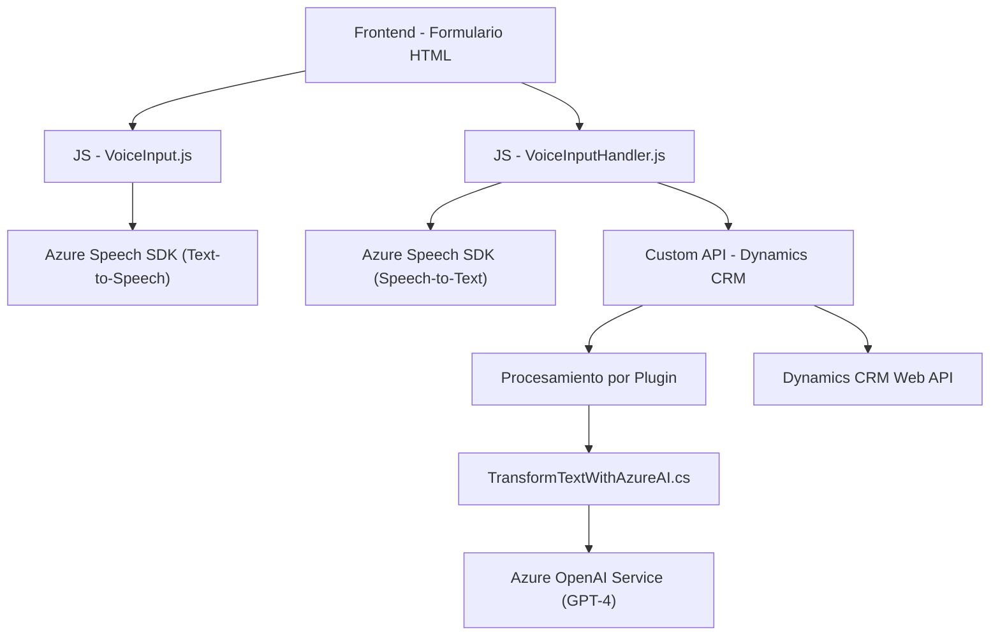

### Breve resumen técnico
El repositorio tiene archivos orientados a integrar varios servicios con la plataforma Microsoft Dynamics CRM, destacando el uso de Azure Speech SDK para reconocimiento y síntesis de voz, y el servicio Azure OpenAI para transformación de texto. Se enfoca en mejorar la interacción entre humanos y el CRM mediante comandos de voz e inteligencia artificial.

---

### Descripción de arquitectura
La arquitectura tiene varias capas organizadas modularmente bajo un enfoque de orquestación. Se combina lógica de frontend para interacción del usuario, procesamiento de texto por AI, y plugins de Dynamics CRM que amplían las funcionalidades del sistema. Aunque partes del sistema son modulares, su configuración general se asemeja a una arquitectura "n capas":
1. **Capa de presentación (frontend)**: Proveen interacción directa con el usuario (formularios).
2. **Capa de lógica de negocio**: Implementada en Azure Speech SDK y los plugins.
3. **Capa de datos**: Comunicación con Dynamics CRM y servicios externos como Azure OpenAI.

Esta estructura promueve la modularidad y flexibilidad, siendo fácil de escalar mediante la incorporación de nuevos servicios.

---

### Tecnologías usadas
1. **Frontend**:
   - **JavaScript**: Funcionalidad para manejo de formularios y comandos de voz.
   - **Azure Speech SDK**: Herramienta clave para reconocimiento y síntesis de voz.
   - Servicios del navegador: `window`, `document`.

2. **Backend (Dynamics CRM Plugin)**:
   - **C#**: Implementación mediante `IPlugin`.
   - **Azure OpenAI Service**: GPT-4 para procesamiento avanzado de texto.
   - Dependencias: `Microsoft.Xrm.Sdk`, `System.Net.Http`, JSON (serialización con `Newtonsoft.Json`).

3. **Patrones**:
   - Modularidad: Desagregación de funciones específicas por archivo.
   - Eventos y asincronía: Usos frecuentes de promesas y callbacks.
   - Integración externa: APIs de Azure para voz y procesamiento por IA.

---

### Dependencias o componentes externos
1. Azure Speech SDK:
   - Reconocimiento y síntesis de voz.
   - Dependencia en el CDN oficial (`https://aka.ms/csspeech/jsbrowserpackageraw`).

2. Azure OpenAI Service:
   - Interacción con modelos GPT-4.
   - Transformación de texto según normas definidas.

3. Dynamics CRM APIs:
   - Se utiliza el cliente `Xrm.WebApi.online.execute` para comunicación dentro de la plataforma Dynamics.

4. Frameworks básicos .NET:
   - `Microsoft.Xrm.Sdk` y manejo de consultas para operar sobre CRM.
   - Manejo de Http (`System.Net.Http`) para consumo de servicios REST externos.

---

### Diagrama **Mermaid** (100 % compatible con GitHub Markdown)

---

### Conclusión final
Este repositorio representa una solución de integración avanzada entre servicios de Microsoft Dynamics CRM y las herramientas de Azure. La arquitectura utiliza un enfoque modular con múltiples capas (n capas), garantizando flexibilidad, extensibilidad, y un flujo claro de datos. La interacción con servicios externos como Azure Speech SDK y Azure OpenAI constituye un sistema robusto, pero también dependiente de componentes externos críticos. Aunque bien diseñado, es importante revisar posibles riesgos como la seguridad de claves API y manejar configuraciones fuera del código fuente.

Se recomienda implementar pruebas unitarias para las funciones críticas, especialmente las que dependen de servicios externos, y garantizar la seguridad para las credenciales de acceso a dichos servicios.