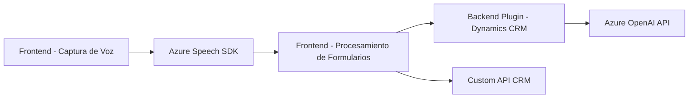

### Breve Resumen Técnico
El repositorio contiene archivos distribuidos en tres directorios relacionados con el desarrollo de funcionalidades usando reconocimiento y síntesis de voz, procesamiento de formularios y modelos AI en un sistema CRM basado en Microsoft Dynamics. Usa tecnologías como **Azure Speech SDK** y **Azure OpenAI**. Los componentes se integran entre frontend (JavaScript), backend (C# plugin) y API externa.

---

### Descripción de Arquitectura
La arquitectura está basada en **n capas**, con separación por responsabilidades:
1. **Frontend**: Se encarga de capturar voz, transcribirla, visualizar y procesar los datos de formularios en el CRM.
2. **Backend/Plugin**: Facilita la conexión con la API de Azure OpenAI para transformar texto según normas específicas.
3. **Dependencias externas**: Azure Speech SDK y Azure OpenAI actúan como servicios que se integran en los componentes mencionados.

Además, el sistema utiliza patrones como **MVC** (Model-View-Controller) en el frontend y el patrón de **plugin** en el backend para interactuar con Dynamics CRM.

---

### Tecnologías Usadas
1. **Frontend**:
   - Lenguaje: JavaScript (ES6+).
   - Framework: Ninguno (estructura modular con funciones y lógica basada en contexto CRM).
   - Dependencias:
     - **Azure Speech SDK** para reconocimiento y síntesis de voz.
     - **Xrm.WebApi** para comunicación con APIs internas del CRM.

2. **Backend**:
   - Lenguaje: C# (.NET Framework).
   - SDKs externos:
     - **Newtonsoft.Json**: Manejo avanzado de estructuras JSON.
     - **System.Net.Http**: Comunicación con Azure OpenAI API.
     - **Azure OpenAI API**: Servicio externo para procesamiento de texto según normas.

---

### Diagrama **Mermaid**

---

### Conclusión Final
El proyecto es una solución híbrida compuesta por **módulos integrados** en una arquitectura de **n capas**, diseñada para interactuar con formularios CRM y proporcionar funcionalidades avanzadas de reconocimiento y síntesis de voz, junto con inteligencia artificial para la transformación de texto. La elección de tecnologías como **Azure Speech SDK**, **Azure OpenAI** y **CRM plugins** refleja esfuerzos para combinar la inteligencia artificial y reconocimiento de voz en servicios empresariales, con una integración acertada, reutilizable y escalable.