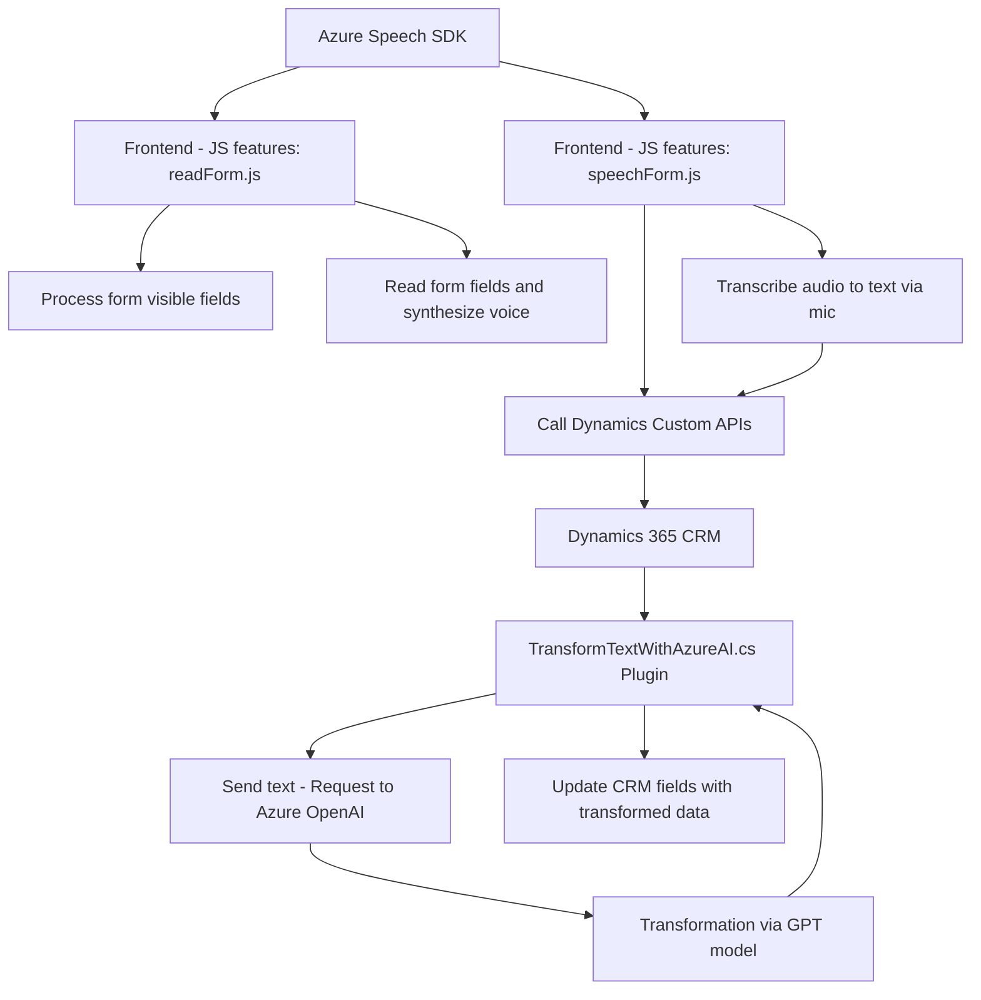

### Breve resumen técnico
El repositorio contiene tres archivos que implementan funcionalidades estrechamente relacionadas con procesamiento de datos en un formulario web o CRM, integración con la Azure Speech SDK y la interacción con Azure OpenAI para generación y modificación de texto. Su arquitectura gira en torno a servicios externos de Microsoft Azure para realizar tareas avanzadas (como síntesis de voz o transformación de texto con OpenAI) y está enfocada en la integración dentro de Dynamics 365.

---

### Descripción de arquitectura
La solución global sigue una **arquitectura de integraciones externas con procesos distribuidos**. Cada archivo constituye un módulo especializado, que añade capacidades específicas al sistema:
1. **`readForm.js` y `speechForm.js`**: Funcionan como aspectos de un **frontend**. Su rol principal incluye recoger datos de formularios y transformarlos en texto; luego, traducirlo a voz e integrar transcripciones por entrada de micrófono al CRM.
2. **`TransformTextWithAzureAI.cs`**: Persiste dentro de Dynamics CRM como un **plugin** orientado a la manipulación de texto con Azure OpenAI.

En términos de patrones:
- **Frontend**: Modular, centrado en manipulaciones DOM y Azure SDK, utilizando eventos y promesas para gestionar flujos.
- **Backend Plugin**: Basado en el patrón `Plugin` de Dynamics CRM, con integración de servicios externos (Azure OpenAI API).

---

### Tecnologías usadas
1. **Frontend:**
   - JavaScript: Core del desarrollo, que contiene funciones modulares para la integración con API y SDKs.
   - Azure Speech SDK: Utilizado para síntesis y transcripción de voz en los formularios.
   - DOM Manipulation: Métodos básicos para interacción dinámica con el formulario CRM.

2. **Plugin Backend:**
   - C#: Lenguaje principal para definición del plugin.
   - Azure OpenAI: Servicio API para transformar texto en JSON estructurado.
   - Microsoft Dynamics SDK: Para extender la funcionalidad CRM.
   - Newtonsoft.Json y System.Text.Json: Bibliotecas para serialización y manipulación de JSON.
   - HTTP Framework: Para comunicación con el endpoint Azure OpenAI.

---

### Dependencias y componentes externos
1. **Azure Speech SDK**: Para síntesis y transcripción de voz.
2. **Azure OpenAI**: Procesamiento de texto basado en el modelo GPT.
3. **Microsoft Dynamics SDK**: Base para los plugins y extensiones del CRM.
4. **APIs del navegador**:
   - Manipulación DOM para carga de SDK y captura de datos.
   - Web API (`Xrm.WebApi.online`) para interacción con CRM en JavaScript.
5. **Serialization Libraries**:
   - **Newtonsoft.Json**: Popular en .NET para manipular JSON.
   - **System.Text.Json**: Otra librería moderna para serialización JSON.

---

### Diagrama Mermaid válido para GitHub

---

### Conclusión final
La solución está diseñada para integrar capacidades avanzadas de Azure dentro de Microsoft Dynamics CRM y el frontend de un sistema basado en JavaScript. Ofrece principalmente:
1. Interfaz de voz a través de Azure Speech SDK.
2. Procesamiento avanzado de texto mediante Azure OpenAI.
3. Interacción directa con el CRM Dynamics, tanto desde la capa de front como mediante plugins.

**Arquitectura:** Se orienta hacia un diseño híbrido con **integración externa** mediante SDKs y APIs. Sin embargo, los módulos de frontend muestran similitudes con una **arquitectura modular basada en eventos**. Mientras tanto, el plugin implementa un patrón de arquitectura típico del ecosistema Dynamics CRM.

Este diseño es extensible y utiliza patrones desacoplados que permiten agregar nuevos servicios (como un SDK adicional de Azure o un API externa) fácilmente.