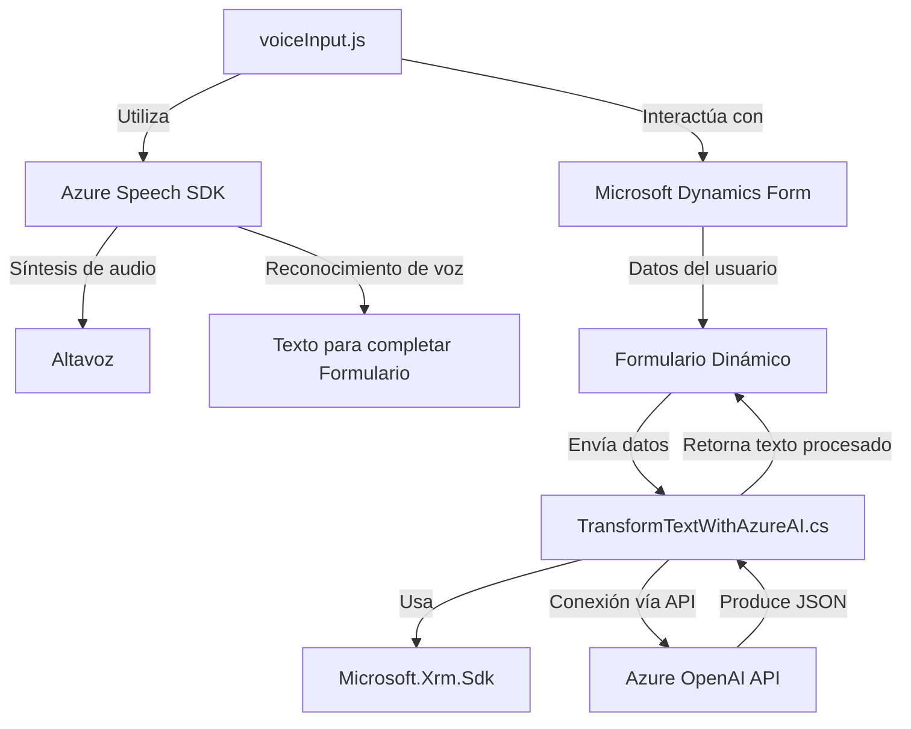

### Breve resumen técnico
El repositorio descrito parece ser parte de una solución integrada con Microsoft Dynamics CRM y servicios de Azure. Sus componentes principales permiten interactuar con formularios y ofrecer capacidades avanzadas de reconocimiento y síntesis de voz mediante el Azure Speech SDK, así como generar texto estructurado mediante el Azure OpenAI API. La solución utiliza JavaScript para el frontend (interacción con formularios) y C# para la lógica de plugins en Dynamics CRM.

---

### Descripción de arquitectura
1. **Solución**: 
   - **Tipo**: Es una solución híbrida diseñada para un ecosistema administrativo o empresarial, con una clara orientación hacia funcionalidades avanzadas basadas en APIs externas y procesamiento de datos en tiempo real. Incluye:
     - Un módulo frontend para la interacción de usuarios y formularios (principalmente usando JavaScript).
     - Un plugin backend (`TransformTextWithAzureAI.cs`) que funciona dentro del entorno de Dynamics CRM.

2. **Arquitectura**:  
   - **Frontend**: Está estructurado de manera modular donde las responsabilidades están separadas en funciones específicas. Esto sigue una aproximación de **n-capas** dentro del frontend.
   - **Backend**: El plugin sigue una arquitectura de **hexagonal o puertas y adaptadores**, centrada en recibir eventos (acciones) de Dynamics CRM y delegar la lógica más compleja a servicios externos como Azure OpenAI.
   - **Integración externa**: Se utilizan servicios basados en APIs (Azure OpenAI y Azure Speech SDK) como microservicios externos, destacándose el enfoque hacia servicios especializados en la nube.

---

### Tecnologías usadas
1. **Backend**:
   - Microsoft Dynamics CRM SDK como base de desarrollo del plugin.  
   - C# como lenguaje para lógica personalizada.
   - Azure OpenAI API para procesamiento avanzado de texto. Este servicio permite transformar texto en base a reglas específicas.
   - HTTP client para comunicación con los servicios de Azure.

2. **Frontend**:
   - JavaScript nativo para la manipulación del DOM y lógica interactiva de formularios.
   - Azure Speech SDK para la síntesis de voz y reconocimiento de voz.
   - ECMAScript Promises para operaciones asíncronas.

3. **Otros Patrones**:
   - Modularidad en los archivos de JavaScript asegurando separación de responsabilidades (principio SOLID: Single Responsibility Principle).
   - Integración dinámica de SDK externo.
   - Uso de Promesas en los métodos para el manejo de operaciones asincrónicas.

---

### Dependencias externas
1. **Frontend**:  
   - *Azure Speech SDK*: Gestiona procesos de síntesis y reconocimiento de voz.
   - *Microsoft Dynamics*: interacción con los datos del formulario.

2. **Backend**:  
   - *Azure OpenAI API*: Procesamiento de texto según reglas específicas.
   - *Microsoft Dynamics SDK*: Facilita el acceso al contexto y modificación de entidad en CRM.
   - *HTTP Client*: Comunicación entre el plugin y el servicio de Azure.

3. **Funcionalidades auxiliares**:
   - Serialización/Deserialización de JSON (`System.Text.Json`).
   - Validación mediante expresiones regulares (`System.Text.RegularExpressions`).

---

### Diagrama Mermaid válido para GitHub Markdown

---

### Conclusión final
La solución presentada corresponde a un microservicio y plugin para la integración avanzada con Microsoft Dynamics CRM. La funcionalidad principal se centra en procesar y sintetizar comandos de voz y transformar texto estructurado mediante reglas personalizadas definidas por la API de Azure OpenAI. Esto permite un flujo eficiente entre frontend y backend manteniendo una separación clara de responsabilidades.

La solución tiene su núcleo principal basado en una arquitectura de **integración API microservicio** utilizando servicios externos alojados en la nube (Azure). El diseño modular y flexible asegura escalabilidad y permite añadir nuevas funcionalidades sin afectar la base del sistema. Sin embargo, es imprescindible contemplar medidas de seguridad como el uso adecuado de claves de API y configuración sensible.