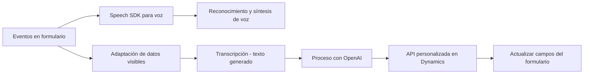

### Breve Resumen Técnico
El repositorio analizado parece estar orientado hacia una solución que utiliza tecnologías de **Azure** (Speech SDK, OpenAI) para extender funcionalidades sobre **Microsoft Dynamics 365**. La solución permite reconocer voz, procesar texto y sintetizar resultados mediante servicios alojados en la nube y módulos personalizados.

---

### Descripción de Arquitectura
1. **Tipo de solución:**  
   Principalmente esta solución implementa una combinación entre:  
   - **Frontend:** Archivos en JavaScript permiten manipular formularios interactivos y la integración con SDK de Azure Speech.  
   - **Plugins:** Archivos en C# añaden funcionalidades mediante la extensión de Microsoft Dynamics CRM.  
   - Balance entre cliente-servidor, conectando componentes locales (DOM, Dynamics 365) con servicios en la nube (Azure Speech SDK, OpenAI).

2. **Arquitectura:**  
   La arquitectura parece tener una estructura de múltiples capas:  
   - **Presentación:** Implementada con JavaScript dentro de un navegador, basado en el DOM y el formulario de Microsoft Dynamics 365.  
   - **Negocio:** Módulos de procesamiento como `getReadableValue` realizan lógica para extraer datos de formularios y transformarlos.  
   - **Servicios Externos:** Los plugins y adaptadores llaman APIs de Azure (IA y Speech SDK) para manipular texto o audio.  
   Además, utiliza patrones distribuidos que se alinean con una integración **cliente-servidor** moderna.

3. **Patrones usados:**  
   - **Callback Pattern:** Se utiliza en funciones para gestionar la carga dinámica del SDK de Azure Speech.  
   - **Adapter Pattern:** Uso de funciones como `getReadableValue` para conversión de valores de campos del formulario a formatos estándar.  
   - **Hexagonal Architecture (parcial):** En el plugin de C#, se separa la interacción con el dominio (Dynamics CRM) y servicios externos (Azure OpenAI).  
   - **Microservicios:** APIs externas en Azure son tratadas como servicios especializados.

---

### Tecnologías Usadas
1. **Frontend:**  
   - **JavaScript:** Para DOM manipulation y lógica asociada con formularios de Dynamics 365.  
   - **Azure Speech SDK:** Para integrar síntesis y reconocimiento de voz.

2. **Backend / Plugins:**  
   - **C#/.NET Framework:** Plugins desarrollados para extender funcionalidades mediante Microsoft Dynamics CRM.  
   - **Azure OpenAI:** Procesamiento avanzado de texto mediante un modelo de IA específico.

3. **APIs/Servicios Externos:**  
   - **Azure Speech SDK:** Procesamiento de voz a través de funciones específicas en la capa frontend.  
   - **Azure OpenAI API:** Procesamiento de texto personalizado basado en IA.

---

### Dependencias y Componentes Externos
- **Exteriores:**  
  - Azure Speech SDK: Para voz y síntesis.  
  - Azure OpenAI: Procesamiento avanzado de texto.  
  - Microsoft Dynamics 365: Como base del sistema de CRM.  
- **Internos:**  
  - Sistema de extensiones de plugins en Dynamics CRM (IPlugin).  
  - Contexto de formularios (`executionContext`) proporcionado por el frontend de Dynamics.  
  - Manipulación del DOM en los módulos de frontend.

---

### Diagrama Mermaid válido para GitHub

---

### Conclusión Final
La solución es un **sistema extendido basado en cliente-servidor** que utiliza Azure como plataforma para síntesis y reconocimiento de voz (Speech SDK) e integración con IA avanzada (OpenAI). A nivel de arquitectura, combina un modelo de múltiples capas con patrones de distribuciones y adaptadores que facilitan la integración del procesamiento de voz y texto con los formularios dinámicos de CRM. Su diseño modular y distribuido lo hace eficiente para entornos corporativos que necesitan personalización y capacidades avanzadas sobre plataformas existentes.