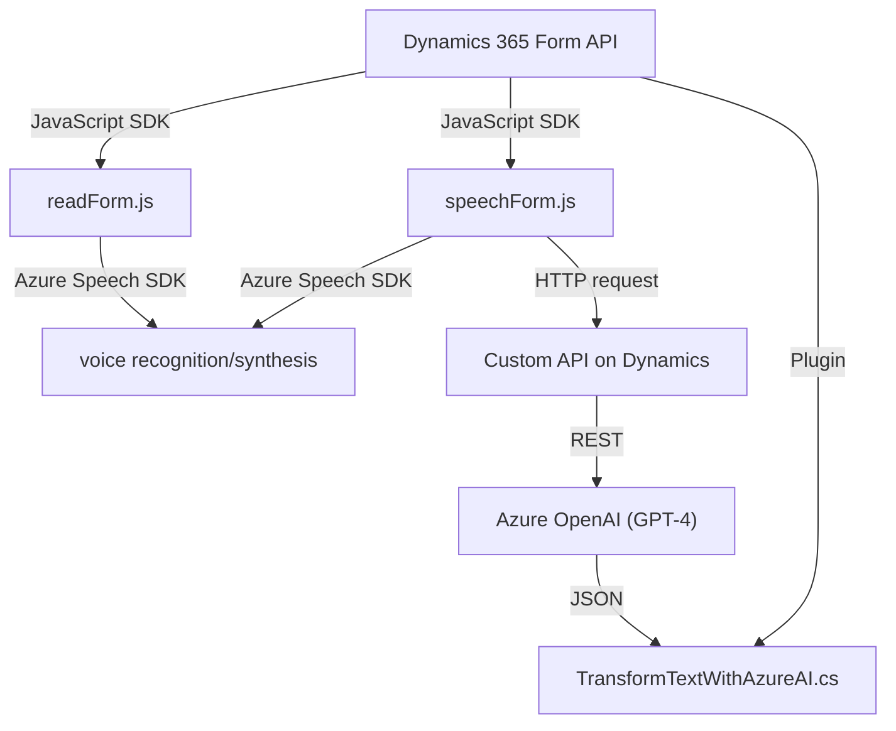

### Breve resumen técnico:

El repositorio analiza archivos que implementan funcionalidades de reconocimiento de voz y texto, así como interacción con APIs externas. Utiliza tecnologías avanzadas como el **Azure Speech SDK** para reconocimiento y síntesis de voz, y **Azure OpenAI GPT-4** para procesamiento de texto en JSON. A través de una arquitectura modular, el código interactúa con formularios de **Dynamics 365** y servicios cloud como Azure AI para procesamiento de datos en tiempo real.

---

### Descripción de la arquitectura:

La solución se basa en una arquitectura **combinada de servicios** orientada a la integración con plataformas externas usando **plugins y SDKs**. A nivel de diseño, se exhiben principios de **modularidad, reutilización funcional y separación de responsabilidades**.

- Los archivos JavaScript (como `readForm.js` y `speechForm.js`) implementan una capa lógica que interactúa con las UI de formularios en **Dynamics 365**, facilitando el reconocimiento de voz y el procesamiento de comandos mediante SDKs y APIs externas.
- El archivo **C# TransformTextWithAzureAI.cs** implementa un **plugin de Dynamics CRM**, que actúa como una capa de interacción entre el sistema CRM y la API de Azure OpenAI. Esto aporta capacidad de procesamiento avanzado de texto para necesidades empresariales específicas.

---

### Tecnologías usadas:

**Frontend/JavaScript:**
1. **Azure Speech SDK**: Para reconocimiento de voz y síntesis de texto hablado.
2. **Dynamics 365 API (formContext)**: Para extracción y manipulación de datos de formularios.
3. **JavaScript (ES6+)**: Desarrollo modular con funciones reutilizables.
4. **HTTP requests/API calls**: Llamadas a APIs externas (dinámicas para SDK y procesamiento en la nube).

**Backend/C#:**
1. **Microsoft Dynamics Plugin Framework**: Gestión de eventos en CRM.
2. **Azure OpenAI GPT-4 model**: Procesamiento de texto avanzado, implementado vía peticiones HTTP.
3. **JSON libraries**: Manejo de datos, serialización/deserialización.

---

### Diagrama Mermaid:

---

### Conclusión final:

La solución representa una **arquitectura modular orientada a eventos y servicios**, que integra las capacidades de **Azure Speech SDK**, **Dynamics 365 API**, y **Azure OpenAI GPT-4** para el reconocimiento y procesamiento de voz y texto. La aplicación utiliza un enfoque de **n capas**: el frontend (JavaScript) para la lógica de interacción con los formularios, la capa intermedia (API), y el backend (plugin en C#) para procesar y estructurar datos mediante una IA. Esto la convierte en una solución escalable y adaptable a necesidades empresariales modernas, con patrones como **Facade**, **Proxy**, y **Callback** para garantizar la modularidad y robustez del diseño.