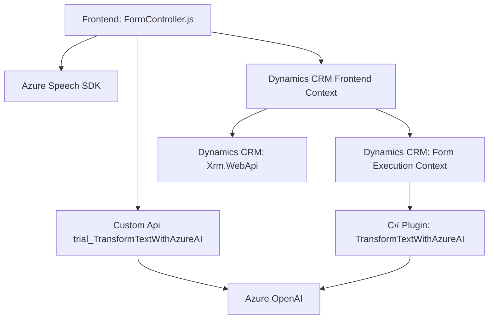

### Resumen técnico

Se trata de una solución híbrida que combina frontend con Microsoft Dynamics CRM, una API externa (Azure Speech SDK), y un plugin específico que integra el procesamiento de texto mediante Azure OpenAI. La funcionalidad está centrada en brindar voz como entrada/salida y en procesar comandos reconocidos para manipular datos dinámicos en formularios basados en Dynamics CRM. Además, complementa esta solución con transformación avanzada de datos a través del plugin desarrollado para Microsoft Dynamics.

---

### Descripción de arquitectura

La solución muestra una **arquitectura multitier** orientada hacia una mezcla de integración de servicios y APIs externas. A grandes rasgos, se podría clasificar como una **arquitectura microservicio integrada**, ya que usa múltiples APIs externas como componentes funcionales separados y ligadas a Dynamics CRM.

1. **Frontend**:
   - Implementación en JavaScript para manejar formularios, voz como entrada/salida mediante el **Azure Speech SDK**, y normalización de datos en Dynamics CRM.
   - Modularización clara de funciones específicas para cada tarea (manejo de SDK, reconocimiento de voz, procesamiento de formularios, etc.).

2. **Backend/Integración (Plugins)**:
   - Plugin para Dynamics (C#) utiliza la arquitectura de extensibilidad basada en la interfaz `IPlugin` para aplicar transformaciones mediante reglas definidas y el servicio Azure OpenAI.
   - Acoplamiento con servicios externos como la **Azure OpenAI API**, que añade capacidades avanzadas de inteligencia artificial.

3. **Exposición**:
   - A través de la SDK de Dynamics CRM y mediante un **Custom API** para el procesamiento externo del texto mediante IA. La API utilizada desde el frontend encadena proceso entre el reconocimiento dinámico en el navegador y el procesamiento de datos en el servidor.

4. **Patrones aplicados**:
   - **Patrón Facade**: Simplifica la complejidad de múltiples interacciones con APIs externas.
   - **Capa de adaptadores (Adapter Pattern)**: Mapea campos visibles en formularios a modelos que pueden ser utilizados por otras áreas del sistema (ej.: mapeo entre etiquetas y atributos en Dynamics).
   - **Carga condicional**: Usa métodos como `ensureSpeechSDKLoaded` para minimizar dependencias innecesarias y optimizar rendimiento del frontend.

---

### Tecnologías usadas

1. **Frontend**:
   - **JavaScript**: Lógica de integración con formularios.
   - **Azure Speech SDK**: Biblioteca para generación de voz y reconocimiento de entrada de voz.

2. **Backend/Dynamics**:
   - **C# Plugin**:
     - Microsoft Dynamics CRM SDK.
     - Azure OpenAI API para transformación de texto.

3. **Extralib APIs & Dependencias**:
   - HTTP Client (para interacción con APIs externas).
   - API de Dynamics (`Xrm.WebApi`).
   - `System.Text.Json` y potencial uso de `Newtonsoft.Json.Linq` para parseo de JSON.

4. **Servicios Externos**:
   - **Azure OpenAI (GPT-4)**: Utilizado para transformación textual avanzada.
   - **Azure Speech SDK**: Configuración y compatibilidad con Microsoft Azure Cloud para todas las operaciones de entrada/salida de voz.

---

### Diagrama Mermaid

---

### Conclusión final

Este repositorio implementa una solución avanzada de integración entre frontend, backend y servicios externos para mejorar la experiencia de usuario a través del reconocimiento de voz, síntesis de voz, y manipulación dinámica de formularios en Microsoft Dynamics CRM. Utiliza arquitecturas modernas que incorporan múltiples patrones como **Fachada**, **Carga Condicional** y **adapter Mapping**, lo que permite la escalabilidad y modularidad en un ecosistema basado en APIs.

La integración explícita con servicios de Azure (Speech SDK y OpenAI) amplía las capacidades del sistema, enfocándose especialmente en la generación de voz y procesamiento semántico. Es ideal para entornos empresariales donde la automatización y la accesibilidad son críticas.