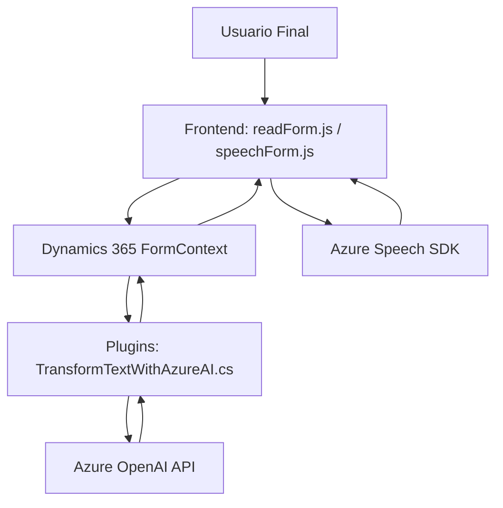

### Breve Resumen Técnico

El repositorio contiene tres archivos principales que se enfocan en la integración de servicios de **Azure** (Speech SDK y OpenAI) con sistemas de gestión de datos en **Dynamics 365**. Los archivos del frontend (`readForm.js` y `speechForm.js`) se centran en procesar datos visibles del formulario y realizar síntesis/reconocimiento de voz, mientras que el archivo del plugin (`TransformTextWithAzureAI.cs`) extiende la funcionalidad de Dynamics 365 para realizar transformaciones de texto mediante la API de OpenAI.

---

### Descripción de Arquitectura

1. **Tipo de solución**:
   Este repositorio representa una solución híbrida:
   - **Frontend**: Una interfaz basada en JavaScript que implementa funcionalidades de entrada/salida de voz y manipulación de los datos de formulario en Dynamics 365.
   - **Backend Plugin**: Un plugin que extiende la lógica y operatividad del sistema CRM mediante el uso de Azure AI para transformar datos de texto.

2. **Arquitectura**:
   - Es una **arquitectura monolítica** ampliada con componentes modulares. Las partes del frontend interactúan directamente con Dynamics 365 mediante APIs. 
   - El plugin sigue un patrón de arquitectura orientada a servicios (SOA), al estar basado en el contrato `IPlugin` y realizar comunicación con servicios externos, como el servicio de Azure OpenAI.

3. **Patrones usados**:
   - **Modularización**: Código del frontend estructurado en funciones independientes con responsabilidades delimitadas.
   - **Capa de servicios**: Tanto en el frontend como en el plugin, el código interactúa con servicios externos mediante APIs (Azure Speech SDK y OpenAI).
   - **Facade Pattern**: Se encapsula la lógica de integración con SDKs y APIs externas en funciones específicas para simplicidad de uso.
   - **Carga dinámica**: Los archivos de frontend cargan el Azure Speech SDK de manera dinámica para optimizar recursos y evitar dependencias directas al inicio.

---

### Tecnologías y Dependencias Usadas

- **Frontend**:
  - **JavaScript**:
    - Para manipulación del DOM y procesamiento de datos en formularios.
    - Lógica asíncrona basada en callbacks y promesas.
  - **Azure Speech SDK**:
    - Reconocimiento y síntesis de voz.
    - Integra APIs de AI en el navegador mediante carga dinámica.
- **Backend Plugin**:
  - **Microsoft Dynamics 365 SDK**:
    - Para interactuar con objetos y atributos del CRM.
  - **Azure OpenAI**:
    - Servicios de transformación de texto mediante GPT.
  - **Librerías .NET**:
    - `Newtonsoft.Json` y `System.Text.Json` para manipulación y serialización de JSON.
    - `System.Net.Http` para realizar solicitudes HTTP asíncronas.
  - **C#**:
    - Lenguaje utilizado en el desarrollo del plugin.

---

### Diagrama Mermaid

El siguiente diagrama representa las principales interacciones, dependencias y flujos entre los componentes.

---

### Conclusión Final

Esta solución combina un **frontend en JavaScript** con un **plugin en C#**, ambos interactuando directamente con **Dynamics 365** y utilizando servicios externos de **Azure** para síntesis y transformación de datos basados en IA. Su arquitectura está fuertemente acoplada a Dynamics 365, mostrando atributos de **monolito**, pero utiliza patrones modernos (modularidad, carga dinámica) y elementos de SOA para integración con terceros. Para optimizaciones futuras, una posible migración a microservicios o una arquitectura hexagonal podría ser un camino adecuado, dependiendo de los requerimientos de escalabilidad y mantenimiento.

