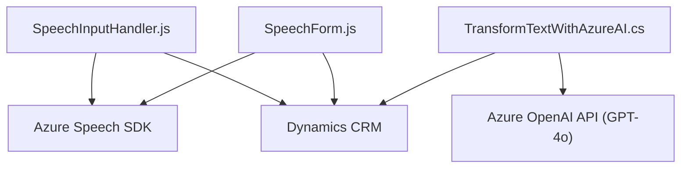

## Breve resumen técnico

El repositorio contiene módulos relacionados con la integración de entrada de voz, procesamiento de transcripciones y transformación de datos en un entorno de **Dynamics CRM** utilizando servicios de **Azure**, como **Azure Speech SDK** y **Azure OpenAI API**. 

Se divide en dos componentes principales: 
1. **Frontend (JavaScript)**: Responsable de capturar datos de formularios CRM, procesar entrada de voz, y realizar síntesis de voz mediante Azure Speech SDK.
2. **Backend (plugins en C#)**: Diseñado para transformar texto en estructuras JSON usando Azure OpenAI, integrándose directamente con Dynamics CRM.

---

## Descripción de arquitectura

El sistema utiliza una arquitectura híbrida:
- **Frontend:** Alta modularidad con orientación a funciones y event-driven programming para capturar entrada de voz y manejar datos en el cliente.
- **Backend:** Arquitectura basada en plugins para Dynamics CRM que procesa y transforma datos usando Azure OpenAI. Este diseño sigue un patrón **n-capas**, donde las capas de negocio están claramente separadas del cliente.

En general, el sistema sigue el patrón **cliente-servidor**:
- **Cliente:** Capta datos del usuario y los preprocesa.
- **Servidor:** Procesa lógica avanzada, como la transformación del texto y el almacenamiento de datos.

---

## Tecnologías usadas

1. **Frontend**
   - **JavaScript**: Principal lenguaje de programación para manejar eventos y DOM.
   - **Azure Speech SDK**: Para entrada de voz, síntesis de texto a voz, y reconocimiento de voz.
   - **Dynamics CRM APIs**: Integración directa con el cliente CRM para manipular formularios.

2. **Backend**
   - **C# (.NET Framework)**: Lenguaje utilizado para desarrollar plugins de Dynamics CRM.
   - **Azure OpenAI (GPT-4o)**: Servicio para transformación avanzada de texto.
   - **Dynamics CRM SDK**: Framework para interacción con los datos y lógica de negocio del CRM.
   - **JSON APIs**: Bibliotecas como Newtonsoft y System.Text.Json para manejo de datos estructurados.

---

## Diagrama Mermaid válido para GitHub

---

## Conclusión final

El repositorio en cuestión está diseñado como una solución integrada para entornos empresariales basados en **Microsoft Dynamics CRM**, complementando la funcionalidad nativa con herramientas avanzadas de **Azure**. Al proporcionar interacción por voz, manejo de formularios, e integración con inteligencia artificial, asegura un flujo de trabajo mejorado y eficiente.

La arquitectura híbrida cliente-servidor, con fuerte dependencia en componentes externos como **Azure Speech SDK** y **Azure OpenAI**, apoya un patrón distribuido, aunque está limitado a una implementación específica de CRM, restringiendo su reutilización en otros sistemas.