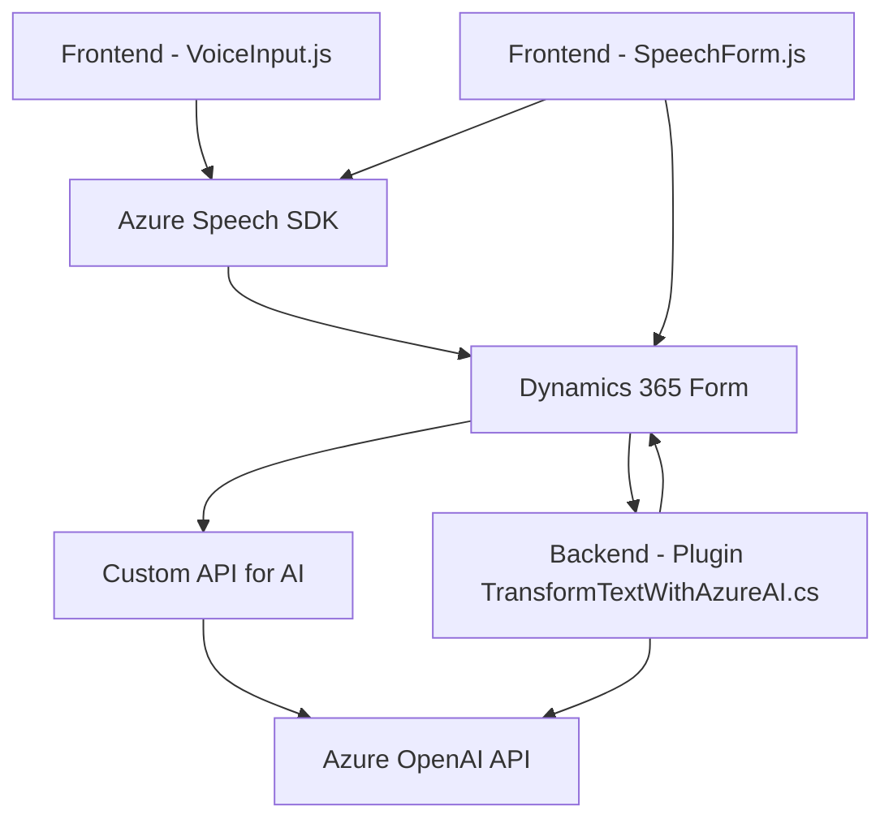

### Breve resumen técnico

El repositorio parece ser parte de un sistema más grande que combina múltiples componentes orientados a la interacción con formularios de Dynamics 365 y servicios externos como Azure Speech SDK y OpenAI. La solución está organizada en tres partes principales: frontend en JavaScript para interacción con formularios y voz, backend mediante plugins de Dynamics CRM en C# para procesamiento y transformación de texto, y servicios adicionales proporcionados por APIs externas.

---

### Descripción de arquitectura

El sistema implementado tiene características que se asemejan a una arquitectura **híbrida**:
1. **Integración en Dynamics CRM:**
   - En el código C# (Plugins), se implementan extensiones propias del modelo de plugins de Dynamics CRM.
   - Usa la arquitectura propia de eventos de Dynamics CRM para extender funcionalidades.
   
2. **Frontend modular con interacción directa a servicios:** 
   - Los archivos JavaScript añaden interacción avanzada al frontend del sistema de formularios mediante un modelo **orientado a funciones**.
   - Las funciones están organizadas de forma independiente y delegan el procesamiento y la síntesis de voz al **Azure Speech SDK** y una **API personalizada integrada**.

3. **Componentes desacoplados y servicios externos:** 
   - Uso de APIs externas para lograr funciones específicas fuera del dominio de la solución (Azure Speech para voz y OpenAI para procesamiento de texto).
   - Combina la arquitectura de un **microservicio** (API externa para procesamiento de datos) con interacciones controladas entre frontend, backend y servicios.

---

### Tecnologías usadas

El sistema utiliza las siguientes tecnologías y frameworks:
1. **Frontend:**
   - **JavaScript**, HTML y APIs del navegador (e.g., `fetch` para solicitudes REST).
   - SDK de Azure Speech **SpeechSDK**.
   - Integración con formularios de Dynamics 365 mediante `executionContext`.

2. **Backend (Plugins):**
   - **C# y .NET Framework** para extensiones de Microsoft Dynamics CRM.
   - Uso de la interfaz `IPlugin` del SDK de Microsoft Dynamics para escribir plugins.
   - APIs HTTP para integrar **Azure OpenAI API** mediante solicitudes REST.
   - **Newtonsoft.Json** y **System.Text.Json** para manejo de JSON.

3. **Servicios externos:**
   - **Azure Speech SDK** (integración en frontend para reconocimiento y síntesis).
   - **Azure OpenAI API** (usada desde el backend para transformar texto mediante IA).
   - **Dynamics CRM Web API** para manipulación de datos del sistema (lookup, asignaciones).

---

### Dependencias o componentes externos presentes
1. **Frontend:**
   - SDK de Azure Speech cargado por la URL `https://aka.ms/csspeech/jsbrowserpackageraw`.
   - APIs internas del navegador (`Web Audio API`, DOM traversal, etc.).
   - Posibles llamadas a servicios personalizados o API REST propios.

2. **Backend:**
   - Integración directa con **Dynamics CRM** Web API.
   - Uso de la **Azure OpenAI API** para transformación de texto.
   - Dependencias estándar de .NET (HttpClient, JSON handling).

3. **Configuraciones sensibles:**
   - Claves y regiones de Azure (e.g. `azureKey`, `azureRegion`) necesarias para interactuar con servicios externos (deben ser externalizadas a archivos de configuración o variables de entorno).

---

### Diagrama Mermaid válido para GitHub

---

### Conclusión final

El repositorio muestra un diseño bien estructurado, basado en una **arquitectura extensible**:
1. Combina **componentes frontend (JavaScript)** y **backend (C#)** orientados a extender las capacidades de Dynamics 365.
2. Maneja interacción directa entre formularios, servicios de voz y transformación de texto utilizando **Azure Speech SDK** y **Azure OpenAI API**.
3. Utiliza un **modelo híbrido**, donde los microservicios (APIs externas) se integran con una solución basada en plugins de Dynamics CRM.

Sin embargo, el uso de claves sensibles y la necesidad de configuración adicional son puntos que deben mejorarse. La solución es adaptable y escalable hacia nuevos servicios externos gracias a su modularidad.