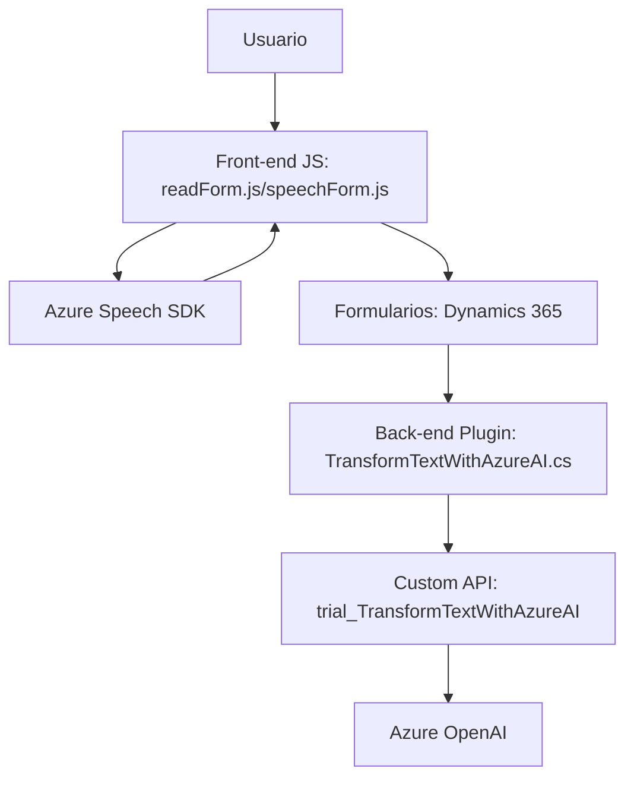

### Breve Resumen Técnico:
El repositorio describe varias componentes de una solución para integrar reconocimiento y generación de voz, manipulación de formularios en Dynamics 365, e inteligencia artificial (IA) con Azure OpenAI y Speech SDK. Incluye tanto módulos front-end en JavaScript como plugins back-end desarrollados en C#.

---

### Descripción de Arquitectura:
La arquitectura sigue un enfoque distribuido, combinando:
1. **Frontend**, con **modularidad**, donde cada archivo JS aborda una funcionalidad específica:
   - `readForm.js`: Extracción de datos y síntesis de voz.
   - `speechForm.js`: Manejo de transcripciones de voz.
2. **Plugin back-end con Dynamics CRM SDK** &
   - Plugin `TransformTextWithAzureAI` conectado a Dynamics CRM, utilizando reglas predefinidas y servicios de Azure OpenAI para procesamiento IA.
3. **Integración con microservicios**, dada la estrecha dependencia de APIs de Azure OpenAI, Azure Speech SDK, y Dynamics Web APIs, lo que refleja un **patrón de arquitectura basada en servicios híbridos**.
4. **N-Capas**: Divide operaciones entre módulos frontend (entrada de datos y voz) y backend (transformación y manejo de lógica corporativa).
5. **Event-driven Architecture**: Usa triggers como eventos de carga del SDK y formularios dinámicos para iniciar acciones.

---

### Tecnologías Usadas:
**Frontend**:
- **JavaScript**: Modulación de interacción con formularios y reconocimiento de voz.
- **Azure Speech SDK**: Reconocimiento y síntesis de voz.
- **Dynamics 365 Web APIs**: Manipulación de datos en formularios.

**Backend**:
- **C#**: Desarrollo de plugins para Dynamics CRM.
- **Microsoft.Xrm.Sdk**: SDK para interacciones con Dynamics CRM.
- **Azure OpenAI API**: Generación de resultados IA estándar.
- **Newtonsoft.Json & System.Text.Json**: Manejo avanzado de estructuras JSON.
- **System.Net.Http**: Comunicación con APIs externas (Azure OpenAI).

**Patrones presentes**:
- Modularidad, event-driven, integración de servicios externos, plug-in architecture, dependency injection.

---

### Diagrama Mermaid (Válido para GitHub):

---

### Conclusión Final:
La solución integra tecnologías modernas para habilitar interacción por voz, análisis inteligente de contenido con IA, y manipulación avanzada en entornos corporativos como Dynamics CRM. La arquitectura está enfocada en modularidad y servicios distribuidos. Los patrones y dependencias aseguran escalabilidad, extensibilidad, y alta integración entre los servicios externos (Azure Speech/AI). Sin embargo, el diseño está altamente acoplado al ecosistema Microsoft, lo que lo hace menos flexible para otros entornos.