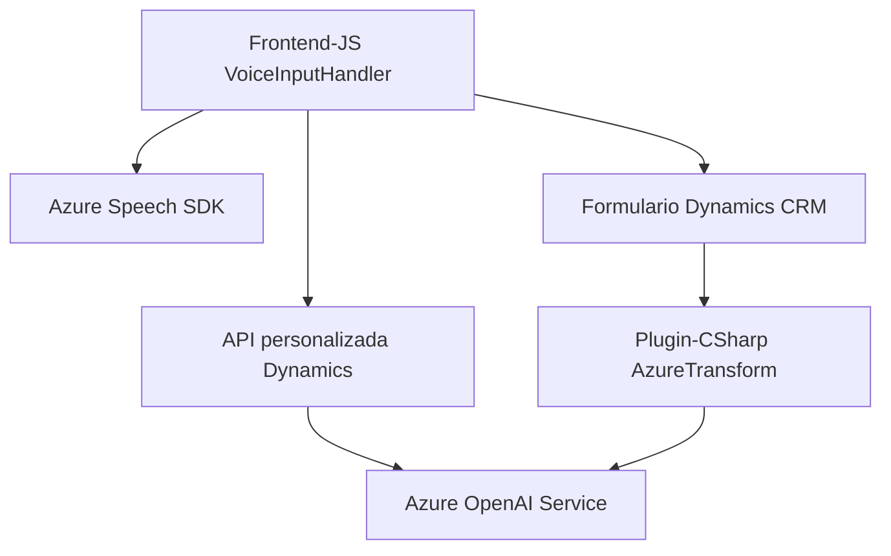

## Breve Resumen Técnico

El repositorio contiene múltiples archivos relacionados con la interacción entre formularios, reconocimiento de voz y servicios de inteligencia artificial en el contexto de Dynamics 365. Los módulos se diseñan para capturar datos del usuario a través de la voz, procesarlos con Azure Speech SDK y transformar texto usando Azure OpenAI Service. La solución usa **JavaScript** para la parte del frontend y **C# para un plugin** que interactúa con Dynamics CRM.

---

## Descripción de Arquitectura

La arquitectura es híbrida y orientada a servicios (**SOA**):
1. **Frontend:** Maneja lógica de interacción basada en JavaScript y el SDK de Azure Speech para sintetizar y reconocer voz. Trabaja directamente sobre formularios visibles de Dynamics 365, procesando datos y llamando servicios externos.
2. **Plugin Backend (+ Dynamics 365):** Como extensión, utiliza plugins en C# para integrar el procesamiento de texto avanzado mediante Azure OpenAI Service, proporcionando transformación estructurada del texto.
3. La solución está diseñada con un enfoque modular que permite que las partes trabajen como componentes individuales, conectándose mediante comunicación asíncrona y APIs.

---

## Tecnologías Usadas

1. **Frontend:**
   - Lenguaje: **JavaScript**.
   - Integraciones: **Azure Speech SDK**.
   - Manipulación de DOM: Procesamiento directo de formularios visible.
   - Servicios externos: API personalizada y REST API hacia Azure OpenAI.

2. **Backend (en plugins):**
   - Lenguaje: **C# (.NET Framework)**.
   - Integraciones: 
     - **Azure OpenAI Service**.
     - **Dynamics 365 SDK** para la manipulación de formularios y datos CRM.
   - Librerías auxiliares: `Newtonsoft.Json.Linq`, `System.Net.Http`.

3. **Patrones:**
   - **Event-driven programming** para carga asincrónica y manejo de eventos.
   - **SOA** con interacción dependiente de servicios externos.
   - **Modularidad backend/cliente:** Desacoplamiento con plugins y APIs.

---

## Dependencias o Componentes Externos

1. **Azure Speech SDK:** Para reconocimiento de voz y síntesis en el navegador.
   - URL: `https://aka.ms/csspeech/jsbrowserpackageraw`.
   - Dependencia directa del frontend JS.
   
2. **Azure OpenAI Service:** Para transformar texto en formato JSON estructurado mediante REST API.
   - Clave API y región necesarias.
   
3. **Dynamics 365 API:**
   - `Xrm.WebApi` para integrar funciones de manipulación de datos y ejecución de lógica personalizada en el contexto del CRM.

4. **Plugins de Dynamics CRM:** Configuración específica como extensiones para ejecutar lógica avanzada en backend (mediante C#).

---

## Mermaid Diagram

A continuación, un diagrama que representa la interacción entre componentes del sistema:

---

## Conclusión Final

La solución presentada integra tecnologías modernas centradas en servicios inteligentes basados en Azure, junto con conectores para Dynamics 365. Su arquitectura modular y orientada a servicios (SOA) permite capacidad de escalabilidad y conectividad entre la parte del frontend, los plugins backend y APIs externas. El uso de patrones de programación como Event-driven y Service-oriented asegura una solución flexible para manejar reconocimiento de voz y transformación avanzada de textos.