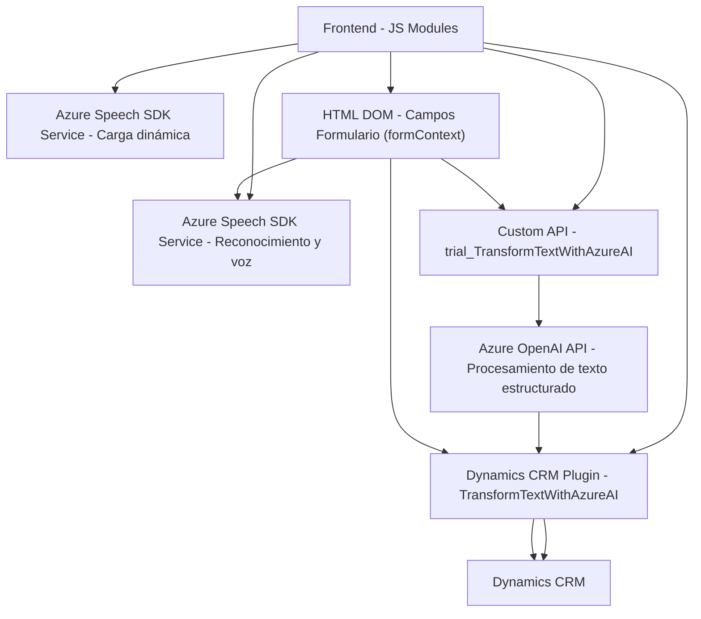

### Breve Resumen Técnico
El repositorio describe una solución que combina frontend en JavaScript, un plugin para Microsoft Dynamics CRM y servicios externos como Azure Speech SDK y Azure OpenAI API para proporcionar funcionalidades avanzadas de reconocimiento de voz, síntesis de texto a voz, y transformación de texto utilizando IA. Está diseñado para integrarse con formularios dinámicos en el entorno Dynamics CRM.

---

### Descripción de Arquitectura
1. **Tipo de Solución:** 
   - Esta solución combina un **frontend ligero** (archivos JS), **microservicios de Azure** (Speech SDK y OpenAI), y un **plugin interno** para extender funcionalidades en Dynamics CRM. 
   - Es una solución híbrida que mezcla cliente-servidor y servicios externos.

2. **Arquitectura General:**  
   - Se utiliza una **arquitectura n-capas** donde:
     - El **frontend** permite capturar datos dinámicos de formularios y comunicarse con servicios de voz.
     - Un componente **backend** (Dynamics CRM plugin) actúa como intermediario entre los datos locales y el servicio Azure OpenAI.
   - Los servicios de Microsoft Azure funcionan como **microservicios** externos para tareas específicas de reconocimiento y procesamiento de voz e IA.

3. **Patrones Utilizados:**
   - **Callback Pattern:** Manejo asíncrono mediante funciones de retorno, particularmente en la integración con SDKs y APIs externas.
   - **SDK Integration:** Uso modular y representativo de SDKs como el Azure Speech SDK para garantizar máxima reutilización.
   - **RESTful Communication:** Para interacción con Azure OpenAI.
   - **Dynamic Mapping Pattern:** En el frontend, para asociar dinámicamente campos del formulario con valores procesados.
   - **Plugin-based Pattern:** Extensión de lógica mediante `IPlugin` de Dynamics CRM.

---

### Tecnologías Usadas
1. **Frontend:**
   - **JavaScript:** Para manipulación de HTML DOM y lógica de reconocimiento/transformación de datos dinámicos.
   - **Azure Speech SDK:** Bibliotecas para reconocimiento de voz, síntesis de texto a voz y funcionalidades relacionadas.
   - **APIs:** Interacción con Azure OpenAI y otros endpoints dinámicos.
2. **Backend:**
   - **Microsoft .NET Framework:** Desarrollo del plugin personalizado usando el SDK de Dynamics CRM.
   - **Azure OpenAI API:** Para transformar texto utilizando inteligencia artificial.
3. **Dependencias Externas:**
   - Frameworks y librerías como `Newtonsoft.Json`, `System.Text.Json`, y `System.Net.Http`.
4. **Hosting:** La solución depende de servicios gestionados de Microsoft como Dynamics CRM y Azure.

---

### Diagrama Mermaid (100 % compatible con GitHub Markdown)

---

### Conclusión Final
Esta solución es una integración orientada a servicios que utiliza una combinación de componentes locales y servicios gestionados en la nube para proporcionar capacidades de voz y procesamiento avanzado de datos en Dynamics CRM. La arquitectura sigue patrones bien definidos y distribuye la lógica entre frontend, backend y APIs externas, logrando alta modularidad para adaptarse a entornos corporativos dinámicos.