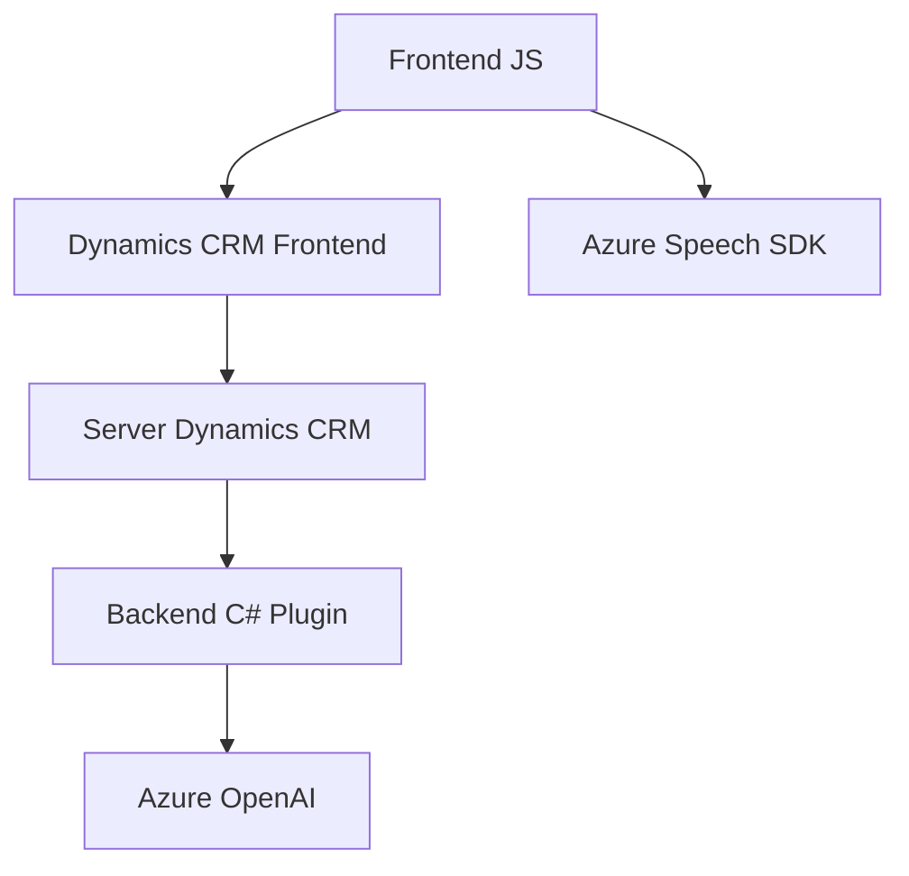

### Breve Resumen Técnico:
Este repositorio contiene integraciones avanzadas de entrada de voz, procesamiento de texto en formularios dinámicos de CRM mediante Azure Speech SDK y Azure OpenAI. Los archivos están organizados en un sistema híbrido de frontend (JavaScript) y backend (C# plugins), con funcionalidades para manipular formularios, realizar solicitudes API, y transformar datos en tiempo real.

---

### Descripción de Arquitectura:
La solución implementa una arquitectura **n-capas** con integración directa a un sistema CRM, distribuyendo responsabilidades entre:
1. **Frontend JS**: Manejo de voz y texto directamente desde formularios interactivos en el cliente.
2. **Backend C#**: Plugins que procesan datos y utilizan servicios de Azure (OpenAI) para enriquecer y transformar los datos.

El sistema opera como una extensión de Dynamics CRM:
- **Frontend**: Funciones para capturar entrada de voz, sintetizar texto, y actualizar campos del CRM.
- **Backend**: Plugins que interactúan con el modelo de datos CRM y procesan datos mediante Azure OpenAI.

---

### Tecnologías Usadas:
1. **Frontend**:
   - **JavaScript**: Manipulación del DOM, funciones modulares.
   - **Azure Speech SDK**: Para entrada y salida de voz/transcripción.
   - **Dynamics 365 Web API**: Comunicación con el sistema CRM.
2. **Backend**:
   - **C#** con .NET Framework: Plugins basados en Dynamics CRM SDK.
   - **Azure OpenAI API**: Procesamiento de texto usando modelos GPT (ej. GPT-4).
   - **HttpClient, System.Text.Json**: Para interacción HTTP y manipulación de datos JSON.
   - **Newtonsoft.Json**: Procesamiento de estructuras JSON avanzadas.
3. **Modelo de integración**:
   - SaaS (Azure Speech y OpenAI están configurados como dependencias externas).
   - Repositorio-like Pattern para interactuar con datos del CRM.

---

### Diagrama Mermaid (GitHub Compatible):

---

### Conclusión Final:
La solución combina tecnologías para lograr una integración avanzada entre entrada de voz y procesamiento de datos en un entorno de CRM. Utiliza una arquitectura **n-capas**, dividiendo claramente las responsabilidades entre frontend y backend, y aprovechando servicios de Azure para sintetizar voz, transcribir datos, y aplicar inteligencia artificial. Sin embargo, ciertas áreas, como la gestión de credenciales (API Keys) y escalabilidad en el plugin, pueden mejorarse para fortalecer la seguridad y rendimiento, especialmente en ambientes empresariales con alta demanda.