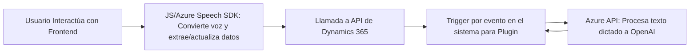

### Breve Resumen Técnico:
El repositorio analiza la integración de funcionalidades avanzadas de procesamiento de voz y manipulación de texto utilizando servicios de inteligencia artificial (Azure Speech SDK y Azure OpenAI) en Dynamics 365. La solución incluye frontend en JavaScript para interacción del usuario y plugins en .NET para lógica avanzada.

---

### Descripción de Arquitectura:
La arquitectura se centra en una solución **mixta modular**, combinando un frontend de interacción con APIs y un backend que utiliza **plugins de Dynamics CRM** con conexiones hacia servicios externos como Azure Speech SDK y OpenAI.:
- El frontend utiliza patrones de **facade** y modularidad para organizar tareas relacionadas con el procesamiento y extracción de datos desde formularios.
- El backend emplea el **Plugin Pattern** de Dynamics CRM para ejecutar lógica personalizada en eventos del sistema, asociada a servicios externos de procesamiento cognitivo.

Arquitectura destacada: **n capas** híbrido con integración de APIs externas para aumentar la funcionalidad del sistema sin dependencia de una arquitectura distribuida (microservicios) explícita.

---

### Tecnologías Usadas:
1. **Frontend**:
    - **Lenguaje**: JavaScript.
    - **Frameworks/Librerías**: Azure Speech SDK, manejo de APIs de Dynamics 365 (Xrm.WebApi).
    - Patrones: Modular, carga de dependencias dinámica, facade.

2. **Backend**:
    - **Lenguaje**: C#.
    - **Frameworks/Librerías**: Microsoft.Xrm.Sdk (API de Dynamics CRM).
    - Servicios externos: Azure OpenAI.
    - Patrones: Plugin Pattern, Service-Oriented Architecture (SOA), Dependency Injection.

3. **Plataforma**:
    - Dynamics 365 como ecosistema corporativo.
    - Azure services para inteligencia artificial (Speech SDK y OpenAI).

---

### Dependencias y Componentes Externos:
- **Azure Speech SDK**:
  - Sintetiza voz para datos textuales del formulario.  
  - Uso condicional con carga dinámica `ensureSpeechSDKLoaded`.

- **Azure OpenAI**:
  - Procesa texto para su transformación según normas específicas.
  - Se integra vía REST API mediante bibliotecas como `System.Net.Http`.

- **Dynamics CRM**:
  - API de Dynamics (`Xrm.WebApi` y `IPlugin`) para manipulación de datos en formularios y entidades.

---

### Diagrama Mermaid:

---

### Conclusión Final:
Esta solución implementa un sistema **n capas híbrido enfocado hacia la interacción avanzada de formularios mediante voz e inteligencia artificial**, logrando una integración efectiva entre frontend, la plataforma Dynamics CRM y servicios en la nube mediante APIs externas. Su diseño modular y uso adecuado de patrones arquitectónicos aseguran la escalabilidad y mantenibilidad del código. Sin embargo, el manejo seguro de claves y credenciales en los servicios externos es crítico para su correcta implementación.