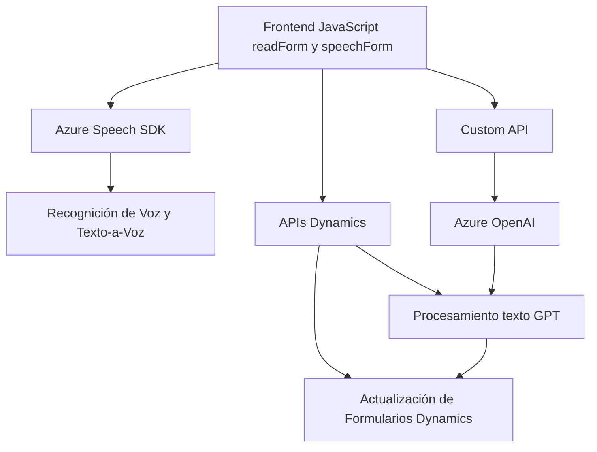

### Breve Resumen Técnico
El repositorio se centra en la integración de servicios de Azure y Dynamics CRM para realizar reconocimiento de voz, síntesis de texto a voz y manipulación automatizada de los formularios basados en entrada de datos, utilizando tanto acercamientos manuales como basados en inteligencia artificial (IA).

---

### Descripción de Arquitectura
La solución puede clasificarse dentro de una **arquitectura híbrida de sistemas conectados**, que integra servicios SaaS como Azure Speech SDK y Azure OpenAI con Dynamics CRM mediante un plugin y JavaScript frontend para manipulación dinámica de formularios dentro del entorno del cliente.

Se asemeja a una **arquitectura monolítica-expandida** en el sentido de que los diferentes componentes interactúan fuertemente con una instancia central de Dynamics CRM a través de su propio modelo de servicios. Sin embargo, agrega extensibilidad por integración de microservicios externos de Azure y APIs personalizadas.

---

### Tecnologías Usadas
1. **Frontend:**
   - Azure Speech SDK: Reconocimiento de voz, Text-to-Speech (TTS).
   - JavaScript ES6: Manipulación dinámica en el navegador.
   - Dynamics 365 JavaScript SDK para integración y manipulación de formularios.

2. **Backend:**
   - Dynamics CRM Plugin SDK (`IPlugin`, `IOrganizationService`): Gestión completa del ciclo de vida de los datos.
   - Azure OpenAI (GPT-4): Procesamiento avanzado de entradas textuales.
   - System.Text.Json / Newtonsoft.Json: Serialización y operación sobre objetos JSON.
   - C# y en parte .NET Framework, indicando compatibilidad con el ecosistema de Microsoft.

---

### Diagrama Mermaid válido para GitHub

---

### Conclusión Final
#### Análisis general:
La solución completa se orienta a crear una herramienta dinámica para manejar formularios de Dynamics 365 con capacidades avanzadas usando voz y text-to-speech, complementada por IA. Esto corresponde a una solución **integrada**, con características modulares por diferentes servicios de Azure y componentes SDK.

#### Posibilidades de mejora:
1. **Desacoplamiento**: Usar una arquitectura más orientada a microservicios, donde una API central coordine entre Azure Speech, Dynamics CRM y otros servicios externos como OpenAI, limitando lógica dispersa entre archivos frontend y plugins.
2. **Seguridad y Escalabilidad**: Implementar mejores prácticas de seguridad, como autenticación robusta entre servicios y optimización en procesamiento de solicitudes asincrónicas para evitar bloqueo de los flujos del CRM.