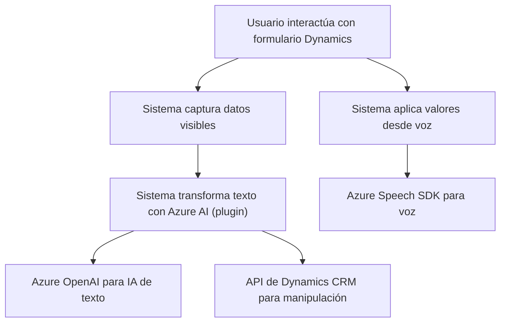

### Breve Resumen Técnico
El repositorio presenta una solución integral que integra el reconocimiento de voz y síntesis, procesamiento avanzado de texto con inteligencia artificial y manipulación dinámica de formularios en Microsoft Dynamics 365. Usa tecnologías como **Azure Speech SDK** y **Azure OpenAI**, además de técnicas modernas de integración de servicios REST y plugins extensibles.

### Descripción de Arquitectura
La arquitectura es **modular** y **orientada a servicios**, con la siguiente estructura:
1. **Frontend (JS)**: Funcionalidades cliente que interactúan con el SDK de Azure Speech para captura y síntesis de voz, además de la lógica para manipular datos de formularios en Dynamics 365.
2. **Backend (Plugins)**: Procesos ejecutados en el servidor de Dynamics CRM para transformar datos usando inteligencia artificial, formando una extensión funcional que sigue el patrón Plugin.
3. **Integración con servicios externos**: Abundante utilización de SDK y APIs (Azure Speech y OpenAI) que enriquecen la experiencia del usuario.

La solución presenta características de arquitectura de **n capas**:
- Capa de presentación (frontend en JS para interacción del usuario).
- Capa lógica y procesamiento (plugins y lógica especializada).
- Capa de datos y servicios externos (Azure, APIs).

### Tecnologías Usadas
1. **Frontend**:
   - **Javascript** para lógica en el cliente.
   - **Azure Speech SDK (REST)** para síntesis y reconocimiento de voz.
   - **Microsoft Dynamics 365** (manipulación de formularios).
2. **Backend**:
   - **C#** para plugins en Dynamics CRM.
   - **Azure OpenAI** para procesamiento avanzado de texto.
   - Manejo de APIs REST y serialización con `System.Net.Http` y `System.Text.Json`.
3. **Patrones Arquitectónicos**:
   - **Modularidad**: Separación clara por función.
   - **Integración con SDK externos**: Uso dinámico de dependencias Azure.
   - **Single Responsibility Principle** para operaciones CRUD y procesamiento en plugins.

### Dependencias o Componentes Externos
- **Azure Speech SDK** para la interacción de voz.
- **Azure OpenAI API** para el procesamiento de texto y normas.
- **Xrm.WebApi.online** en Dynamics 365 para la manipulación de datos.
- **Newtonsoft.Json** y **System.Text.Json** para serialización JSON en el backend.

### Diagrama Mermaid

### Conclusión Final
La solución es robusta y bien integrada, diseñada para entornos empresariales de alta interacción con formularios y datos sensibles como Dynamics CRM. Le permite adicionar valor mediante el reconocimiento de voz y procesamiento avanzado con inteligencia artificial. Sin embargo, sería prudente realizar una revisión de las credenciales de APIs utilizadas para garantizar la seguridad. La arquitectura modular asegura alta extensibilidad y mantenibilidad.