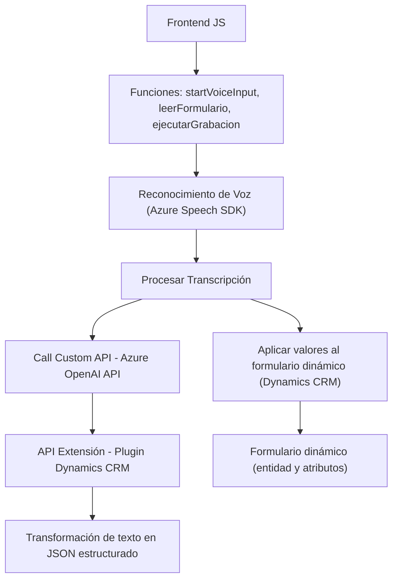

# Resumen Técnico

El repositorio combina múltiples archivos con funciones relacionadas al manejo de formularios dinámicos dentro de Microsoft Dynamics CRM. Se enfoca principalmente en dos capacidades: reconocimiento de voz y síntesis de voz utilizando **Azure Speech SDK** y procesamiento de texto con un modelo de **Azure OpenAI API**, formando una integración directa de tecnologías para aplicaciones empresariales orientadas a la automatización y accesibilidad.

---

# Descripción de la arquitectura

La arquitectura del sistema corresponde principalmente a un patrón de **arquitectura en capas (n-capas)** que interactúa con **Microsoft Dynamics CRM**. Está compuesto por tres capas principales:

1. **Frontend (JavaScript):** Actúa como la capa de presentación, interactuando directamente con los usuarios. Incluye funcionalidades como síntesis de voz, reconocimiento de voz y gestión de datos visibles en formularios.
2. **Backend (Plugins en C#):** Comprende la capa lógica de negocio donde se realiza el procesamiento más complejo de datos. Este manejo implica la ejecución de plugins y el consumo de servicios externos (Azure OpenAI).
3. **Integración con plataformas y APIs externas:** Integra servicios externos como **Azure Speech SDK** para capacidades de habla y reconocimiento de voz, y un modelo de IA de **OpenAI API** alojado en Azure para procesamiento y transformación avanzada de texto.

---

# Tecnologías, Frameworks y Patrones usados

**Tecnologías:**
- **Microsoft Dynamics CRM:** Plataforma de gestión de clientes donde se integran los formularios y plugins.
- **JavaScript:** Utilizado para manejo de eventos y procedimientos en el frontend.
- **Azure Speech SDK (JS):** Manejo de síntesis y reconocimiento de voz.
- **C#:** Lenguaje utilizado para implementar plugins en el backend.
- **Azure OpenAI API:** Para el procesamiento e interpretación del texto en formato JSON, y realizar mejoras con IA.
  
**Frameworks utilizados:**
- **Dynamics SDK:** Utilizado para interacción con la plataforma Dynamics CRM.
- **Newtonsoft.Json:** Utilizado en los plugins de C# para el manejo de estructuras JSON.
- **HTTP Client en C# .NET:** Para solicitudes REST hacia Azure OpenAI API.
  
**Patrones identificados:**
1. **Modularidad:** Funciones separadas en cada archivo para cumplir con tareas específicas. Esto favorece la reutilización y claridad del código.
2. **Carga Condicional:** Dinámica para el SDK de Azure Speech. Permite optimizar los recursos.
3. **Asincronía:** Uso intensivo de promesas y callbacks en las funciones JS y API calls.
4. **Arquitectura orientada a eventos:** Los scripts dependen de interacciones del usuario en los formularios.
5. **Service Locator Pattern:** Uso de servicios proporcionados por **Microsoft Dynamics CRM** mediante la interfaz `IPlugin`.
6. **Componentización:** División clara entre frontend, backend y servicios externos para maximizar la separación de responsabilidades.

---

# Posibles dependencias y componentes externos

1. **Azure Speech SDK:** Integración para síntesis y reconocimiento de voz.
2. **Azure OpenAI API:** Modelo IA para procesamiento de texto avanzado (GPT-variant).
3. **Microsoft Dynamics CRM:** Contexto de ejecución de formularios y lógica operativa.
4. **Newtonsoft.Json:** Para manejo de JSON en C#.
5. **Xrm.WebApi:** API para acceder y manipular los datos en Dynamics CRM.
6. **HTTP Client (.NET System.Net.Http):** Para consumo de servicios REST como OpenAI.
7. **HTML y DOM API (JavaScript):** Para la manipulación de formularios dinámicos en el frontend.

---

# Diagrama Mermaid válido para GitHub

---

# Conclusión Final

Este repositorio describe una aplicación dinámica basada en la **integración de tecnologías avanzadas como Azure Speech SDK y OpenAI**, dando soporte a capacidades de síntesis y reconocimiento de voz, transformaciones basadas en IA, y operaciones en formularios de **Dynamics CRM**. La solución adopta una arquitectura **orientada a eventos y basada en capas (n-capas)**, con una clara separación entre la capa de presentación, la lógica de negocio y las integraciones externas. Es ideal para escenarios corporativos donde se requiere automatización basada en voz y procesamiento inteligente, con directrices de extensibilidad mediante plugins y servicios API.