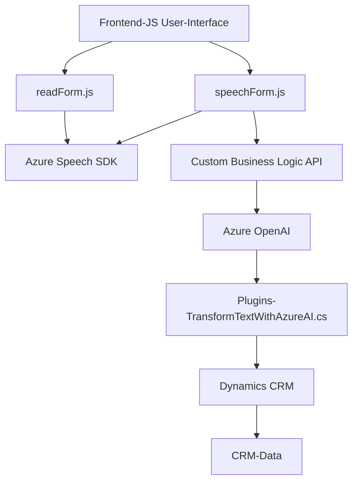

### Breve resumen técnico

El repositorio contiene archivos para la gestión de voz en formularios, integración con APIs de Azure Speech/AI y un plugin personalizado para Dynamics CRM que interactúa con Azure OpenAI. La solución está diseñada para gestionar datos dinámicos en formularios y procesos empresariales, utilizando inteligencia artificial y capacidades de reconocimiento/síntesis de voz. 

---

### Descripción de arquitectura

1. **Tipo de solución**:  
   - Es un **sistema híbrido** compuesto de un front-end para la interacción del usuario (formularios y voz), una integración con servicios externos (Azure Speech SDK y Azure OpenAI), y un **plugin backend** para Dynamics CRM. Esto lo posiciona como una solución **empresarial orientada al procesamiento de voz y datos**.

2. **Arquitectura**:  
   - Predominantemente utiliza **n capas**: 
      1. **Capa de presentación**: Código de front-end que interactúa directamente con el usuario (formularios, voz).  
      2. **Capa de lógica de negocio**: Procesamiento de formularios, transcripciones y transformaciones de texto usando APIs externas.  
      3. **Capa de datos**: Acceso a datos de Dynamics CRM mediante `Xrm.WebApi` y mappings de atributos.  
      4. **Servicios externos**: Azure Speech SDK y Azure OpenAI utilizados como microservicios externos.  

   - Uso de patrones como **modularidad**, **event-driven architecture** y **factory**.  
   - El plugin de Dynamics CRM sigue un enfoque **plugin/event handler**, extendiendo la lógica de negocio al backend del sistema.

---

### Tecnologías usadas

1. **Lado cliente (frontend)**:  
   - **JavaScript**: Gestión de DOM, carga dinámica del Azure Speech SDK, procesamiento de formularios y voz.
   - **Azure Speech SDK**: Sintetización/Reconocimiento de voz.  

2. **Backend (plugin)**:  
   - **C#**: Plugin para Dynamics CRM, interactúa con la API del sistema (`Microsoft.Xrm.Sdk`) y servicios externos.
   - **HTTP Client**: Interacciones con Azure OpenAI.
   - **Newtonsoft.Json** y **System.Text.Json**: Manipulación de estructuras JSON.

3. **APIs externas**:  
   - **Azure Speech SDK**: Gestión de reconocimiento/síntesis de voz.  
   - **Azure OpenAI**: Transformación avanzada de texto en JSON utilizando modelos de lenguaje.

---

### Diagrama Mermaid válido para GitHub

---

### Conclusión final

La solución presentada en el repositorio integra frontend (formulario y voz), API backend (para lógica avanzada con Azure), y plugins en Dynamics CRM, mostrando una arquitectura **modular en capas** que extiende la funcionalidad mediante servicios externos. Los patrones arquitectónicos empleados permiten escalabilidad, flexibilidad y fácil integración con sistemas externos. La elección de tecnologías como **Azure Speech SDK** y **Azure OpenAI** refuerza su capacidad para procesamiento avanzado y enriquecimiento de formulaciones empresariales.