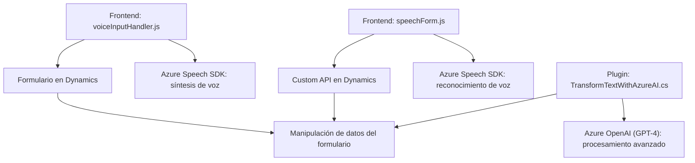

### Breve resumen técnico:

El repositorio parece ser parte de una solución integrada para formularios interactivos en entornos Dynamics 365, que incluye un frontend para procesamiento de voz basado en JavaScript y un backend (plugin) que utiliza Azure OpenAI. Proporciona funcionalidades como reconocimiento y síntesis de voz, procesamiento de datos de formulario, generación de formatos JSON estructurados con GPT-4, y manipulación de entidades de Dynamics 365.

---

### Descripción de arquitectura:

La solución tiene una arquitectura **modular de n capas**, con una clara separación entre las capas de presentación (frontend en JavaScript), negocio (procesamiento de datos y lógica en plugins de Dynamics 365), y servicios externos (integración con Azure Speech SDK y Azure OpenAI). No hay indicios de microservicios, por lo que la arquitectura está diseñada para ser un **monolito modular**, especialmente dentro del contexto de Dynamics 365.

Patrones relevantes:
- **Modularización:** Cada módulo tiene funciones específicas claramente aisladas (procesamiento de voz, lectura de formularios, generación de JSON).
- **Integración externa:** Uso de SDKs y APIs externas (Azure Speech y OpenAI).
- **Data Mapper:** Mapeo de campos entre el formulario y las transcripciones procesadas.
- **Plugin pattern:** Uso de la interfaz `IPlugin` en Dynamics 365 para implementar lógica de negocio mientras aprovecha servicios de Azure.

---

### Tecnologías usadas:

- **Frontend**:
  - **JavaScript**: Para procesamiento de datos, síntesis y reconocimiento de voz.
  - **Azure Speech SDK**: Realiza síntesis de voz y reconocimiento a través de CDN.
  - **Dynamics Web API (`Xrm.WebApi`)**: Interactúa con datos de formularios y entidades en Dynamics 365.

- **Backend**:
  - **C# (.NET Framework)**: Implementación de plugins como lógica de negocio.
  - **Azure OpenAI**: Utiliza GPT-4 para procesar y transformaciones avanzadas de texto.
  - **HTTP Client**: Consumo de APIs externas (OpenAI).

- **Servicios**:
  - **Azure Speech** (en frontend): Procesa síntesis y reconocimiento de voz.
  - **Azure OpenAI Service** (en backend): Realiza transformaciones avanzadas basadas en GPT-4.

---

### Diagrama Mermaid válido para GitHub:

---

### Conclusión final:

La solución integra tecnologías modernas (Azure Speech y OpenAI) con Dynamics 365 para ofrecer una experiencia avanzada de procesamiento de información en formularios. La arquitectura es monolítica pero modular, con claras capas y responsabilidades. Es ideal para entornos empresariales integrados con Dynamics 365, optimizando la interacción mediante voz y AI. El diagrama Mermaid refleja cómo los componentes colaboran y cómo se distribuyen las dependencias entre el frontend, backend y servicios externos.