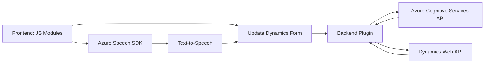

### Breve resumen técnico:
Este repositorio desarrolla una solución que integra un sistema de reconocimiento y síntesis de voz con una plataforma de formularios (Dynamics 365) para automatizar entradas y transformaciones de datos en tiempo real. Utiliza el **Azure Speech SDK** para transcripción y síntesis de voz, mientras que un plugin de Dynamics CRM interactúa con la **API de Azure OpenAI** para transformar texto mediante reglas personalizadas.

---

### Descripción de arquitectura:
Este conjunto de archivos y componentes apunta a una arquitectura **orientada a servicios (Service-Oriented Architecture - SOA)**. Incluye las siguientes características:
1. **Frontend dinámico**: Los archivos JavaScript manejan la lógica de front-end, iterando sobre formularios e interactuando directamente con usuarios para capturar entradas de voz o realizar síntesis.
2. **Backend basado en plugin**: El componente `TransformTextWithAzureAI.cs` actúa como un plugin de Dynamics CRM que aprovecha la API de Azure OpenAI, adecuado para procesamiento textual y actualización de datos del sistema CRM.
3. **Patrones conocidos**:
   - Observador: Carga de SDK de forma dinámica y ejecución de un callback.
   - Builder: Configuración flexible del Azure Speech SDK.
   - Adaptador: Integración con APIs externas mediante wrappers para estructurar datos hacia/desde servicios HTTP.
   - Event-Driven Programming: Reacción a eventos generados por interacción del usuario o del sistema.

La arquitectura es modular y busca integrar dos servicios básicos (Azure y Dynamics CRM) en un flujo funcional, siendo la solución principalmente orientada al modelo **n-capas** y un enfoque **cliente-servidor**, más que una desconexión completa típica de los microservicios.

---

### Tecnologías usadas:
1. **Frontend**:
   - Programación: **JavaScript**.
   - SDK: **Azure Speech SDK** para texto a voz y transcripción por IA.
   - Framework integrado: **Dynamics 365 UI** con uso de `executionContext` y `formContext`.

2. **Backend**:
   - Plataforma: **Dynamics CRM**.
   - Plugin: **C# .NET Framework**.
   - Biblioteca para manejo de JSON: **Newtonsoft.Json**.
   - Librería HTTP: **System.Net.Http**.
   - **Azure OpenAI API** para procesamiento y transformación de texto.

---

### Diagrama Mermaid:

---

### Conclusión final:
Este repositorio implementa una solución de autoservicio completa basada en la integración de servicios externos (Azure Speech SDK y Azure OpenAI API) con la plataforma de Dynamics 365. Se centra en automatizar la entrada de datos de formularios mediante reconocimiento de voz y en enriquecer los datos procesados por IA para una mejor experiencia de usuario. Es una arquitectura de **n-capas** simplificada con orientaciones hacia **SOA** y patrones conocidos que aseguran modularidad y capacidad para escalar. La combinación de tecnologías permite aprovechar las capacidades cognitivas de Azure mientras mantiene una arquitectura robusta en Dynamics 365.