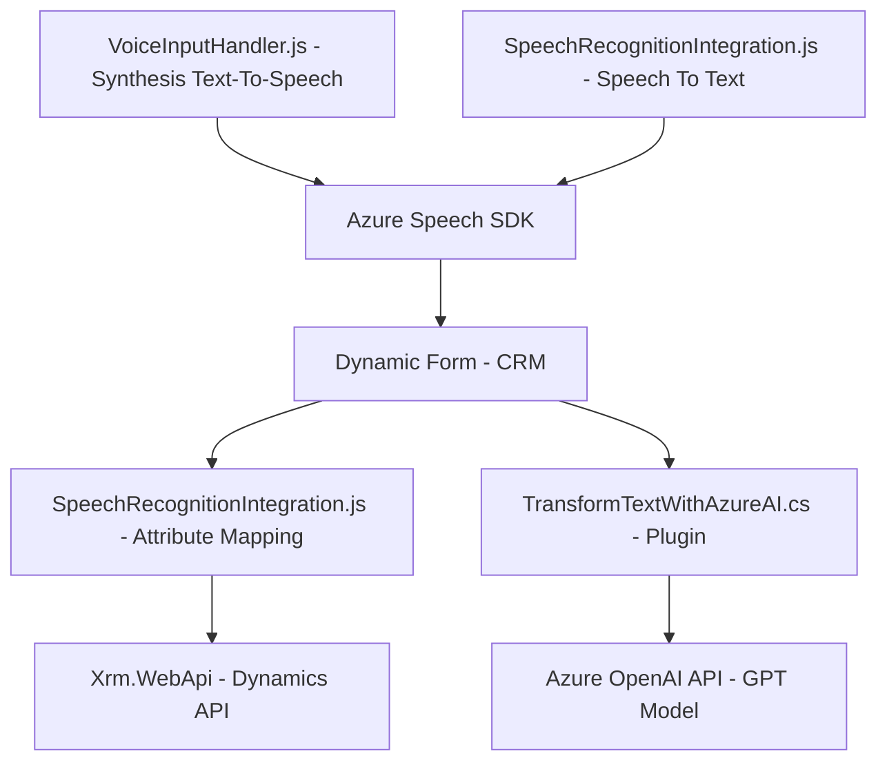

### Breve resumen técnico

La solución se centra en integrar funcionalidades de accesibilidad (mediante reconocimiento de voz y síntesis con el **Azure Speech SDK**) y procesamiento avanzado de texto (mediante **Azure OpenAI API**) en una arquitectura híbrida. Se compone de tres partes: un frontend orientado al reconocimiento y generación de voz, interacción con formularios dinámicos, y un plugin backend para procesamiento avanzado de texto. La finalidad es aumentar la accesibilidad y eficiencia en aplicaciones empresariales principalmente de **CRM Dynamics 365**.

---

### Descripción de arquitectura

La arquitectura es **n-capas** con integración directa entre frontend, CRM Dynamics y servicios externos. El frontend sigue un enfoque **modular**, dividido en archivos especializados para la síntesis de voz (`VoiceInputHandler.js`) y reconocimiento de voz (`SpeechRecognitionIntegration.js`). En el backend, el plugin `TransformTextWithAzureAI.cs` sirve como conectividad a servicios externos de IA (Azure OpenAI), mientras que su lógica se basa en patrones como **encapsulación** (a través del método `GetOpenAIResponse`) para mantener independencia con respecto a servicios externos.

La comunicación entre capas utiliza APIs (Dynamics WebAPI, Azure Speech API y OpenAI API). Las capas son:

1. **Frontend**: Implementación de reconocimiento y síntesis de voz, junto con gestión dinámica de formularios.
2. **Backend**: Lógica integrada como un plugin para CRM Dynamics. Se conecta con Azure OpenAI para transformar texto basado en reglas y proporciona la salida al sistema CRM.
3. **Servicios externos**: Azure Speech SDK y Azure OpenAI constituyen los servicios externos para reconocimiento de voz, síntesis de texto hablado y transformación de texto con IA.

---

### Tecnologías usadas

**Frontend:**
- Lenguaje: JavaScript
- SDK: Azure Speech SDK
- Interacción (CRM): Dynamics Forms y Xrm.WebApi

**Backend:**
- Lenguaje: C#
- APIs:
  - Microsoft CRM Dynamics SDK (`Microsoft.Xrm.Sdk`)
  - Azure OpenAI API para modelos GPT
- Frameworks: .NET (para desarrollar plugins de Dynamics)

**Servicios externos:**
- **Azure Speech SDK**: Reconocimiento y síntesis de voz.
- **Azure OpenAI**: Análisis y transformación de texto mediante modelos de inteligencia artificial.

**Patrones de diseño:**  
- **Facade**: Simplifica y encapsula la interacción con servicios complejos como el SDK o las APIS externas.
- **Delegación**: Procesa lógica en servicios externos (Azure Speech y OpenAI) para especialización.
- **Modularidad**: Separación en funcionalidades específicas dentro de los archivos.
- **Encapsulación**: Centralización de lógica externa en métodos independientes dentro del plugin backend.

---

### Diagrama Mermaid

Diagrama que representa los componentes principales y su interacción, siguiendo las reglas proporcionadas:

---

### Conclusión final

La solución integra una arquitectura **n-capas** y diseño extensible para aumentar la accesibilidad y procesamiento dinámico en aplicaciones empresariales como CRM Dynamics 365. Con módulos frontend y plugins backend, depende de servicios externos (Azure Speech SDK y OpenAI API) para reconocimiento, síntesis y transformación de texto, haciendo uso de patrones como **facade** y **modularidad** para simplificar la interacción y mejorar la reutilización del código.

Es una solución robusta adecuada para entornos empresariales centrados en mejorar la experiencia del usuario mediante aplicaciones inteligentes integradas con IA y voz.