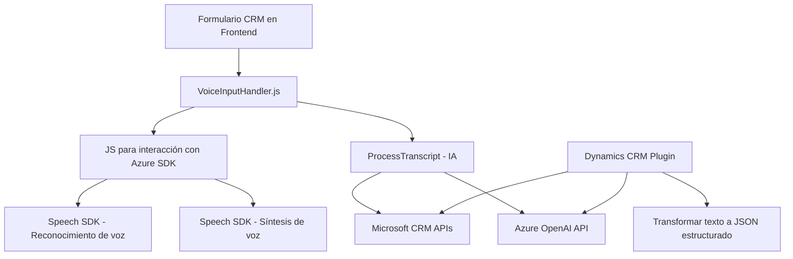

### Breve resumen técnico
El repositorio contiene módulos que integran funcionalidades de voz, inteligencia artificial y accesibilidad con formularios dentro de un ecosistema CRM basado en Microsoft Dynamics. Los archivos emplean servicios de Azure (Speech SDK y OpenAI), lo que permite la síntesis de voz, reconocimiento de texto hablado y la transformación de texto en datos estructurados. La solución contiene componentes que cumplen con los principios de modularidad, extensibilidad, y adaptabilidad.

---

### Descripción de arquitectura
La arquitectura adoptada se clasifica como **modular con enfoque basado en plugins**, siendo ideal para adaptar funcionalidades dentro de un ambiente CRM orientado a extensibilidad. Los principales componentes incluyen tres niveles:
1. **Capa de front-end con JavaScript:** Administra la interacción con formularios, voz y conexión externa al SDK de voz.
2. **Capa de API integrada (plugin en Dynamics CRM):** Implementa la lógica de transformación avanzada con servicios como Azure OpenAI para el procesamiento de texto.
3. **Dependencias externas (Azure Speech SDK, Microsoft APIs y Azure OpenAI API):** Complementan las operaciones como síntesis y análisis de datos.

La arquitectura conceptual se alinea con el patrón **n-capas**, aunque existen características de estilo modular y servicios externos que lo proyectan hacia un enfoque **hexagonal**, permitiendo adaptaciones y extensiones mediante APIs y SDKs.

---

### Tecnologías usadas
1. **Frontend:**
   - **JavaScript:** Implementación en el navegador para interacción en formularios.
   - **Azure Speech SDK:** Usado en los módulos de voz para reconocer texto y sintetizar audio.
   - **Microsoft Dynamics CRM libraries (Xrm.WebApi):** Para manipulación y acceso a datos en formularios y entidades.

2. **Backend:**
   - **C#/.NET Framework:** Implementación de un plugin para Microsoft CRM.
   - **Azure OpenAI API:** Integración con el servicio OpenAI de Azure para IA (procesamiento de texto y generación de datos estructurados).
   - **Newtonsoft JSON:** Manipulación avanzada de objetos JSON en la capa de backend.

3. **Servicios externos:**
   - **Azure Speech SDK API:** Reconocimiento y síntesis de voz en tiempo real.
   - **Azure OpenAI API:** Generación de respuestas estructuradas basadas en inteligencia artificial.
   - **Microsoft Dynamics CRM API:** Extensión de funcionalidades en formularios y entidades del sistema.

---

### Diagrama Mermaid válido para GitHub

---

### Conclusión final
La solución presentada utiliza una arquitectura modular n-capas orientada a extensibilidad, especialmente diseñada para integrarse con Microsoft Dynamics CRM. Se explotan servicios cloud como Azure Speech SDK y Azure OpenAI para funcionalidades avanzadas de voz y generación de estructuras de datos, mejorando en accesibilidad y productividad. El flujo está bien organizado dentro de los módulos de frontend, backend y plugins, y utilizan patrones como **callback**, **API integration**, y **facade**. Es adecuada para escenarios empresariales donde la automatización y la exactitud basada en IA son requisitos clave.