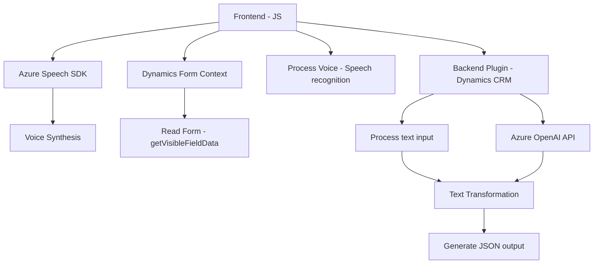

### Breve resumen técnico

El repositorio describe una solución basada en la integración entre componentes frontend de JavaScript y un backend de Microsoft Dynamics 365, combinando procesamiento de voz, manipulación de formularios y acceso a API de Azure AI. Específicamente, proporciona funcionalidad para transformar texto y voz usando servicios externos, como Azure Speech SDK y Azure OpenAI.

---

### Descripción de arquitectura

La solución se basa en una arquitectura **híbrida** que combina módulos independientes en el frontend (JavaScript) y extensiones específicas en el backend server-side (C# para Dynamics Plugins). A nivel general:

1. **Frontend**:
   - Se utiliza para interactuar con usuarios en formularios, capturar datos visibles y realizar procesamiento de entrada/salida de voz. Este componente usa servicios de reconocimiento y síntesis de voz de Azure Speech SDK.
   - La arquitectura es modular, con separación de responsabilidades (manejo de formularios, conversión de datos, y síntesis de voz).

2. **Backend Plugins**:
   - Los plugins están integrados en el entorno de Dynamics CRM y se ejecutan en eventos específicos del sistema. Utilizan servicios Azure OpenAI para generar una salida estructurada (JSON) basada en texto de entrada.
   - Está basado en el patrón de **diseño de plugins**, típico de Microsoft Dynamics.

---

### Tecnologías usadas

1. **Frontend (JavaScript)**:
   - **Azure Speech SDK**: Para la síntesis y reconocimiento de voz.
   - **JavaScript**: Manejo de formularios y datos.
   - **Integración dinámica de APIs**.

2. **Backend Plugins (.NET)**:
   - **Microsoft Dynamics CRM SDK**: Para integración directa como plugins.
   - **Azure OpenAI**: Transformación avanzada de texto para producir JSON estructurado.
   - **Bibliotecas estándar de .NET**:
     - `Newtonsoft.Json` para manipulación de JSON.
     - `HttpClient` para realizar solicitudes HTTP.
     - `System.Linq` para operaciones funcionales.

3. **Patrones y Principios**:
   - Modularidad funcional: Separación de responsabilidades en funciones individuales que se integran para ofrecer una solución completa.
   - Integración API: Las llamadas a servicios externos (Azure Speech y OpenAI) son centrales a la funcionalidad.
   - Diseño por eventos (Backend Dynamics): Plugins responden a eventos específicos como parte de configuraciones de negocio.

---

### Diagrama Mermaid válido para GitHub Markdown:

---

### Conclusión final

La solución está diseñada para implementar una integración fluida entre frontend y backend, aprovechando API externas como Azure Speech SDK y OpenAI. La arquitectura híbrida combina:

- **Responsabilidad del frontend**: Procesamiento de entrada visual y de voz, interacción con el usuario y transformación en datos útiles.
- **Responsabilidad del backend**: Generación de datos estructurados mediante normas predefinidas con servicios de IA.

En general, el diseño es modular, extensible y con integración API bien definida, lo que permite su escalabilidad en ambientes corporativos como Dynamics CRM.