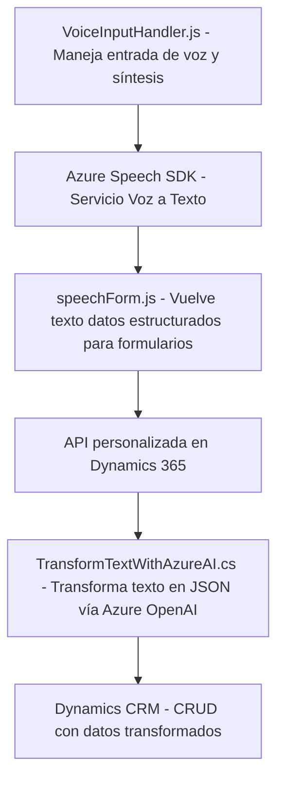

### Breve resumen técnico
El repositorio analiza tres archivos (`VoiceInputHandler.js`, `speechForm.js` y `TransformTextWithAzureAI.cs`), responsables del manejo de entrada y procesamiento de voz con tecnologías como **Azure Speech SDK**, **Dynamics 365 WebAPI**, y **Azure OpenAI GPT**. El objetivo principal de la solución es integrar dinámica y automáticamente datos de voz en formularios y transformarlos según reglas específicas dentro del entorno Dynamics CRM.

---

### Descripción de arquitectura
La solución utiliza una combinación de estructura en capas orientada a eventos e integración con servicios externos. Esto permite identificar los siguientes patrones arquitectónicos:
- **N-capas**: Organización de la funcionalidad en niveles diferenciados compuestos por entrada (voz), procesamiento (Azure Speech SDK/Azure OpenAI), y servicios CRM (Dynamics 365).
- **Service Layer**: Implementación modular en el manejo de integración con SDKs y APIs externas.
- **Event-driven architecture**: Respuesta asincrónica a eventos como la carga de SDK o la activación de plugins desde Dynamics CRM.
- **Microservicios ligeros**: Aunque no presenta una arquitectura completa basada en microservicios, el plugin `TransformTextWithAzureAI.cs` actúa como un servicio independiente especializado en procesamiento de texto con OpenAI.

---

### Tecnologías usadas
**Frontend (`VoiceInputHandler.js`, `speechForm.js`):**
- **Lenguaje**: JavaScript (ES6+).
- **Frameworks/SDK usados**:
  - **Azure Speech SDK**: Manejo de texto a voz y voz a texto.
  - **Dynamics 365 WebAPI**: Manipulación de datos dentro del CRM y llamada a APIs personalizadas.
  - **Navegador**: Carga dinámica de scripts con `document`.

**Backend (`TransformTextWithAzureAI.cs`):**
- **Lenguaje**: C#.
- **Frameworks/SDK usados**:
  - **Azure OpenAI GPT**: Transformación avanzada de texto según reglas predefinidas.
  - **Newtonsoft.Json** y **System.Text.Json**: Manejo y serialización de JSON.
  - **Dynamics CRM SDK**: Acceso y manipulación de datos en CRM.
  - **HTTPClients**: Consumo de APIs externas.

---

### Diagrama **Mermaid** válido para GitHub Markdown

---

### Conclusión final
La solución presentada utiliza una estrategia modular y orientada a la integración con servicios externos, ideal para sistemas que necesitan funcionalidades avanzadas como la síntesis de voz o transformación de texto en tiempo real. La arquitectura es híbrida, combinando patrones de **n-capas** y **event-driven** para gestionar flujos específicos dentro de entornos complejos como Dynamics CRM.

El enfoque sobre SDKs (Azure Speech y OpenAI GPT) refuerza las capacidades de procesamiento avanzado, mientras que el uso de plugins y APIs asegura extensibilidad y personalización. Este diseño es adecuado para aplicaciones empresariales donde coexistan la interacción con usuarios y operaciones CRM complejas.