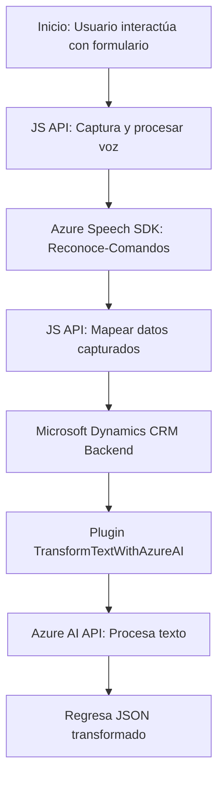

### Análisis técnico integral

#### Breve resumen técnico
El repositorio contiene tres archivos principales distribuidos en dos directorios bajo la estructura `FRONTEND/JS` y `Plugins`. Estos archivos implementan funcionalidades relacionadas con la interacción con formularios y voz en una aplicación que se integra con **Azure Speech SDK** y **Azure OpenAI API**. El backend está vinculado a **Microsoft Dynamics CRM**, lo que sugiere una aplicación empresarial para manejo de datos integrados.

---

### Descripción de arquitectura

1. **Tipo de solución:** Este sistema corresponde a una solución híbrida que incluye:
   - Una **API externa** en Azure para procesamiento de voz y datos con OpenAI.
   - Un **frontend web interactivo**, orientado principalmente a la integración con formularios y voice user interface.
   - **Plugins de backend** ejecutados dentro del ecosistema Dynamics CRM, operando como extensiones bajo un esquema similar a microservicios.

2. **Tipo de arquitectura:** 
   - Es una arquitectura de **n capas** con separación de capas de presentación (frontend), lógica de negocio (plugins y lógica del aplicativo), y nivel de datos (Microsoft Dynamics CRM).
   - Uso de **event-driven architecture** para escuchar y procesar eventos de entrada (voz) desde el cliente.
   - La integración con APIs externas como Azure Speech SDK y Azure OpenAI posiciona la aplicación en el ámbito de los microservicios, donde el backend actúa como una orquestación de servicios distribuida.

---

### Tecnologías usadas

1. **Frontend:** 
   - **JavaScript:** Para implementar interacción con formularios y voz.
   - **Azure Speech SDK:** Reconocimiento de voz y síntesis de texto a voz, cargado dinámicamente desde un endpoint predefinido.

2. **Backend:**  
   - **Microsoft Dynamics CRM SDK:** Extensiones mediante la implementación de plugins.
   - **Azure OpenAI API:** Para transformar texto según reglas.
   - **C#**: Desarrollo de la lógica del plugin (utilizando principios de clean architecture).

3. **Dependencias:**
   - JSON manipulación: `Newtonsoft.Json`, `System.Text.Json`.
   - Dynamics SDK para manejar los datos del formulario.
   - HTTP requests manejados por `HttpClient`.

4. **Patrones de diseño/arquitectura:**
   - **Carga dinámica de dependencias:** El SDK de Azure Speech se carga dinámicamente según necesidad en el frontend.
   - **Plugin pattern:** En la integración con Dynamics CRM para extender funcionalidades administrativas.
   - **Factory Method:** Configuración de instancias requeridas por el SDK (e.g., `SpeechConfig`).
   - **Microservicios básicos:** Comunicación mediante APIs externas para funcionalidades específicas que no están acopladas al sistema principal.
   - **MVC:** Separación implícita de responsabilidades en la arquitectura global del sistema.

---

### Dependencias o componentes externos

1. **Front-End:** 
   - Azure Speech SDK (JavaScript Speech Browser SDK).
   - Posiblemente Framework de frontend (React/Angular/Vue), aunque no se especifica en los archivos proporcionados.

2. **Backend:**
   - Dynamics CRM Platform y su SDK.
   - Azure OpenAI API para procesamiento de texto.
   - Dynamics Web API (`Xrm.WebApi`) para manipulación y consulta de datos.

---

### Diagrama **Mermaid**

---

### Conclusión final

La solución presentada es una arquitectura de **n capas** y **microservicios básicos**, diseñada para habilitar la integración entre Microsoft Dynamics CRM, Azure Speech SDK y Azure OpenAI API. La comunicación está basada en eventos del frontend (voz y datos de formularios), que fluyen hacia el backend para procesamiento adicional. La inclusión de tecnologías de inteligencia artificial, como el reconocimiento de voz y procesamiento de lenguaje natural, la hace altamente escalable y adecuada para entornos empresariales modernos. 

Las buenas prácticas, como la modularización, uso de patrones (Plugin y Factory), carga dinámica de dependencias y separación de capas, refuerzan la calidad y profesionalización del código. Sin embargo, falta confirmación sobre el framework de frontend empleado para concluir la interacción completa.