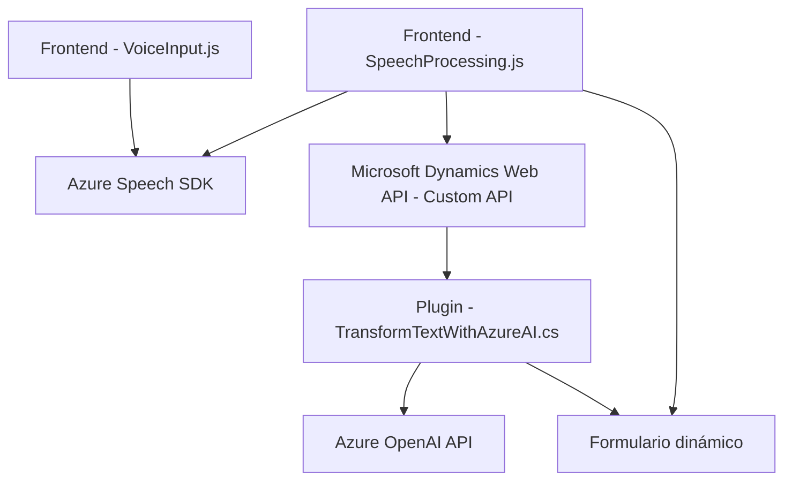

### Breve Resumen Técnico

El repositorio parece contener una solución diseñada para interactuar con formularios dinámicos mediante reconocimiento de voz y síntesis de texto, además de integrar servicios de IA. Combina frontend en JavaScript con un plugin backend en C# para plataformas como Dynamics CRM, utilizando Azure Speech SDK y Azure OpenAI.

---

### Descripción de Arquitectura

La solución presenta una arquitectura **de cliente-servidor** con funcionalidades distribuidas:
1. **Frontend**: Realiza reconocimiento de voz (entrada de datos) y síntesis de texto hablado mediante Azure Speech SDK, gestionando transcripciones y su asignación a formularios dinámicos.
2. **Backend Plugin**: Maneja reglas de transformación textual mediante Azure OpenAI en Microsoft Dynamics CRM, implementando lógica empresarial como parte de un sistema **plugin**.

Aunque no presenta una arquitectura estrictamente modular, destaca:
- **N-Capas en el backend**: Plugin que ejecuta lógica de presentación y negocio.
- **Estructura funcional en frontend**: Uso modular de funciones JavaScript asociadas al trabajo con formularios dinámicos y API personalizada.

---

### Tecnologías Usadas

1. **Frontend**:
   - **Azure Speech SDK** (`https://aka.ms/csspeech/jsbrowserpackageraw`).
   - **JavaScript**: Manejo de formularios (DOM) y eventos.
   - **Microsoft Dynamics Web API**: Realiza integraciones API específicas.

2. **Backend**:
   - **C# Dynamics CRM Plugins** (`IPlugin`).
   - **Azure OpenAI API**: Procesamiento de texto.

3. **Dependencias externas**:
   - `Newtonsoft.Json` y `System.Text.Json`: Para manejar la serialización/deserialización JSON en el plugin.

---

### Diagrama Mermaid (Compatible GitHub Markdown)

---

### Conclusión Final

La solución combina un enfoque de reconocimiento de voz (front-end) con procesamiento avanzado mediante inteligencia artificial (back-end). Su diseño refleja integración robusta con Azure y Microsoft Dynamics para trabajar con formularios y manipular datos. Aunque la arquitectura es mixta, destaca una división funcional clara entre frontend y backend, orientando el frontend a servicios de usuario y el backend a procesamiento empresarial. 

Además, la integración con APIs como Azure Speech y Azure OpenAI refuerza el uso de servicios externos avanzados, pero aumenta la dependencia de dichos servicios para la funcionalidad clave.