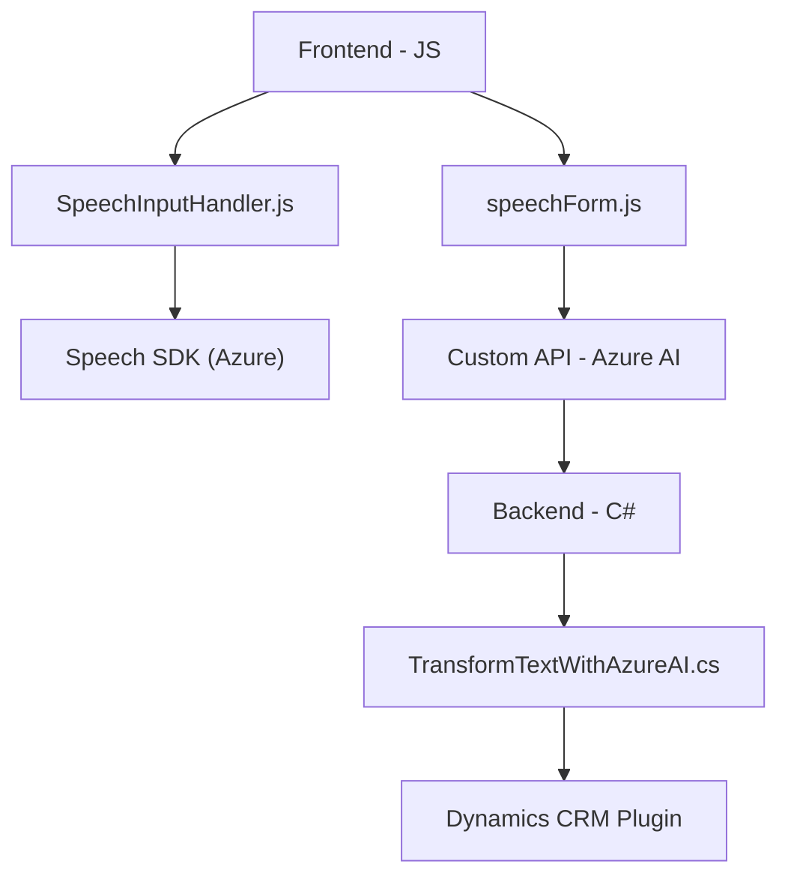

### Breve resumen técnico
Este repositorio combina lógica frontend basada en JavaScript y un backend en .NET (C#) orientado a Dynamics CRM con integración externa a Azure Speech SDK y Azure OpenAI API. La solución es modular y busca transformar la interacción con formularios para gestionarlos mediante entrada y salida de voz, procesando datos dinámicamente con ayuda de IA.

---

### Descripción de arquitectura
La arquitectura utiliza **n capas** con una integración entre el front-end y los plugins del back-end alojados en Dynamics CRM. Esta estructura separa responsabilidades: el frontend captura y procesa datos del usuario a través de voz, mientras que el backend transforma texto con reglas predefinidas mediante una integración con servicios de Azure. Aunque no hay evidencia directa de microservicios, se emplea un paradigma orientado a servicios externos (API Azure OpenAI y Speech) y plugins en el servidor.

---

### Tecnologías usadas
#### Frontend:
- **JavaScript** para procesamiento síncrono/asíncrono y captura de datos.
- **Azure Speech SDK** para reconocimiento y síntesis de voz.
- **DOM API** para manipulación dinámica.
- **Dynamics CRM Frontend API** para interacción con formularios.

#### Backend:
- **C# (.NET Framework)** para desarrollo de plugins.
- **IPlugin de Dynamics CRM** para ejecución de lógica en servidores.
- **System.Net.Http** y **System.Text.Json** para consumir la API de Azure OpenAI.

#### Externas:
- **Azure OpenAI API** para procesamiento de texto avanzado.
- **Azure Speech SDK** para reconocimiento/síntesis de voz.

---

### Diagrama Mermaid válido para GitHub

---

### Conclusión final
Este repositorio ejemplifica una solución orientada al procesamiento de interacción por voz en formularios dińámicos, complementada por generación de texto estructurado a través de IA. Se combina arquitectura **n capas** con integración de APIs externas. Aunque no se implementa una arquitectura de microservicios, la externalización a Azure refuerza un estilo híbrido que mezcla los modelos tradicionales con los beneficios escalables de la computación en la nube. Aspira a proporcionar una experiencia eficiente en entornos empresariales basados en Dynamics CRM.