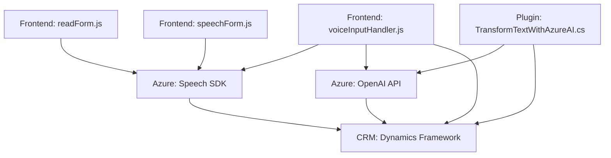

### **Breve resumen técnico**

El repositorio implementa una solución multicomponente orientada a la integración de reconocimiento y síntesis de voz con un sistema CRM (Microsoft Dynamics) utilizando el Azure Speech SDK y OpenAI. La solución incluye:  
1. **Frontend**: Archivos JavaScript para realizar reconocimiento de voz, síntesis y actualización dinámica de formularios.  
2. **Backend/Runtime Plugins**: Clase en C# diseñada como plugin para Dynamics CRM que interactúa con Azure OpenAI para transformar texto basado en reglas predefinidas.

---

### **Descripción de la arquitectura**

La arquitectura es **modular y multicomponente**, compuesta por partes frontend (JavaScript) que interactúan con interfaces de usuario y backend (C# plugins) que manejan la lógica de negocio avanzada en un entorno Dynamics CRM. Los patrones utilizados son:

- **Multicapa**:
  - **Frontend** (presentación/interfaz): JavaScript maneja el reconocimiento/síntesis de voz y la interacción dinámica con formularios CRM.
  - **Integración externa**: Azure Speech SDK y OpenAI para funcionalidades avanzadas (voz/texto).
  - **Backend**: Plugins en C# se ejecutan en Dynamics CRM para normas específicas de transformación de datos.

- **Orientación hacia eventos (Event-driven)**: Los plugins son activados por eventos en Dynamics CRM basados en acciones definidas por la plataforma.  
- **Separación de responsabilidades**:
  - Cada archivo maneja una distinta capa de la aplicación, como reconocimiento de voz, síntesis de texto o ejecución de plugins basados en eventos para manejar la lógica y comunicación con APIs externas.

---

### **Tecnologías y frameworks usados**

1. **Frontend (JavaScript)**:  
   - **Azure Speech SDK**: Reconocimiento y síntesis de voz.  
   - **APIs de Dynamics CRM**: Para realizar operaciones en formularios dinámicos.  

2. **Backend (C# Plugins)**:  
   - **Microsoft Dynamics CRM SDK**: Para integrar la lógica de negocio con el contexto de la organización en Dynamics CRM.  
   - **Azure OpenAI API**: Transformación avanzada de datos (GPT-4).  
   - **Librerías estándar**: `System.Net.Http`, `Newtonsoft.Json` para realizar solicitudes HTTP y manejar datos JSON.

---

### **Diagrama Mermaid válido para GitHub**

---

### **Conclusión final**
La solución combina tecnologías modernas como Azure Speech SDK y Azure OpenAI con integración en un sistema CRM (Microsoft Dynamics). Tiene una arquitectura modular multicapa con separación de responsabilidades entre frontend y backend. Es fácilmente ampliable gracias al uso de SDKs externos y patrones bien definidos como integración externa (APIs) y arquitectura plugin-based en Dynamics. Sin embargo, debe cuidarse el manejo de las claves y credenciales, especialmente para Azure, para evitar riesgos de seguridad.