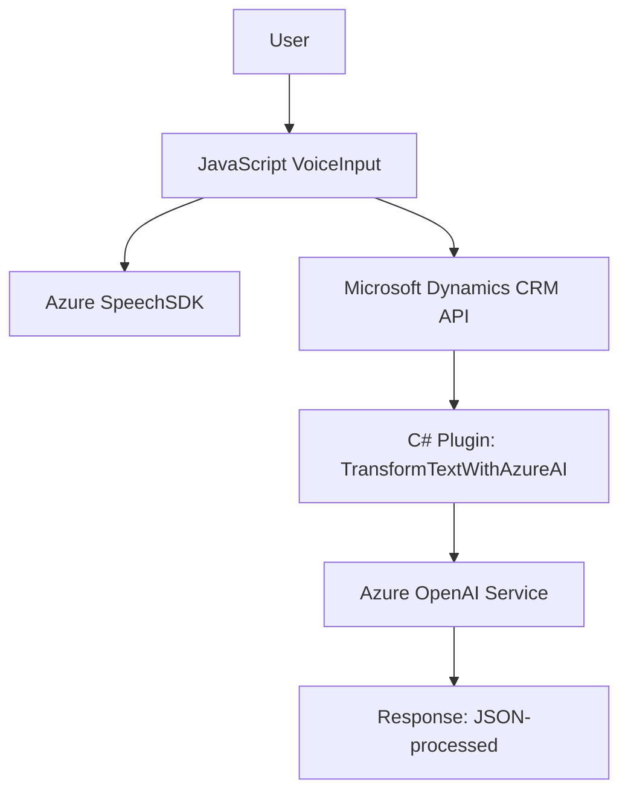

### Breve resumen técnico
El repositorio descrito incluye varios archivos que implementan funcionalidades relacionadas con la integración entre formularios web en Dynamics CRM, reconocimiento de voz y procesamiento de datos mediante inteligencia artificial en Azure. Esto se realiza utilizando un cliente JavaScript para el frontend y un Plugin escrito en C# para Dynamics CRM que usa OpenAI.

---

### Descripción de arquitectura
La arquitectura combina elementos de:
1. **Frontend modular:** El lado del cliente en JavaScript usa funciones independientes para cargar el Speech SDK dinámicamente, realizar reconocimiento de voz, procesar transcripciones y asignar campos en formularios CRM basados en información hablada.
2. **Backend-plugin:** En Dynamics CRM, un plugin analiza datos textual y aplica transformación semántica mediante servicios de IA conectados a Azure OpenAI.
3. **Integración API:** Tanto el frontend como el Plugin interactúan con servicios de Azure (Speech SDK y OpenAI) para lograr capacidades de síntesis y procesamiento avanzadas. Esto sugiere una arquitectura basada en integración con APIs externas y patrones de eventos asincrónicos.

En términos de fundación, la solución utiliza:
- **FRONTEND** en JavaScript con SDKs y dependencias externas.
- **BACKEND** en C# como parte de Dynamics CRM extensible.

La arquitectura general puede considerarse una **arquitectura híbrida**:
- En el frontend, es una arquitectura **modular** segmentada en funciones específicas.
- En el backend (plugin), sigue una **arquitectura n-capas** típica de los sistemas CRM (capa de negocio, capa de datos y capa de integración).

---

### Tecnologías usadas
1. **Frontend:**
   - JavaScript: Para procesar datos y realizar reconocimiento de voz.
   - SDK de Azure Speech: Funciones de síntesis y reconocimiento de voz.
   - Microsoft Dynamics CRM API (`Xrm`): Interacción con formularios.
   - Servicios REST externos: Custom API integrada para procesamiento IA.

2. **Plugin Backend (C#):**
   - Dynamics CRM SDK: Implementación de extensiones (`IPlugin`).
   - Servicios Azure OpenAI GPT-4 para análisis semántico.
   - `HttpClient` y `System.Text.Json`: Comunicación con servicios externos.

---

### Diagrama Mermaid (Archivo representativo completo del sistema)

---

### Conclusión Final
El sistema se presenta como una solución integrada para proporcionar capacidades avanzadas de voz y procesamiento de lenguaje natural. Implementa una combinación de tecnologías modernas en el frontend (JavaScript y Azure SDKs) con un backend extensible en Dynamics CRM (Plugins en C#). Aunque la arquitectura actualmente parece estar orientada a una solución monolítica y modular dentro del entorno CRM, tener dependencias externas sugiere que podría escalar como un componente de microservicios si lo demandara. Se recomienda implementar mejoras en la gestión de credenciales API y optimizar la lógica en cada módulo para garantizar robustez y extensibilidad, especialmente en escenarios de carga elevada o ecosistemas distribuidos más complejos.