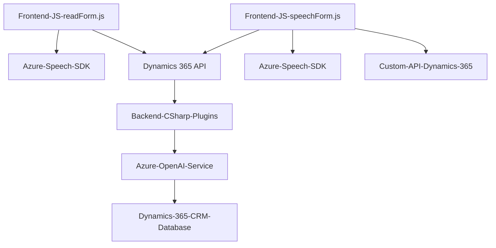

## Análisis detallado

### Resumen técnico
- **Tipo de solución:** Este repositorio contiene un sistema de integración basado en una **aplicación orientada a formularios (frontend), que utiliza tecnologías de reconocimiento y síntesis de voz junto con Azure Speech SDK**, así como un **plugin backend asociado a Dynamics CRM en C#** que aprovecha el servicio de Azure OpenAI para la transformación de texto en formatos estructurados como JSON. La solución está diseñada para mejorar la interacción con formularios mediante voz.
- **Arquitectura:** Arquitectura cliente-servidor con una integración externa basada en servicios cloud de Azure. El frontend presenta una **división modular** de funciones y patrones típicos de aplicaciones guiadas por eventos, mientras que el backend incorpora un **plugin bajo principios de extensión de Dynamics CRM**.
- **Tecnologías utilizadas:**
  - Frontend: Azure Cognitive Services Speech SDK, JavaScript (ES6), Azure Custom APIs.
  - Backend: Dynamics CRM SDK (`IPlugin`), Azure OpenAI Service, C#, Newtonsoft JSON y System.Net.Http para comunicación REST.

---

### Arquitectura

#### Tipo de arquitectura (frontend):
La arquitectura del frontend sigue un modelo **modular escalable** con un patrón típico de separación por responsabilidades (utiliza funciones específicas para tareas concretas como análisis de formulario, conversión de texto y síntesis de voz). Aunque intuye un enfoque de **integración de servicios externos**, la estructura es una capa del flujo cliente-servidor.

#### Tipo de arquitectura (backend):
La implementación en **C# para Dynamics CRM** sigue el modelo de **extensibilidad mediante plugins**. Estos se integran como servicios adicionales en el entorno de Dynamics CRM y permiten transformar datos mediante la conexión a servicios externos como Azure OpenAI.

#### Diseño arquitectónico general:
De la siguiente manera:
1. **Frontend:** Captura los datos visibles del formulario y proporciona funcionalidades de voz (lectura/reconocimiento).
2. **Backend:** Actúa como un servicio backend utilizando plugins y Azure para validar y transformar texto en JSON estructurado.

---

### Tecnologías y Frameworks
1. **Frontend (JavaScript):**
   - Azure Speech SDK: Reconocimiento de voz y síntesis de texto.
   - Dynamics 365 Context APIs: Para obtener datos del formulario y aplicar valores.
   - Asincronismo: Uso de `async/await` para integración fluida con servicios externos.
   - Modularidad: Código segmentado por acción específica.

2. **Backend (C#):**
   - Microsoft Dynamics SDK: Estructuración extensible mediante plugins.
   - Azure OpenAI Service: Transformación de texto usando modelos GPT-4 bajo REST API.
   - Newtonsoft.Json: Manipulación de JSON dinámico.
   - System.Net.Http: Comunicación con servicios externos.

---

### Dependencias o componentes externos:
- **Azure Cognitive Services:** Para el Speech SDK de síntesis y reconocimiento de voz.
- **Azure OpenAI Service:** Para procesamiento de lenguaje natural.
- **Dynamics CRM Web API:** Elemento crítico para insertar datos procesados en los formularios.
- **Custom APIs:** Para procesar el texto reconocido con IA en el frontend.

---

### Diagrama Mermaid:

---

### Conclusión final
La solución es un ejemplo avanzado de integración de servicios cloud y extensibilidad a través de Dynamics CRM. Es ideal para entornos empresariales que buscan optimizar la interacción de usuarios mediante interfaces de formularios dinámicas combinadas con tecnologías de voz y procesamiento IA. Sin embargo, es dependiente de múltiples servicios externos, lo que requiere monitoreo continuo en las configuraciones de credenciales y puntos de acceso. La arquitectura es modular y adecuada para mantener escalabilidad a medida que se agregan nuevos servicios o funcionalidades.