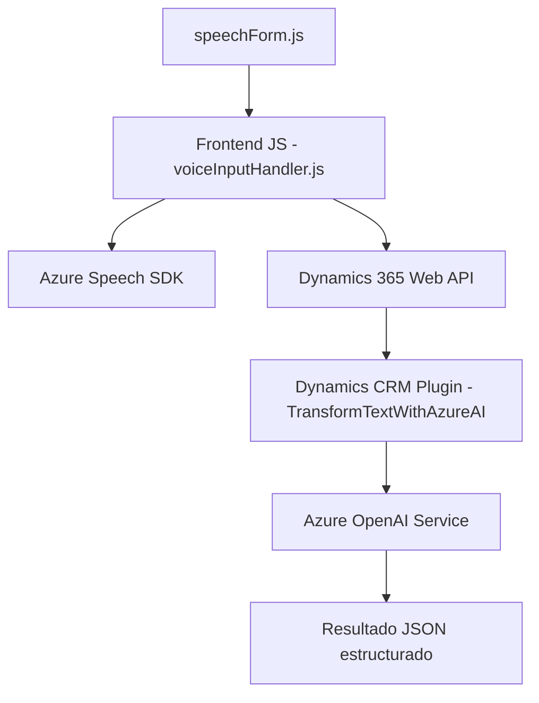

### Breve resumen técnico:
El repositorio representa una solución orientada a la integración de funcionalidad avanzada de inteligencia artificial para mejorar la experiencia de usuario en formularios de Microsoft Dynamics 365. Los principales componentes incluyen un frontend implementado en JavaScript, que interactúa con Azure Speech SDK, una lógica de servidor en C# para un plugin, y conexión con APIs externas como Azure OpenAI Service.

---

### Descripción de la arquitectura:
La arquitectura general es una **n-capas** enfocada a integrar frontend y backend, donde se procesan datos tanto en el lado cliente como en el servidor. Al backend se le agrega un patrón de extensibilidad basado en un **plugin de Dynamics CRM**, que maneja eventos. Por su parte, el frontend organiza sus desarrollos en módulos locales y funciones que se comunican con un SDK externo y APIs en Dynamics 365.

1. Componentes principales:  
   - **Frontend (JavaScript)** interactúa con formularios y realiza síntesis y transcripción de voz mediante el Azure Speech SDK.
   - **Backend (C# / Plugin en Dynamics)** ejecuta el procesamiento específico mediante la integración con Azure OpenAI Service.

2. **Patrones utilizados**:
   - **Modularidad**: Funciones para separar responsabilidades en el frontend.
   - **Facade**: En el backend, se encapsulan las llamadas a servicios externos mediante un método simplificado.
   - **Integración de SDK/API**: El sistema utiliza SDKs y APIs externas como el Azure Speech SDK y servicios de IA.
   - **Uso de Plugins**: El plugin extiende y adapta más la funcionalidad nativa de Dynamics CRM.

---

### Tecnologías usadas:
1. **Frontend**:
   - **JavaScript** como lenguaje principal.
   - **Azure Speech SDK** para síntesis y reconocimiento de voz.
   - Manipulación de **DOM APIs** para formularios.

2. **Backend**:
   - **C#** para manejar lógica avanzada en Dynamics.
   - **Dynamics CRM SDK** para procesar eventos en el sistema.
   - **Azure OpenAI Service** para realizar transformaciones de texto avanzadas.
   - **.NET HttpClient y Newtonsoft.Json** como herramientas auxiliares para peticiones HTTP y manejo de JSON.

3. **Externo**:
   - Azure Speech SDK.
   - Dynamics 365 Web API.
   - Endpoint de Azure OpenAI para GPT-4o.

---

### Diagrama Mermaid:

---

### Conclusión final:
La solución del repositorio aborda una tarea compleja y técnica mediante una arquitectura n-capas modular, integrando tecnologías avanzadas como Azure Speech SDK para voz, Azure OpenAI Service para transformación de texto, y Dynamics 365 Web API para gestión de datos y formulario. El diseño está bien organizado y combina patrones de extensibilidad (Plugins en Dynamics CRM) con servicios externos (Microsoft Azure). Sin embargo, ciertas configuraciones como claves y regiones deberían manejarse de forma más segura usando entornos o variables externas.