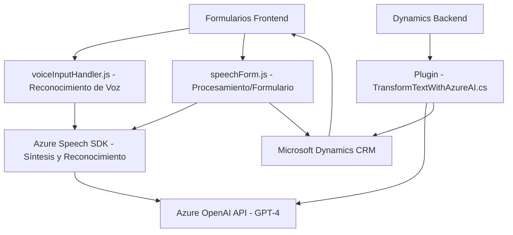

### Breve resumen técnico
El repositorio analiza tres componentes principales, cada uno con una integración directa con Microsoft Azure para comprender y procesar datos desde un formulario o texto en un entorno empresarial:

1. **Frontend (JavaScript):** Maneja entrada/salida de voz en formularios mediante reconocimiento y síntesis vocal mediante Azure Speech SDK.
2. **Backend Plugin (C#):** Extiende funcionalidades de Dynamics CRM usando Azure OpenAI para transformar texto en JSON estructurado.
3. **Arquitectura:** Sistema modular, componentes enlazados a servicios externos, y apoyo en APIs empresariales como Dynamics y Azure.

---

### Descripción de arquitectura
La solución utiliza una arquitectura híbrida de **Microservicios y servicios desacoplados**, con las siguientes características:
- **Frontend modular:** Componentes segmentados para gestión de voz y manipulación de formularios.
- **Integración de servicios externos:** Comunicación con APIs en Microsoft Azure (Speech SDK y OpenAI).
- **Plugin backend:** Optimizado para Dynamics CRM, siguiendo patrones como Single Responsibility y Plugin Pattern.
- **Desacoplamiento:** Cada archivo tiene claras responsabilidades, permitiendo mantener el sistema escalable y flexible.

---

### Tecnologías usadas
- **Frontend:** JavaScript para la manipulación de formularios en tiempo real.
- **Backend:**  
  - C# con Dynamics CRM SDK (`Microsoft.Xrm.Sdk`) para integración directa.  
  - Azure OpenAI API para procesamiento inteligente de texto.  
- **Servicios externos:**  
  - Azure Speech SDK para reconocimiento/síntesis de voz.  
  - REST APIs para comunicación con OpenAI.
- **Frameworks y librerías:**  
  - `Newtonsoft.Json` y `System.Net.Http` para serialización y peticiones HTTP.
- **Patrones aplicados:**  
  - Event-driven Programming (callbacks en voz).  
  - Plugin Pattern (Dynamics API).  
  - Service Pattern (manejo de Azure SDK y APIs REST).
  
---

### Diagrama Mermaid

---

### Conclusión final
El repositorio destaca como una solución integrada orientada al procesamiento y síntesis de datos en un entorno corporativo. Con una arquitectura modular, el proyecto combina servicios frontend (procesamiento de voz y formularios) con un backend basado en plugins para Dynamics CRM que integra Azure OpenAI.

Características relevantes incluyen:
- **Escalabilidad:** Modificación/expansión sencilla al integrar servicios externos desacoplados.
- **Modularidad:** Código bien segmentado por responsabilidades, manteniendo claridad de propósito.
- **Potencial:** Ideal para casos como accesibilidad (voz y texto) o automatización de procesos en ambientes empresariales.

El diseño empleado es una mezcla de capas de interacción empresariales con componentes modularizados para lograr eficiencia.