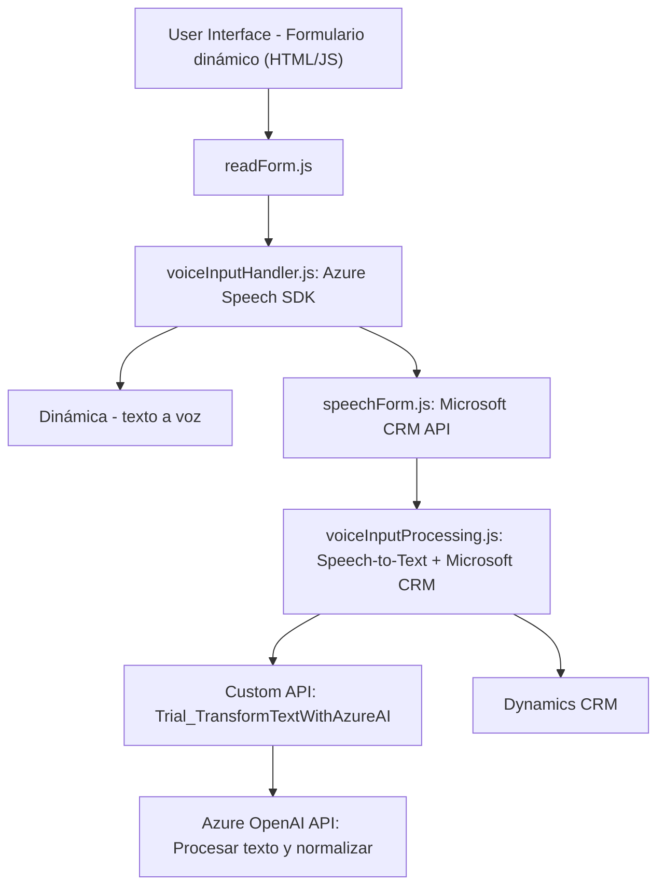

### Breve resumen técnico

El repositorio representa una solución híbrida que implementa funcionalidades para aplicaciones frontend y microservicios asociadas a Microsoft Dynamics CRM. El objetivo principal del código y los archivos descritos es integrar el SDK de Azure Speech para convertir texto en audio, capturar comandos mediante entrada de voz, y mejorar la experiencia interactiva de los usuarios con formularios y datos en un sistema CRM. Además, incluye un plugin para utilizar la API de Azure OpenAI para transformar y estructurar texto en formato JSON.

---

### Descripción de arquitectura

La arquitectura parece estar diseñada como una **n-capas**, donde cada capa tiene una responsabilidad específica:

1. **Frontend**: Manejo de la interacción visual del usuario, dinámico, con funciones para la producción de texto a voz y captura de comandos por voz.
2. **Middleware (microservicios o plugins)**: Procesamiento intermedio que incluye integración con servicios de IA y SDK Azure (Speech y OpenAI).
3. **Back-end y sistema CRM**: Manejo de datos, almacenamiento, y aplicación de lógica personalizada mediante plugins dirigidos al Microsoft Dynamics CRM.

Los módulos en JavaScript modelan una arquitectura **modular** y **de integración de terceros**, mientras que el plugin en `.NET` implementa claramente un **plugin pattern** y sigue el flujo de **Service-Oriented Architecture (SOA)**.

---

### Tecnologías usadas

#### Frontend
1. **Javascript (ES6)**:
   - DOM API para manipulación del HTML y ejecución de funciones dinámicas.
   - Modularización de código a través de un enfoque claro en funciones específicas.
   
2. **Azure Speech SDK**:
   - Sintetización de texto a voz y reconocimiento de comandos por entrada de voz.

3. **Integración con Microsoft Dynamics CRM**:
   - API de Dynamics CRM (`Xrm.WebApi`) para modificar formularios y atributos.

#### Backend  
1. **Microsoft Dynamics SDK Plugin (`TransformTextWithAzureAI`):**
   - Implementación de un plugin en .NET.
   
2. **C# y librerías de .NET:**
   - Uso de `HttpClient`, `Newtonsoft.Json.Linq` y métodos estándar para consumir APIs RESTful y manipular datos.

3. **Azure OpenAI API**:
   - Procesamiento de texto con IA y estructuras predefinidas.

#### Arquitectura
- **N-capas** para la segregación funcional entre frontend, middleware y backend.
- **Modularidad** con lógica separada por funciones específicas tanto en JS como en el plugin .NET.
- **Service-Oriented Architecture (SOA)** para comunicación con las APIs (Azure Speech y OpenAI) y Dynamics CRM.

---

### Diagrama Mermaid

---

### Conclusión final

La solución implementada en esta arquitectura es una combinación de un frontend dinámico para interacción directa con el usuario, middleware para capturar y procesar información mediante Azure Speech SDK y APIs personalizadas; y backend orientado a integrar datos con Microsoft Dynamics CRM. Este sistema es una **plataforma avanzada de procesamiento de voz** apta para casos de uso como soporte al cliente, interacción automatizada y mejora de sistemas CRM.

Los archivos en el repositorio demuestran un enfoque modular, donde cada componente tiene una funcionalidad bien definida. Además, la integración con servicios externos demuestra un enfoque de **Service-Oriented Architecture (SOA)** hacia la solución cloud-based.