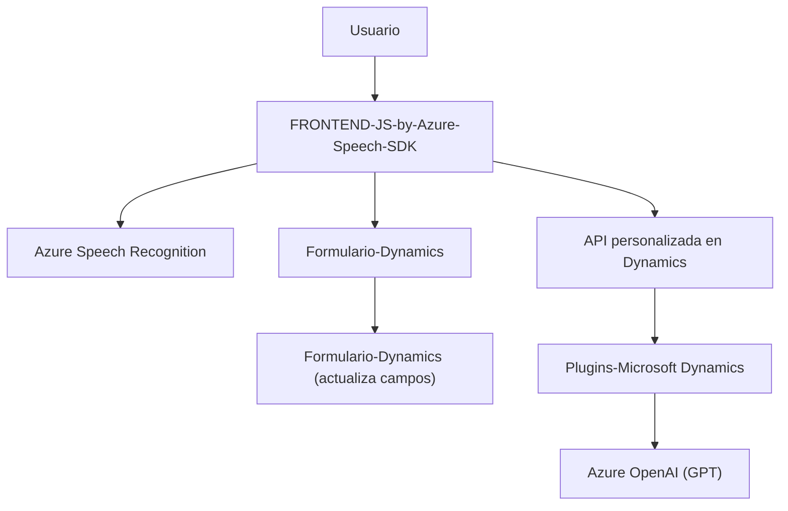

### **Breve resumen técnico**
El contenido de los archivos destacados en el repositorio sugiere una solución tecnológica orientada a la integración de entrada y salida de voz con formularios dinámicos y procesamiento de texto mediante servicios en la nube de Microsoft Azure. Específicamente, se utiliza el **Azure Speech SDK** para el manejo de entrada/salida de voz y el **Azure OpenAI** (GPT) para procesamiento avanzado de texto. Además, hay un plugin implementado en Microsoft Dynamics CRM para extender funcionalidades del sistema.

---

### **Descripción de arquitectura**
La solución general implementa una arquitectura de **n capas con integración de servicios externos**. No se trata de una arquitectura de microservicios ni de un monolito clásico. Más bien, la separación entre módulos (frontend, backend, plugins para aplicaciones externas) muestra un enfoque claro hacia una arquitectura distribuida basada en servicios.

- **Frontend** (JavaScript): Encargado de interactuar con el usuario, captar entrada (voz y formulario) y enviar/recibir datos de servicios externos.
- **Backend con Dynamics Plugin (.NET)**: Realiza transformaciones y procesos de texto usando **Azure OpenAI**, extendiendo funcionalidades de Dynamics CRM y exponiendo otros servicios.
- **Servicios Externos**: Azure Speech SDK y Azure OpenAI configuran servicios externos críticos para el procesamiento de entrada y salida de texto.

---

### **Tecnologías y frameworks utilizados**
1. **Azure Speech SDK**:
   - Recibe entrada de voz y genera síntesis de texto a audio.
   - Usa la API del servicio de Speech de Azure, conectada con `SpeechSDK.SpeechConfig`.
   - Se carga dinámicamente en el navegador desde un CDN de Azure.

2. **Microsoft Dynamics CRM SDK**:
   - Integración directa mediante plugins que extienden la funcionalidad interna del sistema para gestionar eventos y procesos específicos.

3. **Azure OpenAI**:
   - Procesa texto, aplicando transformaciones con reglas predeterminadas y devuelve un resultado formateado. Utiliza la API de GPT (posiblemente GPT-4).

4. **JavaScript**:
   - En el frontend, gestiona la lógica para formularios dinámicos y conecta con servicios externos.

5. **.NET Framework**:
   - Lenguaje base para el desarrollo del plugin (`TransformTextWithAzureAI.cs`) utilizado en Dynamics CRM.
   - Manejo de JSON y API HTTP.

6. **Patrones arquitectónicos**:
   - **Delegación**: Uso de funciones para delegar tareas (lectura de formulario, carga del SDK, síntesis de texto, etc.).
   - **Servicio externo**: Integración con servicios externos (Azure).
   - **Plugin Architecture**: Plugin en Dynamics CRM para ampliar funcionalidades específicas.
   - **Modularidad por componentes**: Separación lógica entre frontend y backend.
   - **Promesas y programación asíncrona**: Especialmente en llamadas HTTP y SDK dinámicos.

---

### **Dependencias o componentes externos**
- **Azure Speech SDK**: Reconocimiento y síntesis de texto hablado.
- **Azure OpenAI (GPT)**: Procesamiento de texto bajo reglas predefinidas.
- **Microsoft Dynamics 365 Web API**: Extiende funcionalidades para la actualización de formularios dinámicos.
- **Newtonsoft.Json.Linq**: Manipulación dinámica de estructuras JSON.
- **System.Net.Http**, **System.Text.Json** (en plugin): Operaciones para consumir servicios externos.
- Llamadas asíncronas y Promises en frontend para integración con Azure.

---

### **Diagrama Mermaid**

---

### **Conclusión final**
Este repositorio representa una solución diseñada para mejorar la interacción humano-máquina mediante entrada y salida de voz, procesamiento avanzado de texto y gestión dinámica de formularios usando infraestructuras y servicios de Microsoft (Azure y Dynamics CRM). Es una arquitectura flexible, orientada a la integración de servicios externos, con un robusto uso de programación asíncrona, Delegación, y modularidad tanto en el frontend como en el backend. Aunque no es estrictamente una arquitectura de microservicios, sigue principios de distribución de responsabilidad en varias capas.