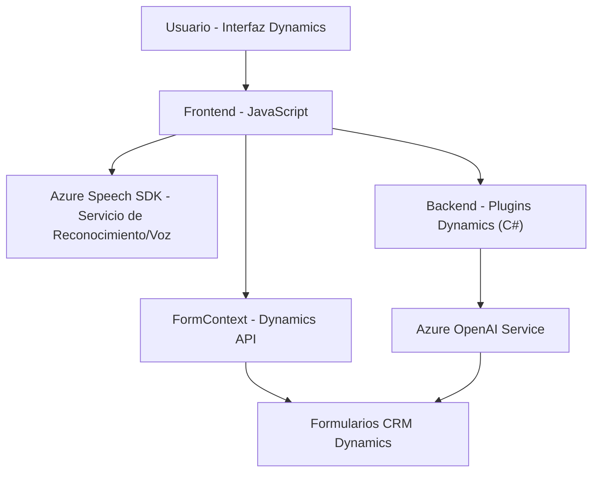

### Breve resumen técnico
El repositorio contiene múltiples funcionalidades distribuidas entre frontend, backend (Plugins), y comunicación externa con servicios dentro de Microsoft Dynamics 365 y Azure. Estas contribuyen a la integración de reconocimiento de voz, procesamiento de texto con inteligencia artificial (Azure OpenAI), síntesis de texto a voz, y actualización de formularios en Dynamics CRM.

---

### Descripción de arquitectura
- **Tipo de solución:** Sistema híbrido compuesto por frontend, backend y microservicios externos. Se presentan funcionalidades estrechamente ligadas a Dynamics CRM (monolito expansible) donde ciertos procesos delegan tareas específicas a microservicios de Azure (Speech y OpenAI). La arquitectura combina patrones de **n-capas** para organización del procesamiento de datos y servicios, **event-driven** para manejar flujo de eventos (SDK y CRM), y **plugin design** para el backend (CRM-triggered plugins).
- **Elementos principales:**
  1. **Frontend (JavaScript):** Responsables de interactuar con usuarios mediante formulación dinámica, reconocimiento de voz y síntesis de texto a voz.
  2. **Backend (Plugins en C#):** Implementación de reglas, procesamiento avanzado de texto y comunicación directa con Azure OpenAI.
  3. **Microservicios externos:** Uso del SDK de Azure Speech para reconocimiento/síntesis de voz y el servicio Azure OpenAI para transformación de datos basados en IA.

---

### Tecnologías usadas
1. **Frontend:**
   - **JavaScript**
   - **Azure Speech SDK**
   - Dynamics CRM client APIs (`Xrm.WebApi.online.execute`, integración con `formContext` para manipulación de UI/atributos)

2. **Backend (Plugins):**
   - **C#**
   - **Microsoft.Xrm.Sdk**
   - **Newtonsoft.Json**
   - **System.Net.Http** para integración con Azure OpenAI
  
3. **Servicios externos:**
   - **Azure OpenAI**: Procesamiento avanzado de texto.
   - **Azure Speech Cognitive Services**: Reconocimiento y síntesis de voz.

---

### Diagrama Mermaid válido para GitHub

---

### Conclusión final
El repositorio implementa una solución híbrida combinando frontend y backend ligado al entorno de Dynamics CRM con integración de microservicios externos de Azure. La arquitectura global destaca por su modularidad, separación de responsabilidades y uso extensivo de servicios declarativos como Azure Speech SDK y OpenAI para manejar funciones avanzadas. Adicionalmente, el balance entre código cliente, servidor (Plugins) y servicios remotos promueve agilidad y escalabilidad adaptada a sistemas empresariales como Dynamics CRM.