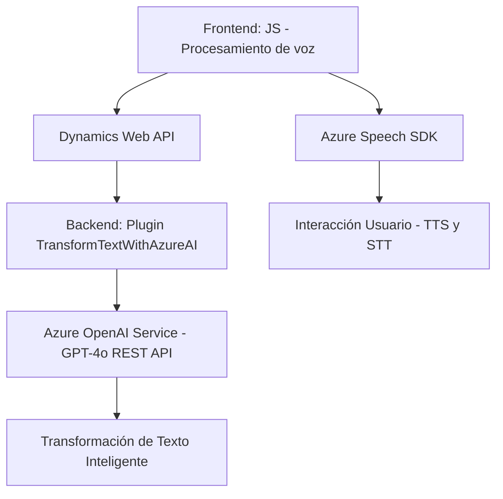

### Breve Resumen Técnico:
El repositorio contiene archivos divididos por funcionalidades específicas: dos módulos para la interacción con un **frontend** dinámico utilizando `Azure Speech SDK` y un **plugin** de backend para Dynamics CRM que se conecta a servicios de Azure OpenAI. Está diseñado para enriquecer la experiencia del usuario mediante la entrada y salida de voz, así como la transformación de texto en lenguaje natural apoyándose en servicios de IA en la nube.

### Descripción de Arquitectura:
La solución combina diferentes capas de arquitectura:
1. **Frontend**: Procesamiento de voz mediante el SDK de Azure para entrada y salida de texto, directamente desde la interfaz del usuario, probablemente dentro de un CRM (como Dynamics 365).
2. **Backend**: Implementación de un plugin que interactúa directamente con Dynamics CRM y un servicio REST de Azure OpenAI para aplicar transformaciones inteligentes al texto de entrada.
3. **Modelo basado en servicios**: La arquitectura muestra características de una solución modular, con conexión a microservicios como Azure Speech y Azure OpenAI.

### Tecnologías Usadas:
1. **Frontend**:
   - **JavaScript**: Lógica asociada al procesamiento de voz/texto directamente en el browser.
   - **Azure Speech SDK**: Utilizado para convertir texto a voz (TTS) y voz a texto (STT).
   - **Dynamics Web API (Xrm.WebApi)**: Para interactuar con los formularios del sistema CRM y realizar llamadas a APIs personalizadas.
2. **Backend Plugin (C#)**:
   - **Microsoft.Xrm.Sdk**: Integración directa con Dynamics CRM.
   - **System.Net.Http**: Comunicaciones HTTP con el servicio Azure OpenAI.
   - **Azure OpenAI Service**: GPT-4 mediante comunicación REST.

### Diagrama Mermaid válido para GitHub:

### Conclusión Final:
La solución implementada es una **arquitectura híbrida** que combina un frontend dinámico, habilitado para procesamiento de voz/texto, con una capa de backend basada en plugins de Dynamics CRM. La integración con servicios de Azure (Speech SDK y OpenAI) permite incorporar capacidades avanzadas de IA. Esto sugiere una orientación hacia aplicaciones empresariales, enfocadas en la automatización inteligente de datos y formularios. La modularidad asegura que cada funcionalidad esté claramente separada, promoviendo escalabilidad y mantenibilidad.