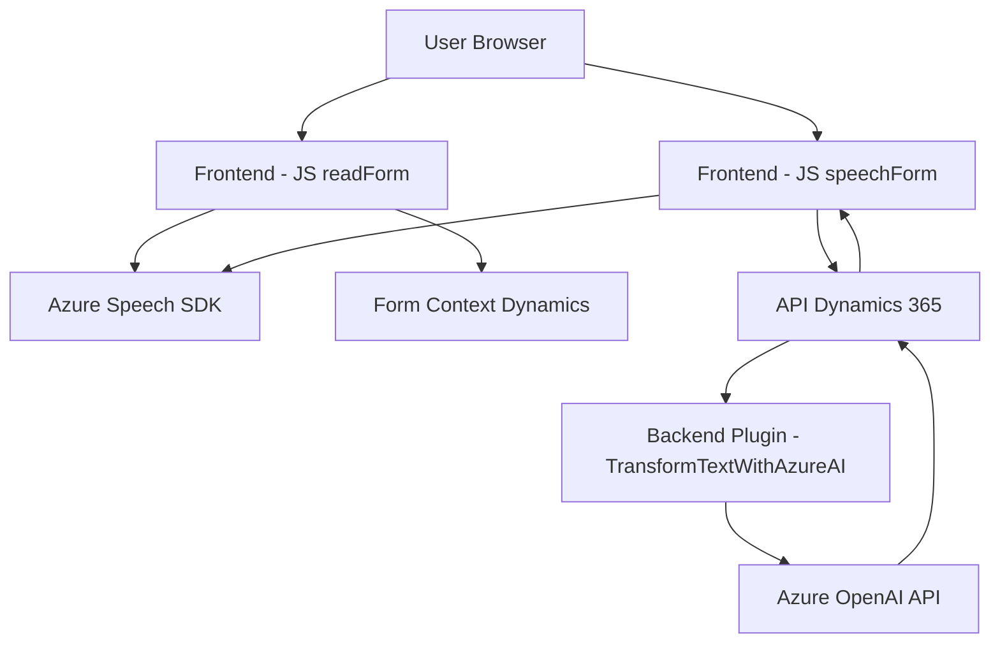

### Breve resumen técnico

El repositorio parece ser parte de una solución que integra servicios de reconocimiento y síntesis de voz de Azure Speech, junto con funciones de procesamiento y transformación en Microsoft Dynamics CRM mediante un complemento (plugin). Los archivos son implementaciones concretas que trabajan en conjunto dentro de una arquitectura basada en capas con comunicación con servicios externos.

---

### Descripción de arquitectura

#### Análisis general:
1. **`FRONTEND/JS/readForm.js`**:
   - Proporciona funcionalidades para sintetizar textos obtenidos desde un formulario en Dynamics CRM utilizando el SDK de Azure Speech. Esto permite convertir información visible en el formulario en audio, proporcionando soporte para capacidades de accesibilidad.
   
2. **`FRONTEND/JS/speechForm.js`**:
   - Agrega la funcionalidad de reconocimiento de voz para convertir comandos o transcripciones habladas en datos estructurados (formulario) que interactúan con Dynamics CRM y su API.

3. **`Plugins/TransformTextWithAzureAI.cs`**:
   - Implementa un plugin de Dynamics CRM para procesar texto utilizando Azure OpenAI. Convierte texto usando reglas específicas (como pares clave-valor) y facilita la integración de inteligencia artificial en la plataforma.

El diseño combina funcionalidades de frontend con capacidades de reconocimiento de voz y plugins en el backend, organizados en arquitectura **n-capas distribuida**, con interfaz para Dynamics CRM.

---

### Tecnologías usadas

1. **Frontend**:
   - **JavaScript**: Lenguaje de programación para interacción en cliente.
   - **Azure Speech SDK**: Integración del reconocimiento de voz y síntesis de texto en audio.
   - **Dynamics 365**: Configuración para manipulación de formularios en contexto CRM.

2. **Backend**:
   - **C#**: Lenguaje de implementación del plugin.
   - **Microsoft.Xrm.Sdk**: Framework de Dynamics para la personalización del SDK del CRM.
   - **Azure OpenAI API**: Servicios de procesamiento y transformación de texto basado en inteligencia artificial.

3. **Patrones y prácticas arquitectónicas**:
   - **Delegación dinámica**: Uso de APIs externas como Azure Speech y OpenAI para delegar tareas específicas.
   - **Integración basada en servicios**: Los componentes se comunican entre sí y con APIs externas como servicios RESTful.
   - **Plugin Architecture**: Extensiones para Dynamics CRM empleando interfaces como `IPlugin`.

---

### Diagrama Mermaid compatible con GitHub Markdown

---

### Conclusión final

Esta solución está centrada en la integración entre un frontend dinámico que permite a los usuarios interactuar con formularios accesibles, Azure Speech SDK y OpenAI API, y un backend para procesamiento avanzado dentro de Dynamics CRM. La arquitectura es de tipo **n-capas y distribuida**, aunque se observan partes con características de microservicios (delegación de la síntesis de voz y procesamiento del lenguaje natural). Este diseño aprovecha servicios en la nube de Azure para extender las capacidades del CRM y proporcionar una experiencia de usuario mejorada mediante automatización y accesibilidad.