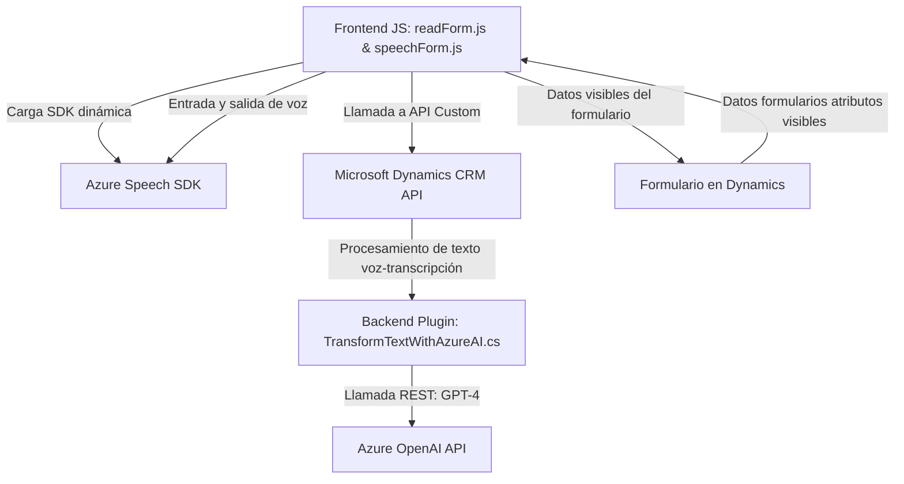

### Breve resumen técnico:
El repositorio resalta la implementación de una solución integrada entre un frontend en JavaScript, un backend basado en Microsoft Dynamics CRM utilizando plugins .Net, y servicios en la nube como Azure Speech SDK y Azure OpenAI. Está orientado al manejo de datos de formularios y procesamiento de voz con inteligencia artificial.

---
### Descripción de arquitectura:
La arquitectura general es **modular y basada en capas**, con una clara integración entre el frontend y backend.  
- **Frontend**: Un diseño centrado en procesar entrada/salida de usuario (voz/texto) desde un formulario y comunicarse con el backend.  
- **Backend**: Extensiones de Microsoft Dynamics CRM mediante plugins y APIs, conectados a servicios externos como Azure OpenAI.  
Este enfoque combina dinámicamente capas funcionales y patrones de integración con servicios cloud, lo que podría complementar una arquitectura **n-capas** o **integración SaaS**.

---
### Tecnologías usadas:
1. **Frontend**: JavaScript, Azure Speech SDK, Microsoft Dynamics API (`Xrm.WebApi`).  
2. **Backend**: C#, Microsoft Dynamics CRM SDK, Azure OpenAI API, JSON para entrada/salida de datos, `System.Net.Http`.  
3. **Servicios cloud**:
   - **Azure Speech SDK**: Entrada y síntesis de voz.  
   - **Azure OpenAI**: Procesamiento de datos con GPT-4 mediante integración RESTful.  

---
### Diagrama *Mermaid* 100 % compatible con **GitHub Markdown**
Este diagrama muestra el flujo de interacción y componentes clave utilizados:

---
### Conclusión final:
El repositorio implementa una solución orientada a la automatización y procesamiento dinámico de datos en sistemas basados en formularios.  
- **Arquitectura destacada**: Una combinación entre **n-capas** aplicada a un entorno específico como Dynamics CRM y **integración cloud-SaaS** para IA y voz.
- **Ventajas**:
   - Escalabilidad mediante servicios en la nube (Azure).  
   - Modularidad funcional en frontend/backend.  
   - Extensibilidad con APIs y SDKs.
