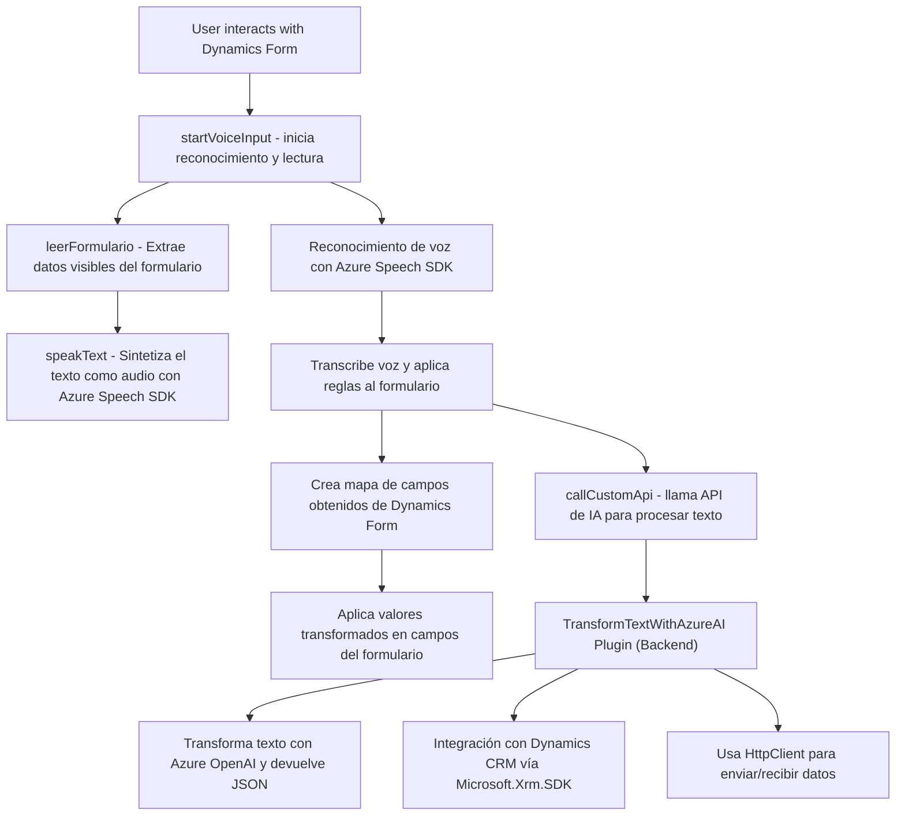

### Breve Resumen Técnico
El repositorio en revisión contiene código que refleja una solución para integrar funcionalidades de síntesis de voz, reconocimiento de voz, y procesamiento avanzado de lenguaje con servicios ofrecidos por **Microsoft Azure**, en específico **Azure Speech SDK** y **Azure OpenAI**. La solución parece estar destinada a extender las capacidades de manejo de formularios de Microsoft Dynamics a través de procesos automatizados que involucran APIs y técnicas de inteligencia artificial (IA).

---

### Descripción de la Arquitectura
1. **Arquitectura de Capas (n-capas)**  
   La solución es organizada en múltiples niveles que interactúan entre sí:
   - **Frontend**: Código en JavaScript para tareas relacionadas con la síntesis y reconocimiento de voz utilizando **Azure Speech SDK**.
   - **Backend**: Plugin en C# que interactúa con Dynamics CRM y el servicio **Azure OpenAI** para transformar datos y estructura de texto.

2. **Componentes principales**:
   - **Modularización funcional**: Separación de funciones en el frontend para operaciones específicas (como transformación y síntesis).
   - **Plugin-oriented architecture**: Uso de la interfaz `IPlugin` proporciona un núcleo básico para extensibilidad dentro de Dynamics CRM.

3. **Extensibilidad**:
   - Utilización de **Azure APIs (Speech SDK, OpenAI)** garantiza integración sin intervención directa en los servicios subyacentes.
   - Uso de la API de Microsoft Dynamics para comunicación entre los componentes de la solución.

---

### Tecnologías Usadas
1. **Frontend (JavaScript)**:
   - **Azure Speech SDK** para síntesis y reconocimiento de voz.
   - **Dynamics CRM Frontend**: Interacción con formularios en Dynamics mediante el modelo de objetos `executionContext`.

2. **Backend (C#)**:
   - **Microsoft.Xrm SDK** para construir plugins en Dynamics CRM.
   - **System.Net.Http**: Para solicitudes HTTP al servicio de Azure (REST API).
   - **Newtonsoft.Json.Linq / System.Text.Json**: Parseo y manipulación de datos JSON.

3. **Servicios Externos**:
   - **Azure Speech Services**: Reconocimiento y síntesis de texto a voz.
   - **Azure OpenAI API (GPT Model)**: Transformación avanzada de texto basado en IA.

---

### Diagrama Mermaid Válido para GitHub

---

### Conclusión Final
La solución analizada implementa una arquitectura de integración de servicios dividida en múltiples capas. Combina un frontend basado en JavaScript con SDKs de Microsoft Azure, junto a un backend diseñado como un plugin que interactúa directamente con Dynamics CRM. Se sigue un enfoque modular y altamente extensible al delegar tareas complejas (como síntesis de voz y transformación de texto) a servicios externos como **Azure OpenAI** y **Speech SDK**.

Este diseño muestra una implementación moderna, eficaz y escalable para extender las capacidades predeterminadas de Dynamics CRM, integrando herramientas clave de inteligencia artificial y mejora interactiva para formularios mediante voz y texto.