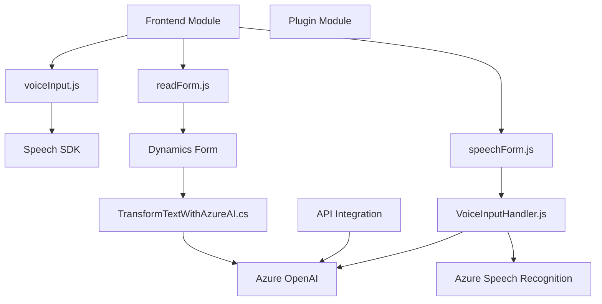

### Resumen Técnico

El repositorio está compuesto por archivos vinculados al desarrollo de funcionalidades que integran **Azure Speech SDK**, **Azure OpenAI**, y **Microsoft Dynamics 365**. Su enfoque principal está en crear herramientas que faciliten el procesamiento de datos mediante voz y transformar dichos datos en estructuras manipulables.

---

### Descripción de Arquitectura

La arquitectura del proyecto parece seguir un enfoque híbrido basado en:
1. **Modularidad**: Cada archivo concentra responsabilidades específicas, como el procesamiento de datos del formulario, la conversión de voz a texto y la interacción con APIs externas.
2. **Integración API**: Utiliza servicios de Azure para procesar datos de forma asincrónica y dinámica.
3. **n-Capas**:
   - **Presentación**: Procesamiento de datos en formularios (archivos `readForm.js` y `voiceInputHandler.js`).
   - **Lógica**: Modificaciones y transformaciones dinámicas mediante plugins en `TransformTextWithAzureAI`.
   - **Acceso a Datos**: APIs externas (Speech SDK, OpenAI) y Dynamics Web API.
4. **Microservicios** (parcial): Aunque no es estrictamente una arquitectura de microservicios, el enfoque de integrar varios servicios externos brinda cierta autonomía funcional.

---

### Tecnologías Usadas

1. **Azure Speech SDK**  
   - Para reconocimiento de voz y síntesis de texto a voz.  

2. **Microsoft Dynamics 365**  
   - Para interacción nativa con formularios, datos y atributos.  

3. **Azure OpenAI**  
   - Para transformar texto de forma dinámica usando IA avanzada.  

4. **JavaScript y ES6**  
   - Para la lógica de frontend que orquesta la interacción usuario-formulario-servicio.  

5. **Dynamics CRM SDK**  
   - Para desarrollar plugins que se ejecutan en el backend de Dynamics CRM.  

6. **HTTP Request**  
   - Integración de APIs externas mediante solicitudes HTTP en el backend.  

7. **JSON Manipulation**  
   - Manejo de datos estructurados (serialización y deserialización) entre servicios.  

---

### Diagrama Mermaid

---

### Conclusión Final

El repositorio aborda una solución modular que potencia las capacidades de **Microsoft Dynamics 365** conectándolo con herramientas avanzadas de **Azure**. A través de una infraestructura basada en dependencias, desarrolla funcionalidades para entrada de voz y procesamiento de texto mediante APIs. Aunque no opera bajo una estricta arquitectura de microservicios, sí implementa un diseño **n-capas** con separación clara de responsabilidades entre frontend y backend.

Recomendaciones:
1. **Externalización de claves sensibles**: Usar soluciones como **Azure Key Vault** para gestionar claves y configuraciones de forma segura.
2. **Mejorar manejo de errores**: Especialmente en solicitudes HTTP hacia Azure Speech y OpenAI.
3. **Documentación**: Consolidar mejores prácticas en una guía técnica que facilite el despliegue y escalabilidad.