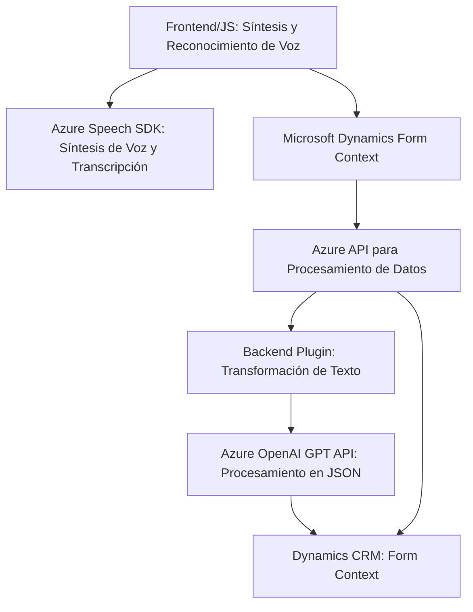

### Breve Resumen Técnico

El repositorio se centra en integrar **Microsoft Dynamics CRM** con servicios de **Azure AI** (Azure Speech SDK y Azure OpenAI GPT API) para mejorar la interacción y accesibilidad del sistema. Los archivos analizados indican un enfoque en funcionalidades como:
1. Síntesis de voz para hacer los formularios más accesibles.
2. Reconocimiento de voz y transcripción para completar automáticamente campos del formulario.
3. Procesamiento avanzado del texto mediante inteligencia artificial con OpenAI, para enriquecer datos y orquestar la interacción con el CRM.

La solución está encapsulada en tres partes:
- **Frontend/JS**: Manejo de la interfaz interactiva con voz.
- **Plugins/TransformTextWithAzureAI.cs**: Extensión de Dynamics CRM mediante un plugin para aprovechar Azure OpenAI.

---

### Descripción de Arquitectura

La arquitectura es híbrida; incluye **n capas** para organizar la lógica interna: capa de presentación (FrontEnd), capa de negocio (Plugin/CRM) con integración de APIs externas, y una capa de servicio proporcionada por **Azure Speech** y **Azure OpenAI API**. 

Además, el uso de modularización en funciones y clases indica un enfoque orientado hacia la **modularidad**, **cohesión funcional** y **separación de responsabilidades**, garantizando que cada componente cumpla un propósito único y específico.

---

### Tecnologías Usadas

1. **Frontend/JS**:
   - **Language**: JavaScript.
   - **External SDK**: Azure Speech SDK (for synthesis and speech-to-text functionality).
   - **Microsoft Dynamics Context**: Utilizes `executionContext` and `Xrm.WebApi` objects from Dynamics CRM.

2. **Backend/Plugin**:
   - **Language**: C#.
   - **Framework**: .NET (likely targeting Dynamics SDK).
   - **Libraries**:
     - `Microsoft.Xrm.Sdk` for CRM interactions.
     - `System.Net.Http` for HTTP requests to Azure OpenAI.
     - `System.Text.Json` / `Newtonsoft.Json.Linq` for JSON manipulation.
     - **Azure OpenAI API** for text transformation and enrichment.

3. **Patterns**:
   - Modular functions (Frontend).
   - Plugin-based architecture (Backend).
   - API Gateway (for communication with Azure APIs).
   - Asynchronous programming using Promises (JS) and async/await (C#).

---

### Diagrama **Mermaid** Válido para GitHub Markdown

---

### Conclusión Final

Esta solución implementa una arquitectura **híbrida** basada en el modelo de **n capas** con una fuerte dependencia en servicios externos (Azure Speech SDK y Azure OpenAI). Los componentes contribuyen a una integración robusta con **Microsoft Dynamics CRM**, enfocándose en accesibilidad mediante voz, automatización de formularios y enriquecimiento de datos estructurados procesados por inteligencia artificial. La arquitectura está bien diseñada, con módulos que encapsulan sus responsabilidades y aprovechan las capacidades de Dynamics y Azure. Sin embargo, el diseño también introduce alta dependencia frente a servicios externos, lo que podría requerir estrategias de manejo de errores y resiliencia en escenarios donde la conectividad sea limitada.