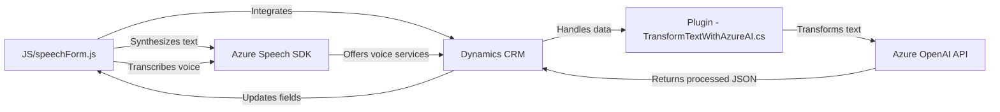

## Análisis del repositorio

### Breve resumen técnico
El repositorio contiene tres principales módulos que destacan por su integración con servicios de Azure:
1. **Frontend/JS/readForm.js y speechForm.js**: Archivos encargados de autorizar y realizar síntesis/transcripción de texto mediante interacción con formularios en Dynamics 365, utilizando **Azure Speech SDK**.
2. **Plugins/TransformTextWithAzureAI.cs**: Plugin de Dynamics CRM que integra **Azure OpenAI** para transformar texto según modelos predefinidos.

La solución está orientada a crear funcionalidades inteligentes y accesibles mediante servicios externos y procesamiento de datos.

---

### Descripción de arquitectura
La solución utiliza una **arquitectura orientada a servicios** combinada con modularidad:
1. **Capas del sistema**:
   - **Presentación (Frontend)**: Funciones de voz e IA aplicadas directamente a formularios, que convierten datos visibles y entrada del usuario.
   - **Lógica del servidor (Backend / Plugins)**: Plugins que procesan y transforman los datos mediante integración con Azure OpenAI y Dynamics CRM.
2. **Servicios externos**:
   - **Azure Speech SDK**: Procesamiento de síntesis y transcripción de voz.
   - **Azure OpenAI API**: Transformación avanzada basada en IA para datos estructurados.
   - **Dynamics 365 APIs y Frameworks**.
3. **Patrones arquitectónicos usados**:
   - **Modularidad**: Funciones distribuidas claramente en módulos independientes.
   - **Plugin Pattern**: Implementado especialmente en el archivo de C# `TransformTextWithAzureAI.cs`.
   - **Orientación a servicios**: Todo el sistema se apoya en integración con APIs externas: Azure Speech SDK y OpenAI.

---

### Tecnologías usadas
1. **Frontend/JS**:
   - **Azure Speech SDK**: Con síntesis y transcripción de texto a voz.
   - **Dynamics 365 API**: Para operar los formularios en un CRM.
   - **JavaScript / ES6**: Incluyendo Promises, callbacks y manipulaciones de SDK.
2. **Backend/CSharp**:
   - **Azure OpenAI API**: Procesamiento avanzado mediante solicitudes HTTP.
   - **Microsoft Dynamics SDK**: Integración de plugins personalizados.
   - **Bibliotecas populares**:
     - `System.Net.Http`: Para solicitudes.
     - `Newtonsoft.Json`: Manejo avanzado de JSON.
3. **Frameworks y servicios externos**:
   - **Dynamics 365**: Contexto CRM para formularios, datos y plugins.
   - **Azure** (Speech SDK y OpenAI): Componentes externos para tareas específicas de IA.

---

### Diagrama Mermaid
El diseño del diagrama se basa en la interacción entre los módulos del sistema y los servicios externos.

---

### Conclusión final
El repositorio implementa una solución de accesibilidad para formularios en Dynamics CRM (mediante síntesis y transcripción de voz) y procesamiento de texto avanzado mediante IA (Azure OpenAI). Utiliza una arquitectura orientada a servicios y funciones modulares, además de depender de APIs externas de **Azure Speech** y **OpenAI**.

Es altamente escalable en un entorno de Dynamics CRM y sigue principios modernos de desarrollo para servicios integrados, basándose en la modularidad y separación de responsabilidades.