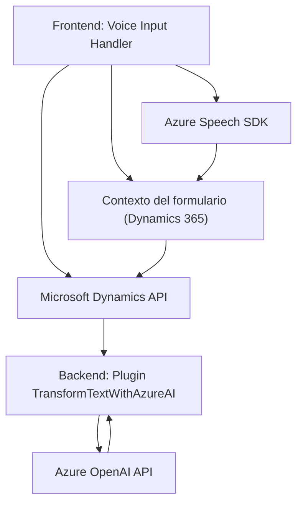

### Breve resumen técnico:
El repositorio presentado parece contener múltiples componentes relacionados con una solución que combina el procesamiento de voz (reconocimiento de entrada y síntesis) y el enriquecimiento de datos mediante una API externa basada en Azure OpenAI, en el contexto de formularios dentro de Microsoft Dynamics. El sistema utiliza JavaScript en el frontend y plugins con C# en el backend.

---

### Descripción de arquitectura:
La arquitectura puede clasificarse como una **arquitectura de n capas**. Los archivos analizados representan capas de presentación (frontend con interacción de voz y formularios) y lógica de negocio (plugin en el backend). Además, hay una clara integración con servicios externos: **Azure Speech SDK** (para procesamiento de voz) y **Azure OpenAI API** (para transformación de texto). Es una solución modular dentro de Dynamics 365 que orquesta múltiples servicios para mejorar la interacción entre usuario y sistema.

---

### Tecnologías usadas:
1. **Frontend**:
   - Lenguaje: JavaScript.
   - Azure Speech SDK: Reconocimiento y síntesis de voz.
   - Microsoft Dynamics API: Interacción con el contexto de formularios y datos.

2. **Backend**:
   - Lenguaje: C#.
   - Framework: Dynamics CRM SDK (plugin).
   - Newtonsoft.Json / System.Text.Json: Manipulación JSON.
   - Azure OpenAI API: Procesamiento de texto con GPT.

3. **General**:
   - Arquitectura orientada a servicios (SOA).
   - Cloud services (Azure Speech SDK & OpenAI).
   - Método estándar para dinámica en Microsoft Dynamics.

---

### Diagrama Mermaid:

---

### Conclusión final:
La solución implementa una **arquitectura de n capas** con integración de servicios de nube, proporcionando accesibilidad y automatización a usuarios que interactúan con formularios en Microsoft Dynamics 365. La combinación de un frontend orientado a la interacción por voz con un backend que aprovecha inteligencia artificial y APIs externas refuerza la modularidad y escalabilidad del sistema.