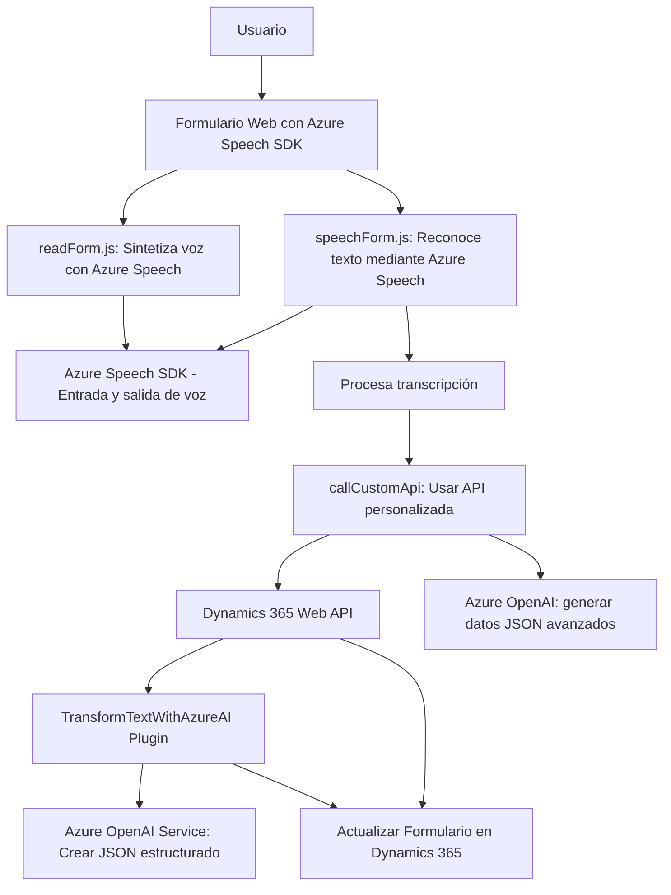

### Breve Resumen Técnico
El repositorio presentado contiene tres archivos clave (`readForm.js`, `speechForm.js`, y `TransformTextWithAzureAI.cs`) que forman parte de una solución que integra **Azure Speech SDK** y **Azure OpenAI** con un sistema **Dynamics 365** para flujo de reconocimiento de voz, síntesis de voz, y procesamiento avanzado de texto con inteligencia artificial. Estas funcionalidades permiten la interacción dinámica de usuarios mediante voz con formularios web y un CRM.

### Descripción de Arquitectura

La solución tiene características de una arquitectura **n capas**, con distintos módulos especializados en sus respectivas funciones:

1. **Frontend (JavaScript clases y funciones)**:
   - Gestión de formularios dinámicos en el navegador.
   - Integración con `Azure Speech SDK` para reconocimiento y síntesis de voz.
   - Actualización en tiempo real de datos en formularios web.
   
2. **Backend (C# Dynamics 365 Plugin):**
   - Proporciona una capa de procesamiento de texto avanzada (utilizando Azure OpenAI).
   - Se configura como un **plugin** que ejecuta procesos en Dynamics 365 cuando ocurren eventos definidos.

Estas capas interactúan con servicios externos (Azure Speech API y Azure OpenAI) y con Dynamics 365 a través de su **Web API**. La solución utiliza un diseño modular con funciones bien separadas y es compatible con sistemas cloud.

### Tecnologías Usadas
1. **Frontend**:
   - **JavaScript ES6**: Modularización con funciones especializadas.
   - **Azure Speech SDK**: Para reconocimiento de voz y síntesis de audio.
   - Dinámica y manipulación de formularios usando contextos de **Dynamics 365**.
   - Uso de Promesas y callbacks para control asíncrono.

2. **Backend**:
   - Tecnología principal: **C# .NET Framework** (o posiblemente **.NET Core** para plugins modernos de Dynamics 365).
   - API REST de **Azure OpenAI Service** (ChatGPT o modelos similares) para el procesamiento de texto.
   - `Microsoft.Xrm.Sdk`: Librería para la integración de Dynamics 365.
   - Serialización de datos con `System.Text.Json` y `Newtonsoft.Json`.

### Dependencias o Componentes Externos
1. **Azure Speech SDK**:
   - Responsable de manejar entrada y salida de voz (grabación, reconocimiento, síntesis).
   - Versión de navegador con carga dinámica desde una URL proporcionada por Microsoft.

2. **Azure OpenAI Service**:
   - Utilizado para procesar y estructurar texto en JSON. Configurado mediante API Key y ajustes como `deployment ID`, `temperature`, entre otros.

3. **Dynamics 365 Platform**:
   - Permite el procesamiento de datos y actualización usando la **Dynamics Web API**.
   - Utiliza plugins desarrollados en C# (`TransformTextWithAzureAI.cs`) como componentes personalizados para extender la funcionalidad del CRM.

4. **Suite de librerías y servicios .NET**:
   - Incluyen entidades fundamentales de Dynamics 365 (`IPlugin`, `IOrganizationServiceFactory`), así como procesamiento de JSON (`System.Text.Json`, `Newtonsoft.Json`), consultas a APIs externas (`HttpClient`), entre otros.

### Diagrama Mermaid

### Conclusión Final

Esta solución es una integración avanzada entre un **sistema CRM**, **Azure Speech Services** y **Azure OpenAI**, dividida en dos módulos principales, frontend y backend. El frontend implementa la captura de entrada de voz y manipulación del DOM para la actualización de formularios basados en Dynamics 365, mientras que el backend (mediante un plugin) se encarga de interactuar con Azure OpenAI para transformar texto según reglas preestablecidas. La arquitectura sigue principios de modularización y eventos, con características propias de una arquitectura **en capas**, junto con patrones como el **Facade**, **Service Loader**, y **Plugin**.

Por último, se identifica una posible vulnerabilidad en el manejo de credenciales de Azure Speech que se encuentran directamente en el código. Se recomienda incorporar prácticas como el uso de variables de entorno o servicios seguros para gestionar estas credenciales mejor.