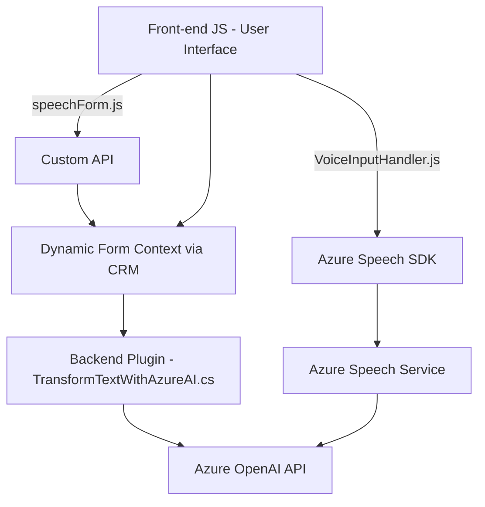

**Resumen técnico:**

Este sistema integra funcionalidades de interacción con tecnologías de Microsoft Azure y Dynamics CRM para manipular datos mediante transcripción, texto a voz, reconocimiento de voz y generación de respuestas inteligencias usando OpenAI. Los archivos están organizados en capas que detrás de su implementación pretenden resolver problemas específicos.

---

### **Descripción de Arquitectura:**
1. **Tipo de solución**: El proyecto parece ser parte de un sistema CRM enriquecido con interacciones naturales (voz, IA). Es probable que sea una combinación de frontend y backend orientada al uso de servicios externos de reconocimiento de voz, texto a voz y generación de datos estructurados.
2. **Arquitectura**:
   - **Capas bien definidas**:
     - La capa de frontend está compuesta por integraciones con Azure Speech SDK.
     - La capa backend está diseñada como un plugin para Dynamics 365, implementando una función específica que utiliza Azure OpenAI para transformar texto.
   - **N capas**: Podría clasificarse como una arquitectura de 3 capas:
     - **Presentación** (JavaScript): donde reside la interacción de usuario y la comunicación con el SDK.
     - **Lógica de negocio** (C# dentro de Dynamics Plugin): manipula datos y realiza la transformación hacia un formato JSON estructurado.
     - **Datos/Externo**: La integración con servicios de terceros (Azure Speech, Azure OpenAI, API personalizada) como fuente o procesador de datos.
   - Uso extensivo de patrones modulares y plugin para desacoplar la lógica. La arquitectura no refleja microservicios ni hexagonal, aunque tiene una lógica hacia uso de servicios externos.

---

### **Tecnologías, Frameworks y Patrones:**
1. **Frontend (JavaScript)**:
   - SDK: **Azure Speech SDK**.
   - Integración con contexto de formularios en CRM (Dynamics SDK).
   - Manejo dinámico de dependencias: Carga condicional del SDK.
   - Modularidad funcional: Las funciones están diseñadas con propósitos específicos.
   - **Patrones utilizados**:
     - Event-Driven Architecture: Uso de callbacks para ejecutar acciones como carga del SDK o procesamiento de texto.
     - Dynamic Loading: Carga de recursos externos según condiciones.

2. **Backend (C# Plugin)**:
   - **Microsoft Dynamics SDK**: Extensión del CRM basada en plugins.
   - **Azure OpenAI API**: Para IA generativa con interacción HTTP POST.
   - **Bibliotecas .NET**:
     - HttpClient (para solicitudes HTTP).
     - System.Text.Json y Newtonsoft.Json para manipulación JSON.
   - **Patrones**:
     - Plugin Pattern: Implementación bien definida basada en eventos del CRM.
     - API Gateway: Facade dedicado al manejo de la lógica externa (OpenAI).

---

### **Dependencias o Componentes Externos posibles:**
1. Servicio en la nube:
   - **Azure Speech Service**: Utilizado para reconocimiento de voz y síntesis de texto a voz.
   - **Azure OpenAI API**: Usado para la generación de texto basado en IA.
2. Infraestructura CRM:
   - **Dynamics CRM SDK**: Extensiones que manejan el contexto del formulario y atributos del sistema.
   - Integración con Dynamics para obtener y modificar datos de formularios desde una API interna.

---

### **Diagrama Mermaid compatible con GitHub Markdown:**

---

### **Conclusión Final:**
Este sistema amplía la funcionalidad de un CRM orientado a formularios con características de interacción de voz, síntesis de audio, y generación de datos estructurados mediante IA. La arquitectura está bien definida y aprovecha las capacidades de servicios gestionados de Azure, combinando un frontend JavaScript modular, un backend personalizado como plugin, y APIs externas. Mientras que la arquitectura general está basada en N capas, se podría enriquecer con patrones como CQRS o un enfoque más desacoplado para hacerla más flexible en escenarios de escalado, especialmente para el plugin de Dynamics.