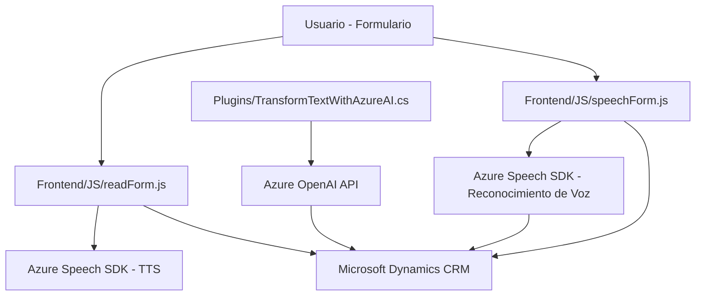

### Breve resumen técnico

Este repositorio tiene componentes diseñados para la interacción entre usuarios y diferentes servicios empresariales. Los archivos analizados corresponden a aplicaciones relacionadas con formularios dinámicos que integran entradas por voz, síntesis de voz y procesamiento de inteligencia artificial, incluyendo un plugin para Microsoft Dynamics CRM con API de OpenAI. El núcleo de la solución utiliza servicios de Azure (Speech SDK y OpenAI) para manejar el reconocimiento de voz, sintetizar texto en voz y transformar texto con normas específicas.

---

### Descripción de arquitectura

1. **Tipo de solución:** El repositorio combina componentes de un frontend (archivos en JavaScript) y un backend (archivo en C# para plugins en Dynamics CRM). Es una **solución híbrida**, con integración entre servicios dinámicos empresariales y frontends personalizados. Esto facilita formularios enriquecidos donde los usuarios interactúan utilizando voz y texto.

2. **Tipo de arquitectura:**
   - **Frontend:** Una arquitectura modular basada en funciones con separación de responsabilidades: carga de SDK, lectura de campos, generación de la síntesis de voz y reconocimiento de voz.
   - **Backend (Plugin):** Arquitectura orientada a servicios (SOA), con consumo de APIs externas y una interacción robusta con la capa de servicios de Dynamics CRM.
   - **Enfoque general:** **n-capas.** El repositorio permite que los componentes sigan el patrón de separación entre servicios, lógica de negocio y presentación. Adopta conceptos de integración de API externa y servicio de voz/I.As como componentes clave.

---

### Tecnologías usadas

1. **Frontend (JavaScript):**
   - **Azure Speech SDK:** Bibliotecas para trabajar con servicios de reconocimiento de voz y Text-to-Speech de Azure.
   - **Microsoft Dynamics:** Contextos específicos de las entidades (como `formContext`).
   - Manipulación de DOM mediante funciones nativas de JavaScript.
   - Uso de promesas (`Promise`), orientación moderna en procesos asincrónicos.

2. **Backend (C# Plugin):**
   - SDK de Dynamics 365: `IPluginExecutionContext`, `IOrganizationServiceFactory`.
   - **Microsoft.Xrm.Sdk:** Para interactuar con entidades y datos de Dynamics 365.
   - **Azure OpenAI API:** API REST para transformación avanzada de datos.
   - **Newtonsoft.Json & System.Text.Json:** Manejo de JSON en el contexto de procesamiento de datos entre Dynamics y Azure.

---

### Dependencias externas o integradas

1. **Azure Speech SDK:** Para reconocimiento de voz y síntesis Text-to-Speech.
2. **Microsoft Dynamics Web API:** Capa de operaciones en la plataforma CRM (ej. llamadas a Custom APIs).
3. **Azure OpenAI API:** Para transformaciones de lenguaje avanzado y creación de texto estructurado.
4. **Librerías JSON (Newtonsoft y System.Text.Json):** Serialización/deserialización de objetos.
5. **Servicios de red (HttpClient en C#):** Para solicitudes hacia APIs externas.
6. **Possibles custom APIs en Dynamics CRM:** Interacciones empresariales basadas en lógica específica.
7. **Entidades Lookup en Dynamics CRM:** Búsquedas dinámicas en la base de datos.

---

### Diagrama Mermaid válido para GitHub Markdown

---

### Conclusión final

El repositorio implementa una solución híbrida donde el frontend proporciona una interfaz interactiva para capturar voz y sintetizar texto, mientras que el backend de CRM utiliza un plugin personalizado para integrar datos procesados por IA mediante el servicio de Azure OpenAI. La arquitectura presenta un enfoque modular orientado a servicios, enfatizando la separación de responsabilidades y el consumo de APIs externas. Aunque el diseño es funcional, el manejo de excepciones y la externalización de configuraciones API serían áreas para considerar en futuras mejoras.