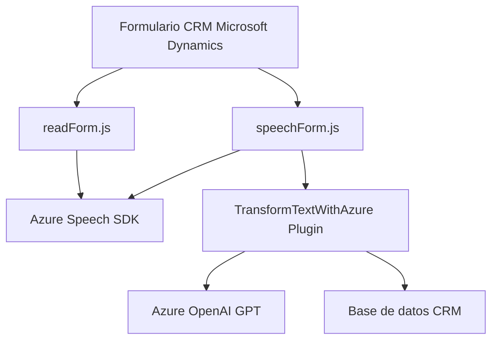

### Breve resumen técnico

El repositorio contiene archivos que interactúan con Microsoft Dynamics CRM y servicios en la nube, específicamente Azure Speech SDK y Azure OpenAI. Los componentes descritos implementan funcionalidades para voz y texto en formularios web, facilitando la entrada y salida audibles, además de integrar AI para transformar texto. La arquitectura general refleja una solución de integración modular con enfoque en eventos y servicios externos.

---

### Descripción de arquitectura

La solución tiene una arquitectura **orientada a servicios** (Service-Oriented Architecture, SOA). Los archivos interactúan con Microsoft Dynamics CRM operando como extensiones (plugins y scripts) dentro de un ecosistema empresarial. Dos módulos de JavaScript dan soporte a formularios web, permitiendo sintetizar datos visibles y ejecutar comandos hablados para la entrada de datos. Además, un plugin en C# conecta Dynamics CRM con Azure OpenAI para transformar texto en formato estructurado.

La configuración utiliza principalmente:
1. **Azure Speech SDK** para síntesis y reconocimiento de voz.
2. **Azure OpenAI GPT** para transformación de texto en el plugin.
3. **Microsoft Dynamics CRM SDK** para manipulación de formularios y entidades en Dynamics.

Los componentes son disociados y cada uno cumple roles específicos, permitiendo expandir la funcionalidad hacia otros servicios (e.g., para interactuar con otras APIs). Esto refleja elementos de una **arquitectura orientada a eventos** y el principio **single responsibility**.

---

### Tecnologías usadas

1. **Frontend**
   - **JavaScript**: Implementación de las funciones en archivos `readForm.js` y `speechForm.js`.
   - **Azure Speech SDK**: Integración para síntesis de voz (con `SpeechSynthesizer`) y reconocimiento de voz (con `SpeechRecognizer`).
   - **Microsoft Dynamics CRM SDK (Xrm)**: Manipulación de formularios y llamadas a la API de CRM.
   - **DOM Manipulación**: Manejo dinámico de scripts y procesamiento visual en la página.

2. **Plugins**
   - **C#**: Desarrollo de un plugin basado en la interfaz `IPlugin`.
   - **Microsoft Dynamics CRM Plugin Framework**: Desarrollo de extensiones mediante la API de Microsoft CRM.
   - **Azure OpenAI (GPT-4)**: Servicio de IA usado para procesamiento NPL; tipo de chatbot transformativo.
   - **.NET SDK**: Manipulación de datos (e.g., JSON, Regex).

3. **Arquitectura**
   - **Modularidad extrema**: Uso de funciones/métodos independientes para facilitar el entendimiento y reutilización (e.g., `getFieldMap`, `ensureSpeechSDKLoaded`).
   - **Patrones de diseño**:
     - Eventos y callbacks para cargar dinámicamente dependencias y SDKs.
     - API Wrappers para simplificar interacciones con servicios externos (Azure Speech y OpenAI).
     - Singleton para conexión ligera por HTTP a servicios remotos.
   - **Service-Oriented Architecture** (SOA).

---

### Diagrama Mermaid válido

Este diagrama muestra la interacción entre los componentes del sistema.

---

### Conclusión final

Esta solución es una implementación de **Service-Oriented Architecture** con énfasis en la integración de API de reconocimiento de voz (por Azure Speech SDK), dinámica de entrada de datos en formularios CRM, y procesamiento inteligente del lenguaje (Azure OpenAI). La solución se construye sobre una base modular, por lo que cada componente se integra como una funcionalidad autosuficiente. Aunque el principal enfoque está en formularios dinámicos dentro de Microsoft Dynamics CRM, la arquitectura permite la fácil expansión a otros sistemas debido al uso de técnicas API-first y SDKs configurables.