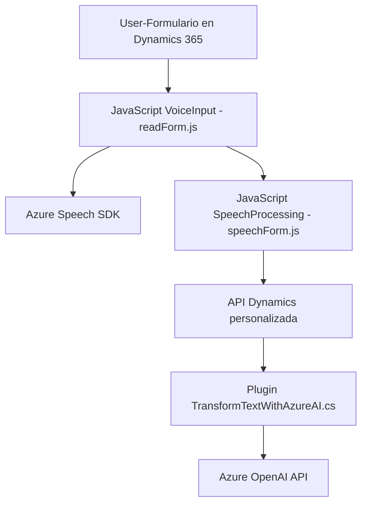

### Breve Resumen Técnico
El repositorio implementa una solución integrada en **Microsoft Dynamics 365**, que utiliza capacidades de síntesis y reconocimiento de voz ofrecidas por **Azure Speech SDK**, junto con procesamiento de texto enriquecido mediante **Azure OpenAI API**. Su objetivo principal es mejorar la interacción con formularios dentro de Dynamics 365 utilizando voz como medio de entrada y salida.

---

### Descripción de Arquitectura
La arquitectura de esta solución se puede clasificar como **arquitectura híbrida de cliente-servidor** con una integración explícita de **APIs externas (Azure Speech SDK y OpenAI)**. En el lado del cliente (JavaScript en el navegador), la aplicación está diseñada siguiendo un modelo modular funcional que interactúa directamente con los formularios visibles de Dynamics. En el backend, el archivo `TransformTextWithAzureAI.cs` implementa un plugin utilizando **Microsoft Dynamics SDK** para extender la lógica del CRM y conectar con servicios de Azure.

El enfoque arquitectónico general parece orientarse hacia el **patrón por capas**:
1. Una capa de gestión: Funciones en JavaScript para interactuar con el cliente y SDK.
2. Una capa de procesamiento: Transformaciones textuales mediante Azure OpenAI.
3. Una capa externa (Servicios Azure y APIs).

---

### Tecnologías Usadas
#### Componentes del frontend:
- **Microsoft Dynamics 365 Client API** (manipulación de objetos de formulario con `executionContext` y APIs como `Xrm.WebApi`).
- **Azure Speech SDK** (síntesis y reconocimiento de voz, cargado dinámicamente en el cliente).
  
#### Componentes del backend:
- **Microsoft Dynamics SDK (`IPlugin`)** para implementar extensiones en formularios CRM.
- **Azure OpenAI API** (`gpt-4`) para procesamiento de inteligencia artificial textual.

#### Tecnologías transversales:
- **JavaScript** (modular y funcional).
- **C#** (implementación del plugin de Dynamics CRM).
- **HTTP Communications via HttpClient** para integración externa.

#### Patrones usados:
1. **Interacción cliente-API**: Aprovechando el SDK y APIs de Dynamics 365 junto con las de Azure para procesar datos.
2. **Modularización y cohesión**: Separación clara de responsabilidades en funciones independientes. 
3. **Event-driven programming**: Uso extensivo de callbacks junto con SDKs.
4. **Delegation**: Lógica de delegación para la manipulación de eventos y callbacks (en la carga dinámica del Azure Speech SDK).

---

### Diagrama **Mermaid** compatible con **GitHub Markdown**

---

### Conclusión Final
Este repositorio tiene como objetivo ofrecer una solución innovadora que integra **procesamiento de voz y datos mediante tecnologías cloud de Azure** en fórmulas dinámicas CRM (Dynamics 365). Con una arquitectura híbrida distribuida entre cliente y servidor, el sistema se apoya fuertemente en los SDK de **Microsoft** y **Azure** para síntesis de voz, reconocimiento, y tratamiento de texto. Aunque el código parece bien estructurado, destaca por su dependencia en servicios externos que podrían requerir robustez adicional en la validación y manejo de errores (especialmente en las llamadas a servicios en tiempo real).