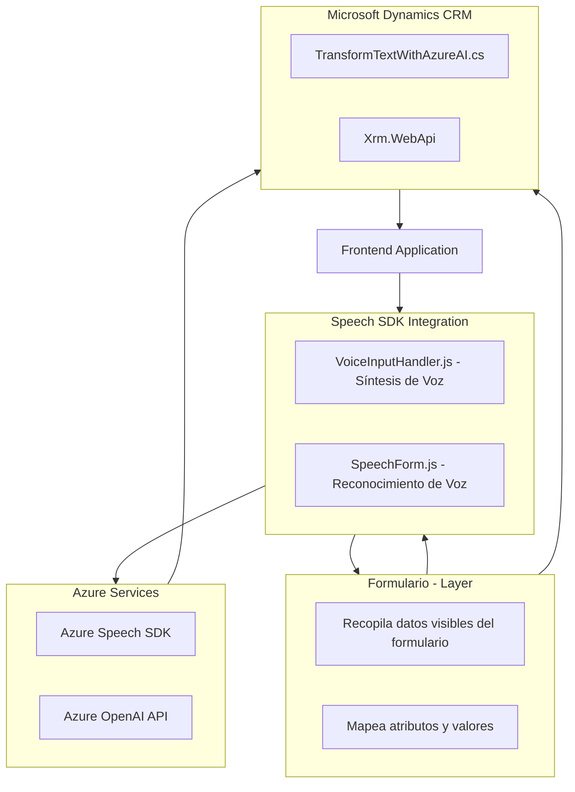

## Breve Resumen Técnico

Este repositorio parece formar parte de una solución diseñada para integrar funcionalidades de reconocimiento de voz, síntesis de voz y procesamiento basado en IA en un sistema de formularios dinámicos. Principalmente, el sistema utiliza Azure Speech SDK y Azure OpenAI Service, conectado con Microsoft Dynamics CRM.

---

## Descripción de Arquitectura

La arquitectura utilizada parece ser de **n capas** combinada con características dirigidas a la modularidad. Presenta una **división entre frontend y backend**, orientada al uso de servicios externos (Azure Speech SDK, Azure OpenAI). El frontend realiza tareas como captura de voz y procesamiento de formularios, mientras que el backend actúa como capa de lógica adherida a Dynamics CRM, implementando plugins personalizados.

### Características Clave
1. **Integración API y SaaS:** Uso extensivo de servicios de Microsoft Azure (Speech SDK, OpenAI) para realizar tareas específicas.
2. **Modularidad Funcional:** Cada archivo está bien separado por responsabilidades claras (lectura de formularios, síntesis de voz, procesamiento de IA).
3. **Eventos y Plugins:** Backend orientado a eventos utilizando plugins de Dynamics CRM en combinación con servicios externos.

---

## Tecnologías Utilizadas
1. **Frontend (JavaScript):**
   - **Azure Speech SDK:** Captura de voz y síntesis de texto en voz.
   - **API personalizada:** Procesa texto reconocido con reglas específicas.
   - **Dynamics CRM SDK:** Acceso a datos del CRM (campos, valores).

2. **Backend (C#):**
   - **Microsoft Dynamics CRM SDK:** Implementación de `IPlugin` para lógica basada en eventos.
   - **Azure OpenAI Service:** Genera respuestas JSON basadas en texto ingresado.
   - **Newtonsoft.Json:** Para manipulación y deserialización de JSON.
   - **HttpClient:** Realiza las solicitudes HTTP hacia Azure OpenAI Service.

---

### Diagrama Mermaid para Repositorio

---

## Conclusión Final

Este repositorio orienta su implementación hacia una **arquitectura n capas**: backend (lógica CRM con plugins) y frontend (integración de Azure Speech SDK). Logra una **modularidad funcional** al segmentar tareas específicas como reconocimiento de datos, síntesis de voz, y generación de texto estructurado mediante IA. Sin embargo, las dependencias de servicios externos (Azure API y Dynamics CRM) convierten la solución en una aplicación altamente dependiente del ecosistema Microsoft. Una mejora podría ser el uso de herramientas más avanzadas para manejar excepciones y secretos más seguros en la integración de APIs externas.